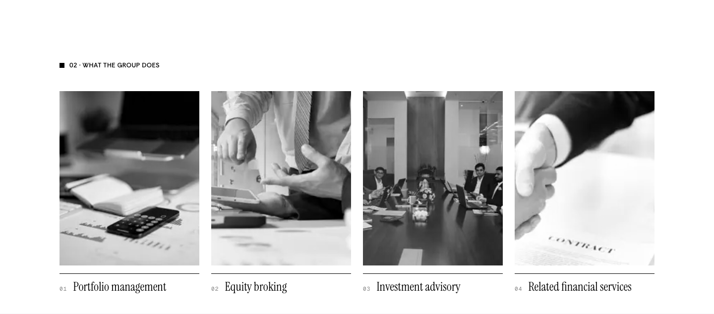
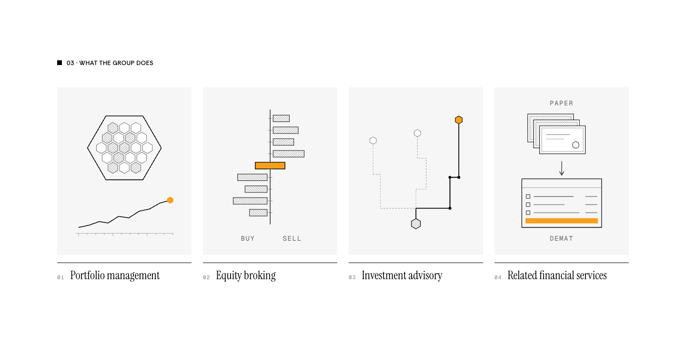
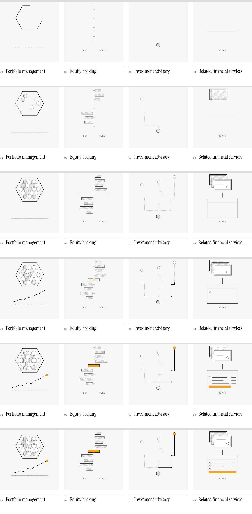
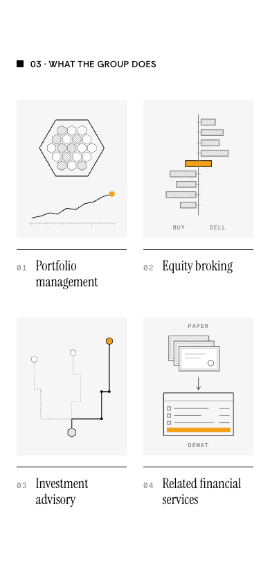
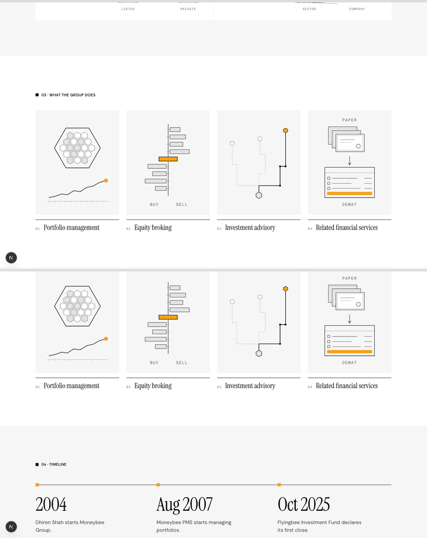

# What the group does: after the team, drawn instead of photographed

**Problem.** On /about, "What the group does" sits before the team and shows four stock photographs.
**Result.** The section moves after Key Team Members. Each of its four tiles shows an explainer drawing that plays once when the row scrolls into view, in the plate style of the team cards' drawings.
**Proof.** /about at 1440 and 390 matches the preview below, the drawings play in the order shown in the frame strip, and reduced motion shows the finished drawings at once.

```
now:      01 Founder → 02 What the group does → 03 Key Team Members → 04 Timeline → 05 Story
proposed: 01 Founder → 02 Key Team Members → 03 What the group does → 04 Timeline → 05 Story
          black        grey                   white, grey tiles        grey           white
```

Preview: `https://moneybees.localhost:1355/preview/about-areas` (deleted once this lands). Key Team Members still reads 03 in the preview; it becomes 02.

## Current and proposed, 1440





## What each drawing shows

The facts come from the group profile deck. Its page 4 says the group is "a BSE and NSE registered stockbroker and CDSL Depository participant", and its transactions slides list the advisory work.

| Tile | Drawing | Orange lands on |
| --- | --- | --- |
| Portfolio management | An account outline fills with 19 holdings (the PMS holds 15 to 20 stocks), then a value line runs along a time axis | Where the value has got to |
| Equity broking | An order book: offers to sell on one side, bids to buy on the other. One of each slides in and they meet on the middle row | The trade |
| Investment advisory | Three dashed routes lead up from a business. The advised route draws in ink, stop by stop | Where the advice arrives |
| Related financial services | Paper share certificates; one travels down into a demat account ledger and comes out as entries | The newest entry |

**Assumption to confirm:** tile 4 draws the depository service (CDSL depository participant), because that is the related service the deck names. Say if you would rather it showed something else.

## Motion

Each tile plays for about 2.5 seconds, 220 ms behind the tile before it. Hairlines draw first, hatching settles, and orange lands last. Frames captured about 0.65 s apart:



## 390



## Around it

Key Team Members (grey) above, the timeline (grey) below:



## Files

| File | Change |
| --- | --- |
| `components/about-v3/areas-section.tsx` | New: the four drawings and the section |
| `app/about/page.tsx` | New order; footer "What the group does" moves after "Our team" |
| `components/about-v3/about-sections.tsx` | The old photo `AreasSection` goes |
| `lib/about-v3.ts` | `AREAS` (the photo list) goes |
| `public/about/photos/` | `research-desk.jpg`, `dealing-desk.jpg`, `handshake.jpg` and `SOURCES.md` are deleted; nothing else uses them |
| `components/team/team-sections.tsx` | Eyebrow 03 → 02 |
| `components/about-v3/timeline-section.tsx` | Back to its grey `#F6F6F6`. It only went white to separate it from the grey team section, which no longer sits above it |

## Left out

- **No video.** webreel is not installed here. The frame strip and the live preview URL show the motion instead.
- **Labels at 390.** BUY, SELL, PAPER and DEMAT render at about 7.5px on a phone. They are readable, but small.
