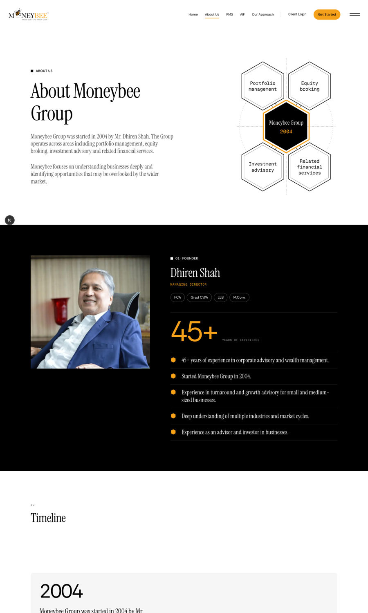
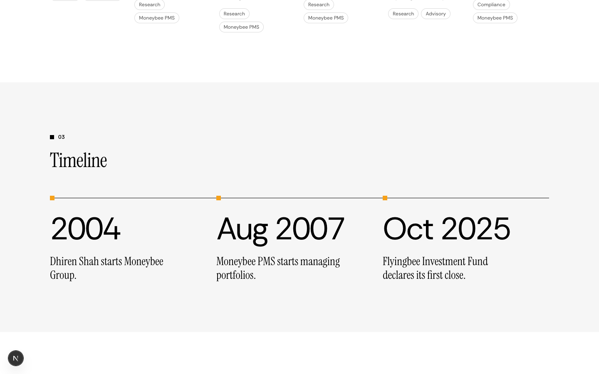
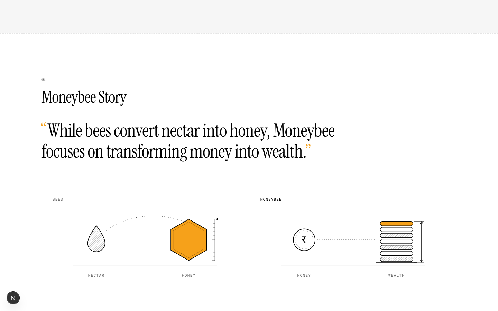
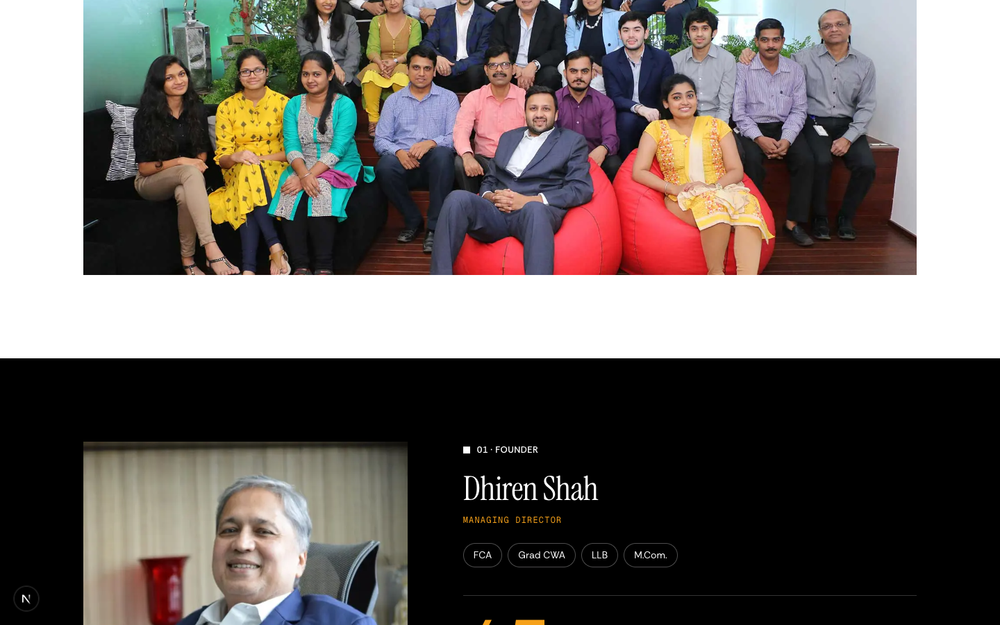
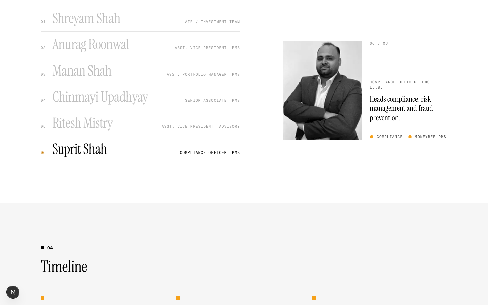
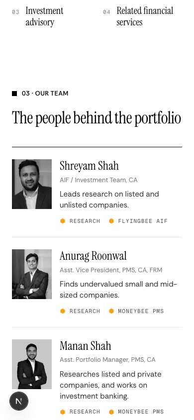
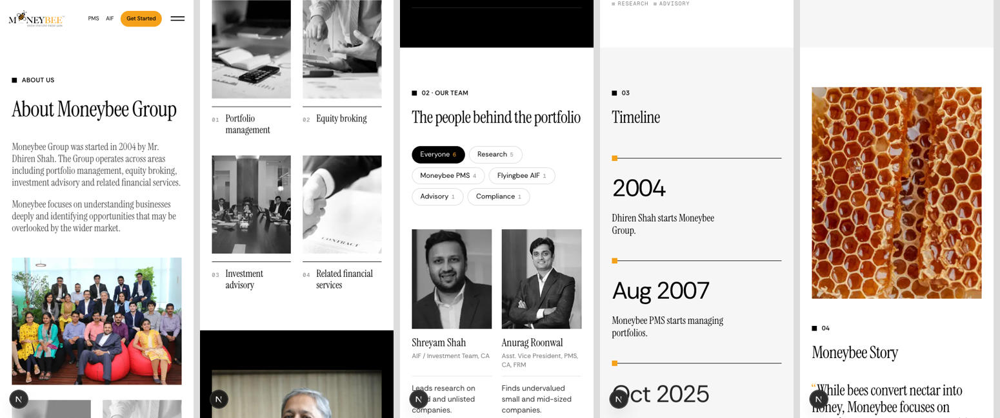
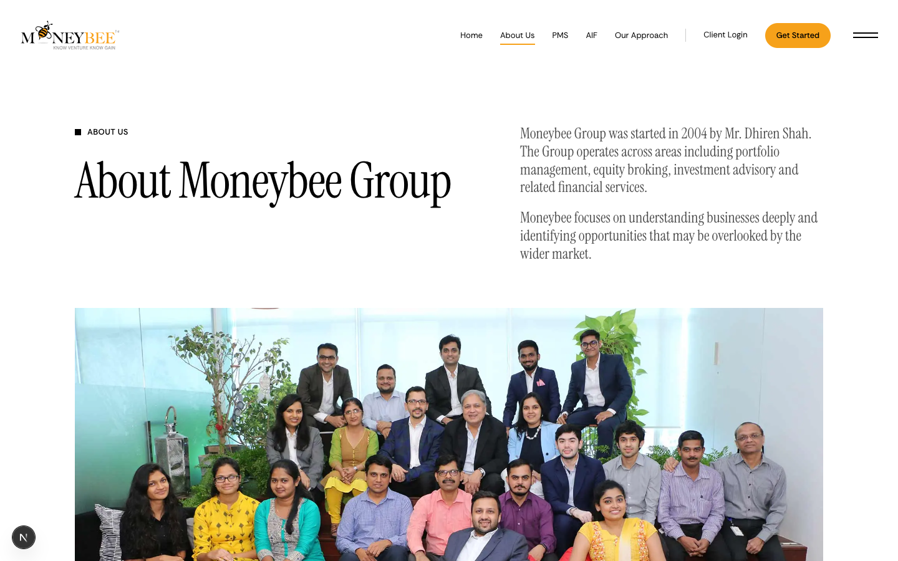
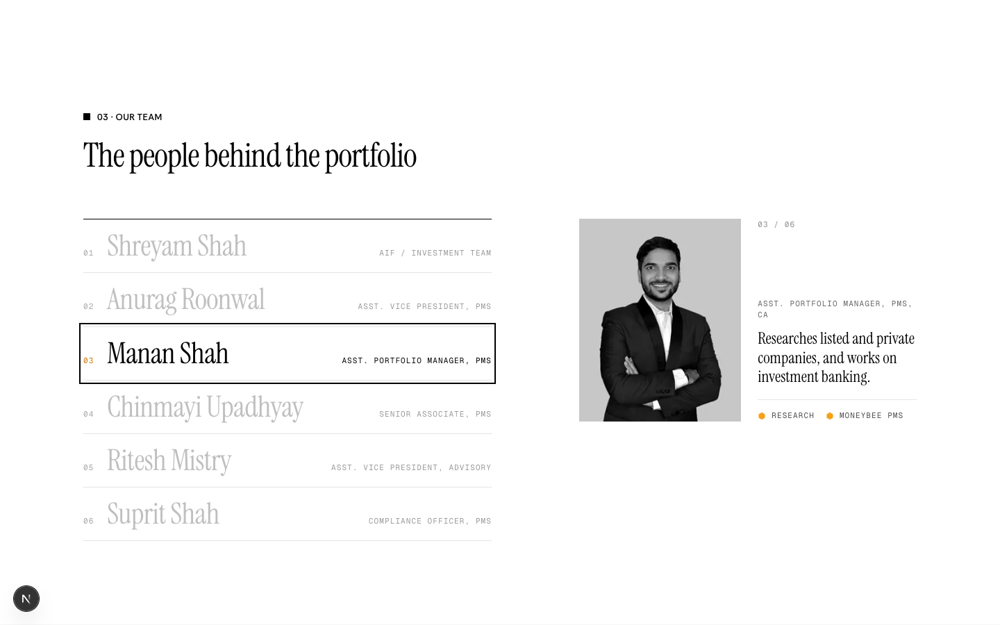

# /about with people and photographs

**Wrong now:** /about shows only the founder's face. The team photo sits unlabelled near the end, the hero is a hexagon drawing, and none of moneybee.in's hero images are used.
**After:** the hero opens on the moneybee.in team photo with Dhiren Shah's band straight after it. The group's four areas each get a photograph. A new section shows six people with their role, one line of what they do, and a filter that lights who does which work. The Moneybee Story stays as it is.
**Proof:** the preview at `https://moneybees.localhost:1355/preview/about` (1440 and 390 screenshots below). `/about` itself is unchanged until you approve.

## Current vs proposed

| Current (1440) | Proposed (1440) |
| --- | --- |
|  |  |
| Hexagon drawing of the four areas |  |
| No team section on /about | See revision 3 below |
| Timeline: pinned card scroll, 3 stops, ~1,500px of empty scroll |  |
| Story: two line drawings | Unchanged (your note). Only its number moves from 03 to 05  |

**Revision 2, from your notes:** Dhiren Shah follows the group picture directly, and the story keeps its drawings.

| Group picture, then Dhiren Shah | Dhiren Shah, then the four areas |
| --- | --- |
|  |  |

**Revision 4, from your note ("bad design, check inspo.page"):** the table is gone. I studied the team examples on inspo.page ([details.so/inspo/category/team](https://www.details.so/inspo/category/team)) and followed the pattern most of them share:
- **Telha Clarke and K95:** a list of large names, with the inactive names greyed. One portrait swaps as you move through the list.
- **AUAR:** name rows with the role set on the right.
- **United Carriers:** one active portrait beside a short bio, with a "01 / 20" counter.

Here, the six names run down the left with each role on the right, so you can see who does what without hovering. Hovering, focusing or tapping a name swaps the one portrait, which cross-fades. Beside the portrait sit a counter, the role and qualification, the line of what they do, and the work they are part of. The panel stays in view while you move down the list.


Moving down to Suprit Shah: the panel stays in view and swaps to him.



On a phone it is a plain list, with a portrait beside each name:



**Phone (390px), no sideways scroll:**



## Page order

```
Hero: heading + §2 company text → team photo (moneybee.in hero slide)
01 Founder (unchanged black band, directly after the group picture)
02 What the group does (four area photos)
03 The people behind the portfolio (new: name list + one portrait, after inspo.page team sections)
04 Timeline (flat rule, 3 stops)
05 Moneybee Story (unchanged drawings)
Footer (the "Let's talk" band is removed)
```

## Where each photo comes from

| Slot | Photo | Source |
| --- | --- | --- |
| Hero | Team at Lower Parel | moneybee.in hero slide `slider22-1.jpg` (already `/people/moneybee-team.jpg`) |
| Portfolio management | Desk with statements and charts | Unsplash, Jakub Żerdzicki |
| Equity broking | Hands over a laptop and tablet | moneybee.in hero slide `slider1.jpg`, white fade cropped off |
| Investment advisory | Moneybee boardroom meeting | moneybee.in `video_bg.jpg` (already `/people/moneybee-boardroom.jpg`) |
| Related financial services | Handshake over a contract | moneybee.in hero slide `slider3.jpg`, cropped |
| People | Six headshots | already in `/public/people` (deck photos) |

The area photos are grey so four different stock sources read as one set. The team photo stays in colour. Portraits are grey, like the area photos.

## Files

| File | Today | After |
| --- | --- | --- |
| `lib/about-v3.ts` (new) | none | Photos, the six people joined to `TEAM` in `lib/insights.ts`, filters, timeline stops |
| `components/about-v3/about-sections.tsx` (new) | none | Hero with the group photo, the four areas section, flat timeline |
| `components/about-v3/people-section.tsx` (new) | none | Name list with one swapping portrait, with a plain list below 768px (client) |
| `public/about/photos/*` (new) | none | 3 cropped photos + `SOURCES.md` |
| `app/about/page.tsx` | about-v2 hero, founder, card-scroll timeline, team photo, drawn story, Let's talk band | v3 hero, about-v2 founder, v3 areas, people, v3 timeline, about-v2 story; no Let's talk band |
| `app/preview/about/page.tsx` (new) | none | This preview. Deleted after the swap |
| `components/about-v2/about-sections.tsx` | all /about sections | `FounderSection` and `StorySection` stay. `StorySection` takes an `index` prop (default "03") so it can read 05. The hero, card-scroll timeline and team photo sections get removed in the swap |

## The choices worth checking

What each person does. One deck fact per person, written plainly (`lib/about-v3.ts`):

```ts
"Shreyam Shah":      "Leads research on listed and unlisted companies."                  // research, aif
"Anurag Roonwal":    "Finds undervalued small and mid-sized companies."                  // research, pms
"Manan Shah":        "Researches listed and private companies, and works on investment banking."
"Chinmayi Upadhyay": "Researches sectors and companies, listed and private."
"Ritesh Mistry":     "Builds business models and valuations for chemical, automobile and capital goods companies."
"Suprit Shah":       "Heads compliance, risk management and fraud prevention."           // compliance, pms
```

Timeline: one stop added from the AIF deck. Dhiren's 45+ years were a span rather than a date, so that stop is dropped.

```diff
  2004      Dhiren Shah starts Moneybee Group.
  Aug 2007  Moneybee PMS starts managing portfolios.
- 45+ years ...
+ Oct 2025  Flyingbee Investment Fund declares its first close.   // deck: "First Close declared on October 30, 2025"
```

The people are read from `TEAM` rather than retyped, so a role change in the deck data reaches this page too:

```ts
export const PEOPLE = Object.entries(DETAILS).map(([name, details]) => {
  const member = TEAM.find((entry) => entry.name === name);
  if (!member) throw new Error(`lib/about-v3.ts: ${name} is not in TEAM`);
  return { ...member, ...details };
});
```

## Left out, and open questions

- **Photo licence.** The moneybee.in slides are the client's own site stock. Confirm with them that the licence covers the new site. The Unsplash photos are free, and none are Unsplash+.
- **Equity broking** is still listed because the docx §2 says so. It conflicts with the MB-01 no-broking scope. If you drop it, the areas row becomes three photos.
- **Dates.** The docx asks for history dates to be approved before publishing. Oct 2025 comes from the deck, not the docx.
- **/team overlap.** /team still shows its three docx people. After this change, /about shows six. Worth deciding whether /team should become the six too.
- **moneybee.in team.php** lists 20+ staff, mostly broking. I used only the six in the PMS/AIF decks.
- **New label:** "What the group does" is my wording. The docx has no heading for the four areas, and moving them after the founder separated them from the sentence that names them.
- **Not verified yet:** keyboard focus order through the filters on the real /about route, and the swap itself.

## Verified implementation (live /about, after approval)

- Section order read from the DOM: hero, founder, group, people, timeline, story. There is no `#talk` band.
- Page width is 1440 at 1440 and 390 at 390, so nothing scrolls sideways.
- Tab from Shreyam moves focus down the names. Each shows a solid outline, and the panel follows: 02/06 through 06/06.
- `/preview/about` is deleted. The replaced about-v2 hero, card-scroll timeline, team-photo section, `GROUP_AREAS` and `TIMELINE` are removed.

| Hero | Our team, keyboard focus on Manan Shah |
| --- | --- |
|  |  |
