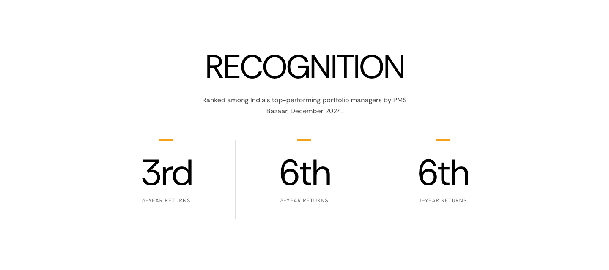
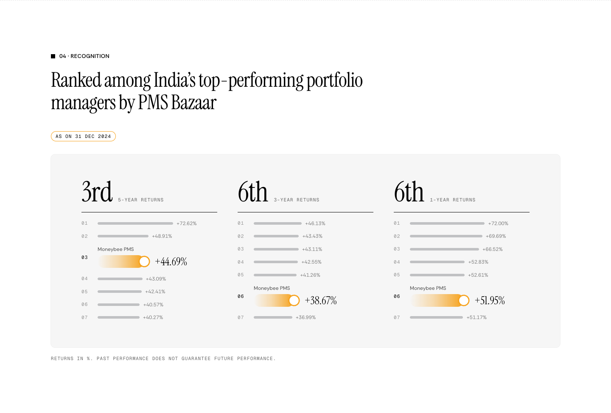
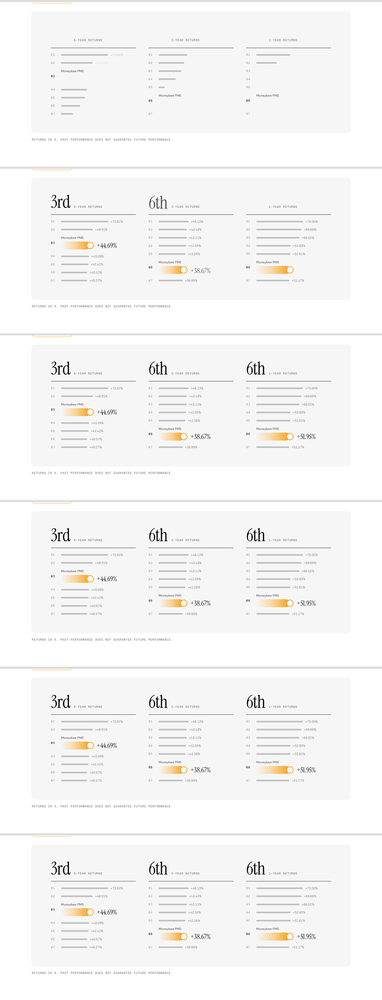
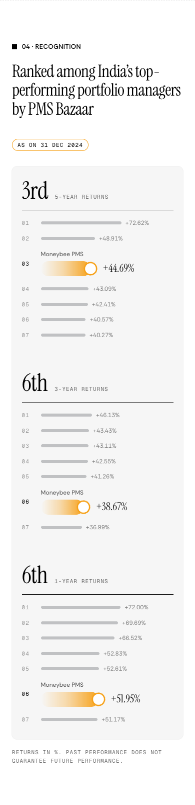
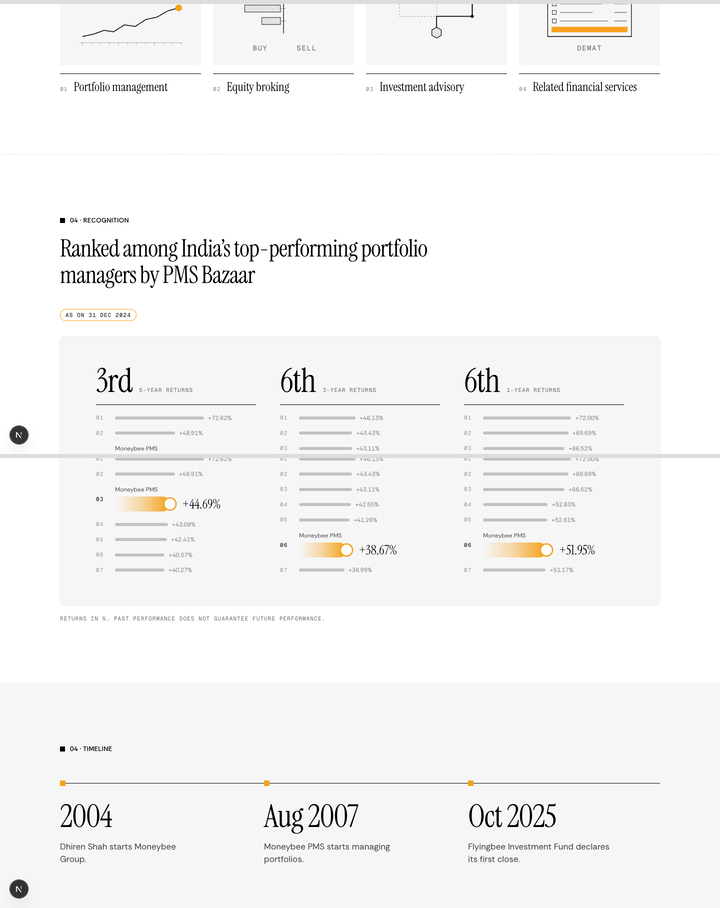
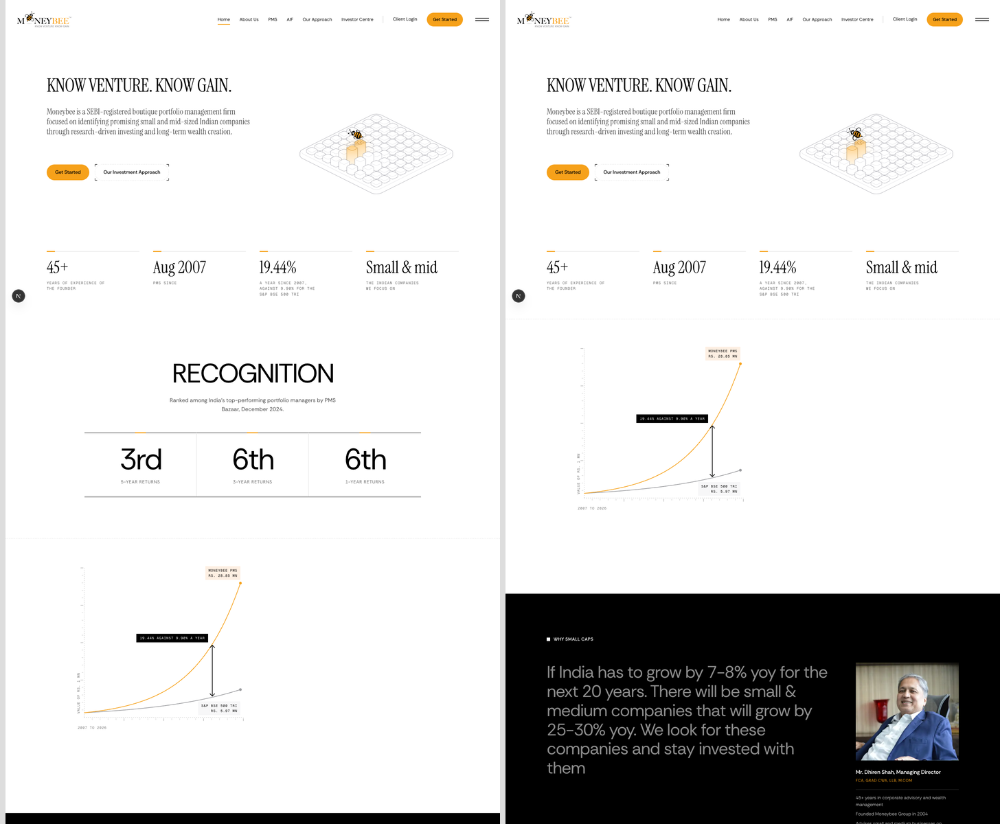

# Recognition: off the homepage, reworked on /about

**Problem.** The homepage shows Recognition as three bare ranks (3rd, 6th, 6th). On their own, the ranks don't show what Moneybee was ranked against.
**Result.** Recognition leaves the homepage. It moves to /about as section 04. Each rank sits above PMS Bazaar's top-seven list for that period, drawn in the /pms performance chart's language: grey bars for the other schemes and the orange lit bar for Moneybee.
**Proof.** Every return matches the deck's page 5. The bars share one scale. The homepage runs from the hero straight into the wealth chart.

```
/about:  01 Founder → 02 Key Team Members → 03 What the group does → 04 Recognition → 05 Timeline → 06 Story
         black        grey                   white                    white, dashed rule   grey      white
/:       Hero → (Recognition removed) → Who we are → …
```

## Current and proposed

Current, on the homepage:



Proposed, on /about:



- **Heading:** the current lead, "Ranked among India's top-performing portfolio managers by PMS Bazaar".
- **Date:** in the orange pill, the way the loved chart shows its date. The deck prints "As on 31 Dec 2024".
- **Rows:** the other schemes are unnamed grey bars. Moneybee's row is labelled "Moneybee PMS" and fills orange to the ringed marker.
- **Note:** "Returns in %. Past performance does not guarantee future performance." The content plan asks for the disclaimer wherever performance figures appear, and the /pms chart carries one too.
- **Scale:** the three lists share one scale, so a longer bar is a higher return across all three lists.

## Motion

The grey bars sweep in 60 ms apart. Then Moneybee's bar fills, its ring draws, and the return and the large rank rise together. Each list starts 150 ms after the one before it. The timings are the /pms chart's. Frames captured about 0.55 s apart:



## 390

The three lists stack.



## On /about

What the group does above it, the grey timeline below. Recognition is white like the section above it, so a dashed rule separates them. The /pms chart and the Story section use the same rule.



## The homepage without it

Left current, right proposed:



## For the client before launch

The returns come from the group profile deck. Its footer says "Strictly confidential. For Private Circulation Only. Not for Public Circulation." The three ranks are already public on the homepage. Moneybee's returns at those ranks (44.69%, 38.67%, 51.95%) and the other schemes' returns would be new on the public site. They are PMS Bazaar's published figures, but the client should confirm that they can be shown.

## Files

| File | Change |
| --- | --- |
| `components/about-v3/recognition-section.tsx` | New: the section and its three lists |
| `lib/insights.ts` | `RANKING_TABLES` and `RANKINGS_AS_OF` (deck p5, checked against the page image) replace `RANKINGS` |
| `app/about/page.tsx` | Recognition becomes 04, Story 06; the footer gets "Recognition" |
| `components/about-v3/timeline-section.tsx` | Label 04 → 05 |
| `app/page.tsx` | Recognition removed |
| `components/home/home-sections.tsx` | `RecognitionSection` and its comment go |

## Left out

- **No video.** webreel is not installed here. The frame strip shows the motion instead.
- **Peer names.** The deck names the other schemes. The site does not; naming competitors is the client's call.
- **Timeline label in the preview.** The preview still shows "04 · Timeline". It becomes 05 when this lands.
