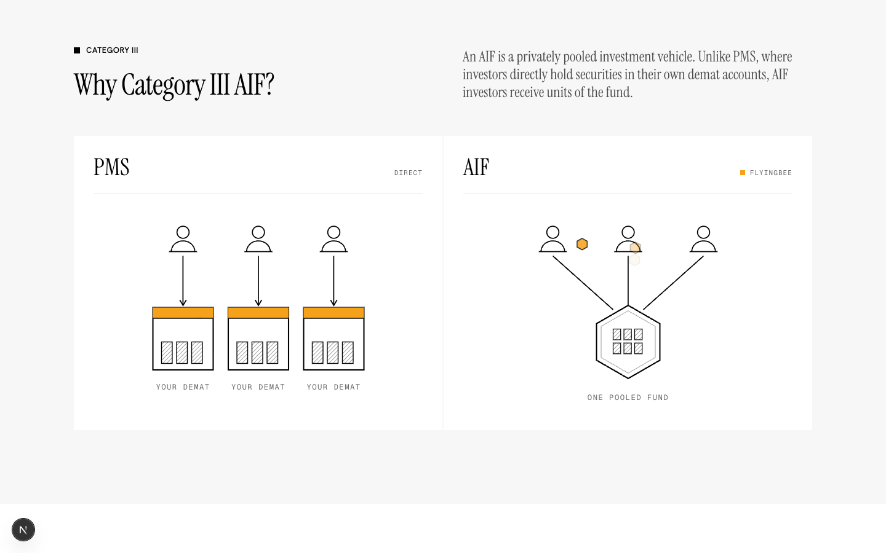
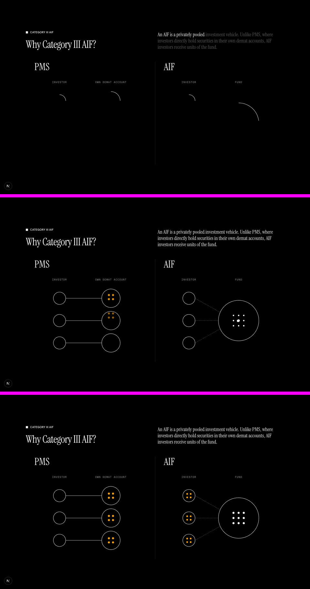
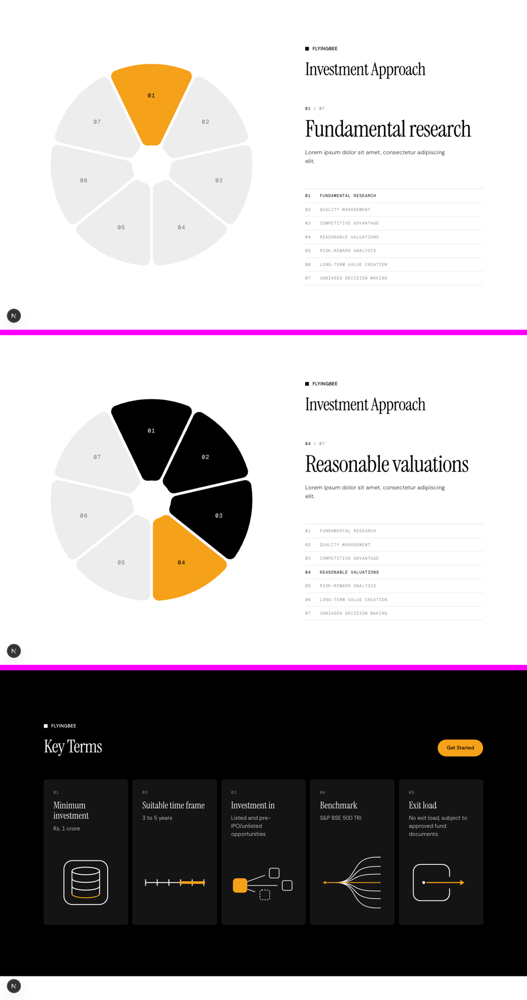
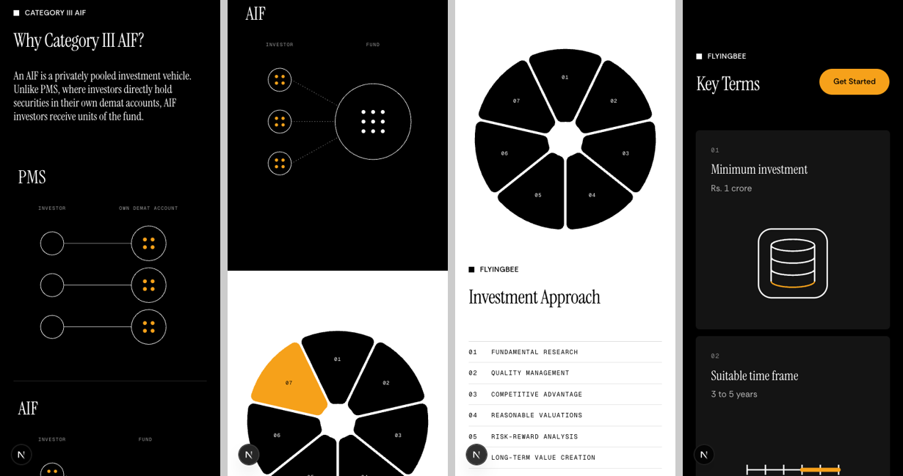

# /aif reworked to the /pms standard

**Wrong now:** the live /aif has the new product header, but everything under it is the old design: a dot field, plain term cards and a centred chain. You said: "not designed as well and visuals are not as good."
**After:** three sections rebuilt from your references, none of them repeating a /pms visual. The header stays as approved.
**Proof:** the preview at `https://moneybees.localhost:1355/preview/aif`, with screenshots at the scroll points below. /aif is unchanged until you approve.

## Today, under the header

## Proposed

### 1. Why Category III AIF? (pinned scroll scene on black)

The section pins for two screens while the scene plays. These frames are at 10%, 55% and 100% of the scroll:

- **What it shows:** two equal panels, never overlapping. On the PMS side, each investor's securities land in their own demat account. On the AIF side, the investors' money travels into one fund, the fund's holdings appear, and units travel back out to each investor.
- **Orange:** it marks what the investor holds, with 12 orange holdings on each side, so neither product is lit over the other.
- **The explanation:** the plan's sentence fills from grey to white word by word as the scene plays.
- **Rings:** they draw on in the measured Unit8 weights (study 02).

### 2. Investment Approach (pinned seven-wedge wheel)

- **The wheel:** it uses study 01's rounded wedges, rebuilt the way the measurement found them: pie sectors with their points rounded off and an even gap between them.
- **Sizes:** the seven points aren't data, so every wedge is the same length.
- **On scroll:** the wedges light in turn. The lit wedge is the one orange element, finished wedges turn black, and the active point takes the stage in large serif type with a 01 / 07 counter.
- **On a phone or with reduced motion:** the wheel sits still, every wedge black and none lit, beside the numbered list.

### 3. Key Terms (line cards on black)

- **The cards:** the five plan terms as study 04's line cards. Each has a white line drawing with exactly one orange element, using the measured study geometry, and the drawings wipe on as the cards rise in turn.
- **The button:** the plan's orange Get Started sits beside the heading.
- **Compliance:** the plan's compliance note stays a code comment, not visible text.

**Phone (390), no sideways scroll** (page width measured at exactly 390):

## Files

| File | After approval |
| --- | --- |
| `components/aif-v3/pooling-section.tsx` (new) | The pinned pooling scene |
| `components/aif-v3/approach-wheel.tsx` (new) | The pinned wedge wheel |
| `components/aif-v3/key-terms-section.tsx`, `term-figures.tsx` (new) | The line cards |
| `components/aif-v3/use-pinned-progress.ts` (new) | Scroll progress through a pinned section; static on phones and under reduced motion |
| `app/aif/page.tsx` | `ProductHero` plus the three new sections; the Let's talk band is removed |
| `components/aif-v2/aif-sections.tsx` and its glyphs | Removed once nothing imports them |
| `app/preview/aif/page.tsx` | Deleted after the swap |

## Left out, and open

- The body copy where the plan gives none is still lorem (one line per approach point).
- The fund structure diagram stays out, as you asked.
- Not verified in Safari or Firefox.
