# Our Approach and Performance: references 09 and 08

**Missing:** references 07, 08 and 09 were not used anywhere on the site. The eight pages besides /pms and /aif still carry their old drawings below the new headers.
**Becomes true:** /our-approach is built on 09, the process sheet. /performance shows wealth growth on 08, the growing discs.
**Proof:** previews at `/preview/our-approach` and `/preview/performance`, captured at 1440 and 390 below. Neither has horizontal scroll, and the live pages are unchanged until you approve.

## Our Approach on 09

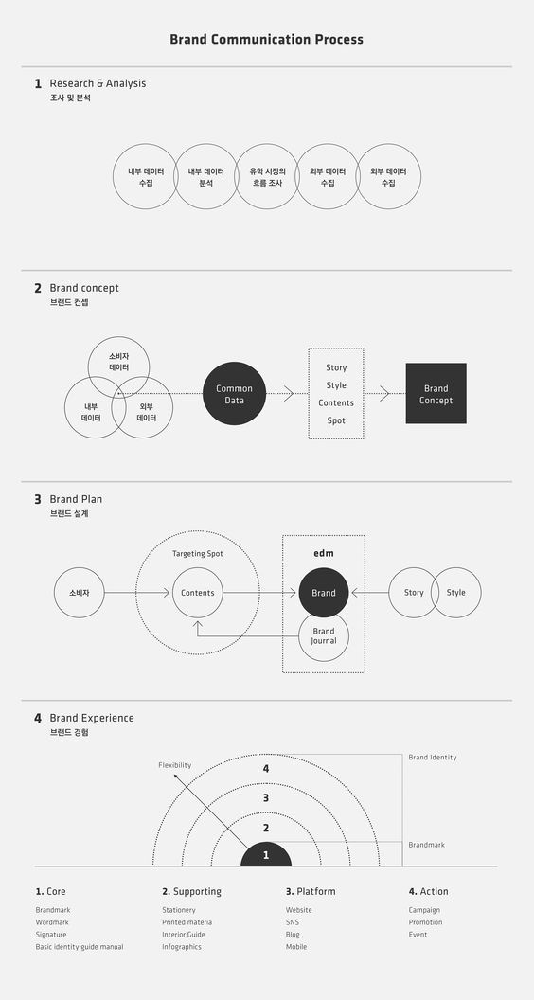

Each step of the plan's process gets its own figure, drawn from that step's sentence in 09's shapes: interlocking rings, a Venn with a start dot, a targeting ring, a dotted list box, filled nodes and dotted connectors. The one orange element in each figure is the step's result. The labels inside the figures are the plan's own words from the sentence.

| Current | |
| --- | --- |
| 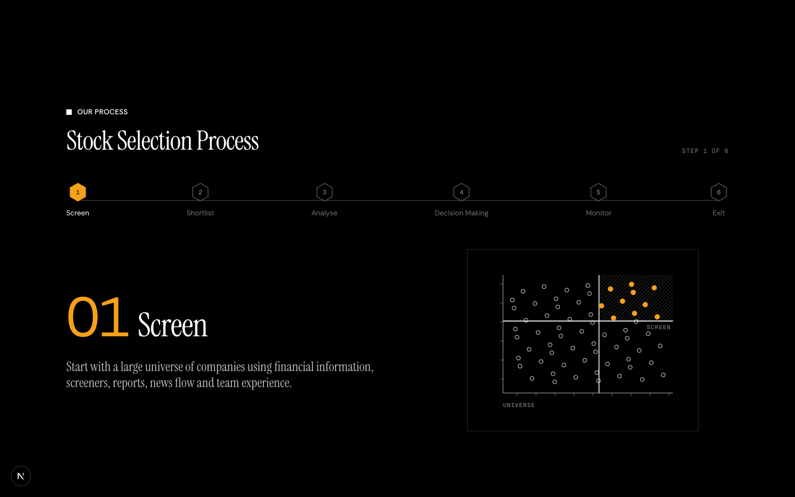 | |

| Step | Proposed |
| --- | --- |
| 01 Screen: the five sources as one chain, feeding the universe of companies | 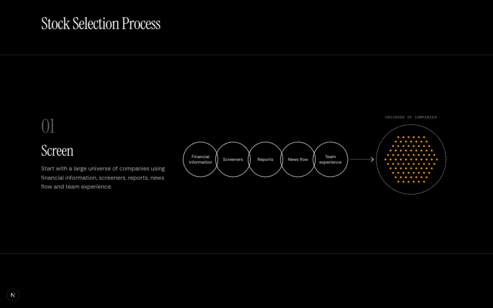 |
| 02 Shortlist: the four checks overlap, and what passes all four goes on | 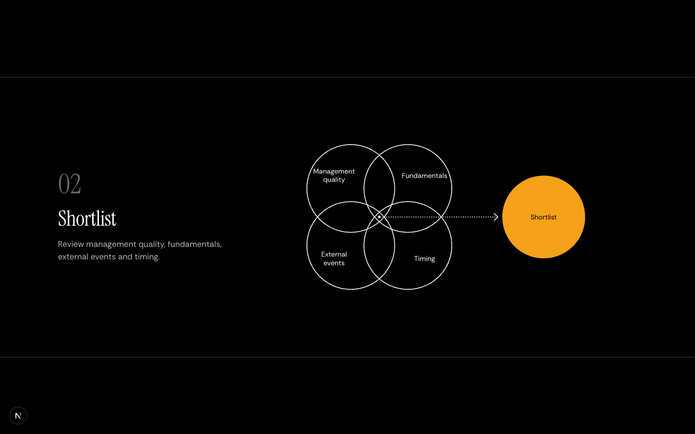 |
| 03 Analyse: five kinds of work aimed at one company in the targeting ring | 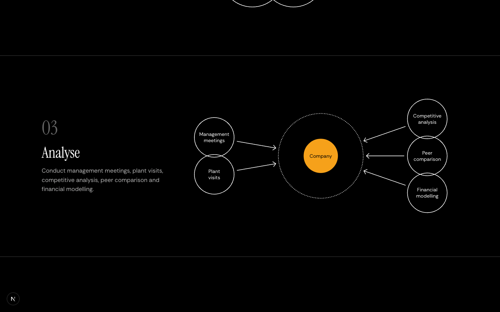 |
| 04 Decision Making: company, the five things reviewed in a dotted box, decision | 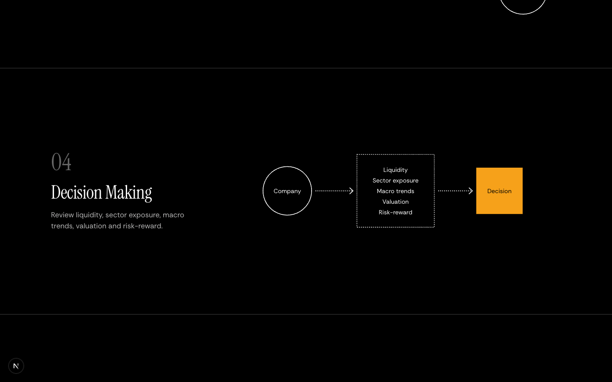 |
| 05 Monitor: four things tracked, feeding a holding watched round and round | 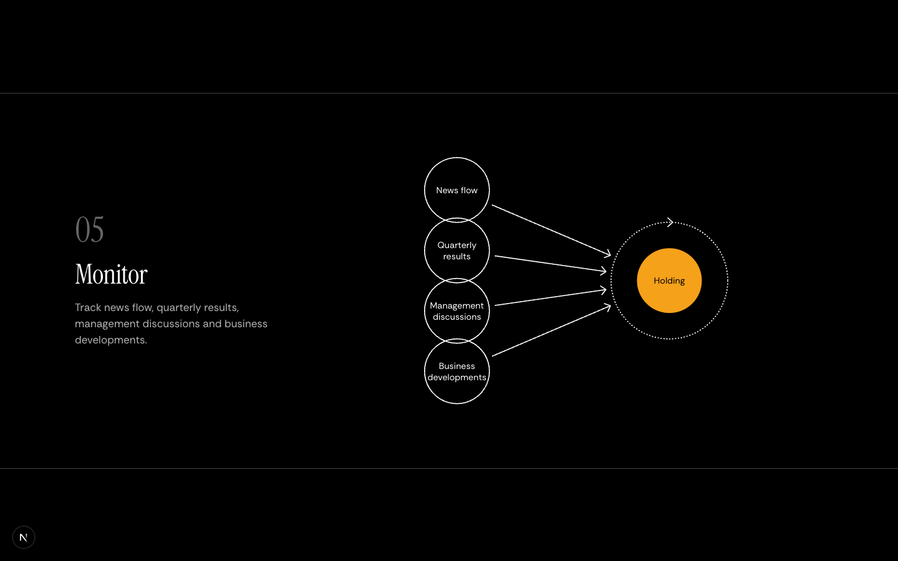 |
| 06 Exit: either condition leads to the exit | 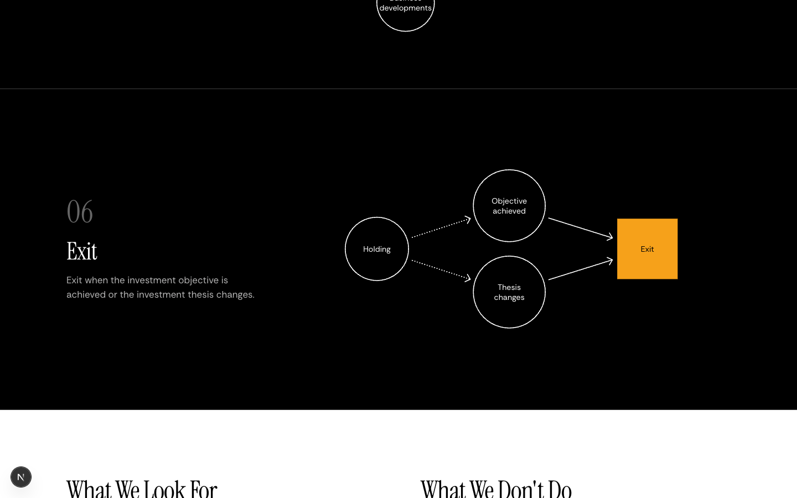 |

On phones every figure has its own vertical arrangement, at a readable size:

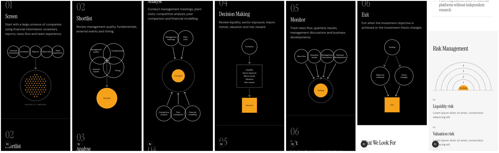

The lists use 09's closing columns. Each line has a ring bullet: an orange core for what we look for, a struck ring for what we don't do. Risk management is 09's last stage: the portfolio as the filled orange core, the four risks as numbered half-rings with a constant step, and the closing columns as the legend.

| Current | Proposed |
| --- | --- |
| 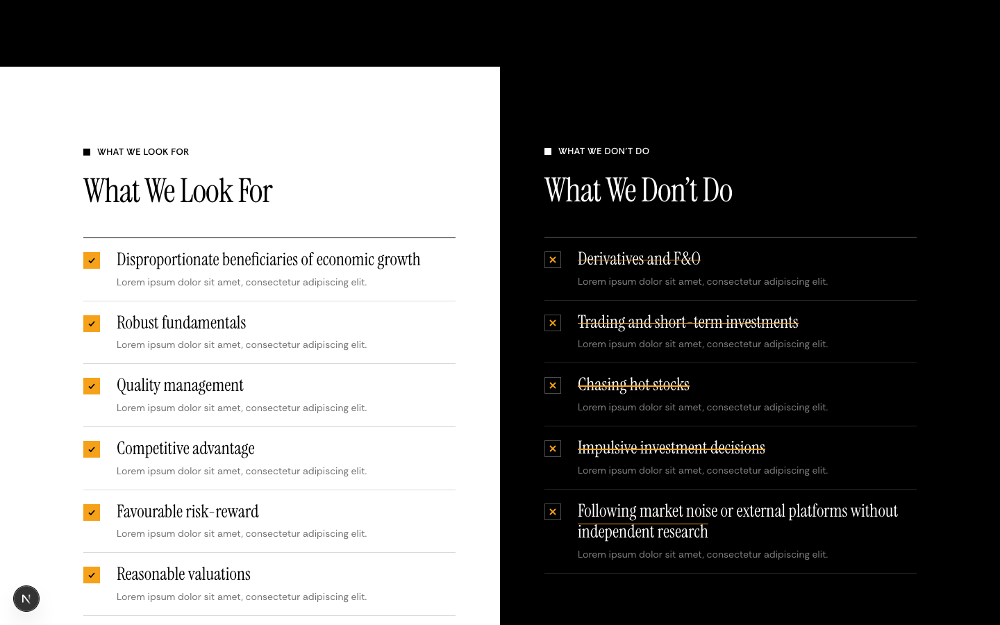 | 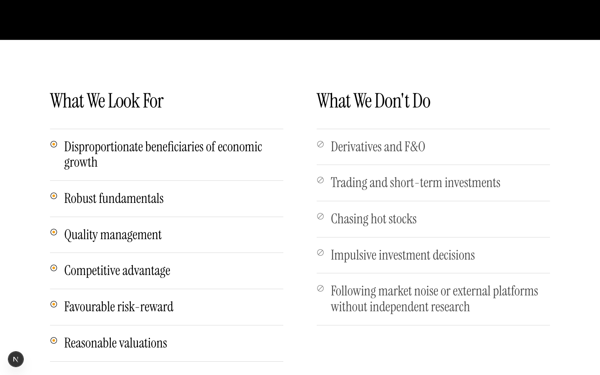 |
| 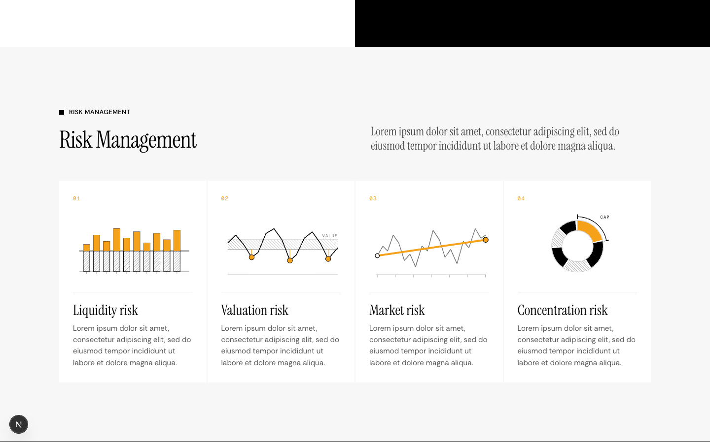 | 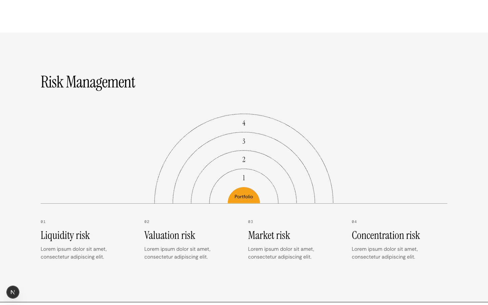 |

## Performance wealth growth on 08


There are two outcomes of the same Rs. 1 Mn, so they are two progressions on one axis and never one chain: Rs. 1 Mn to Rs. 5.97 Mn in the S&P BSE 500 TRI, then Rs. 1 Mn to Rs. 28.85 Mn in Moneybee PMS. Disc areas follow the values, so 08's equal size steps become sizes the numbers set. The arrows, the 45° chevron, the lookout standing just inside the top of the orange disc and its clipped shadow follow the 08 measurements. The PMS and AIF lit rows you liked stay exactly as they are.

| Current | Proposed |
| --- | --- |
| 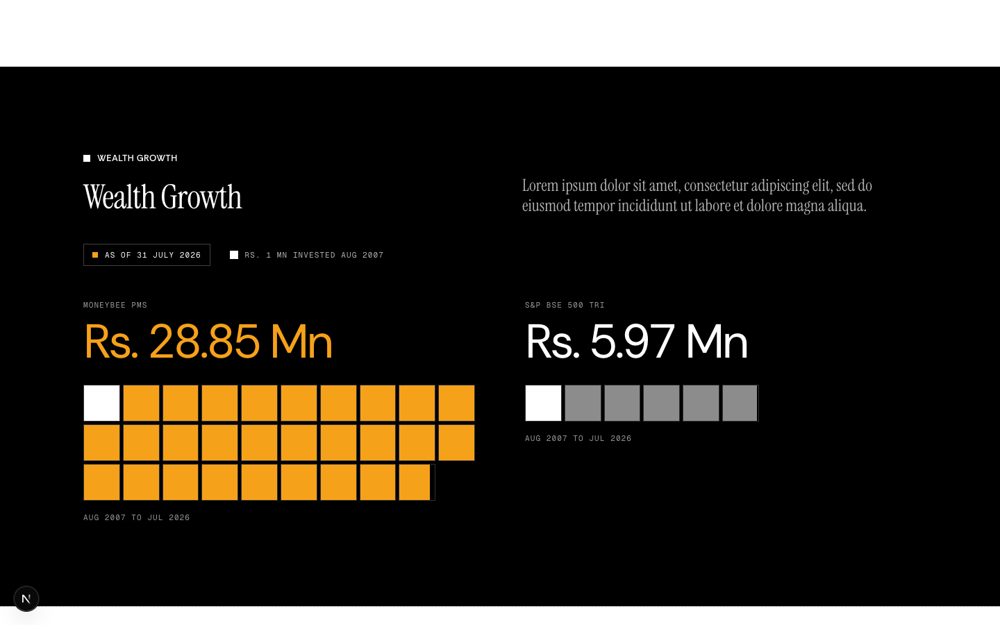 | 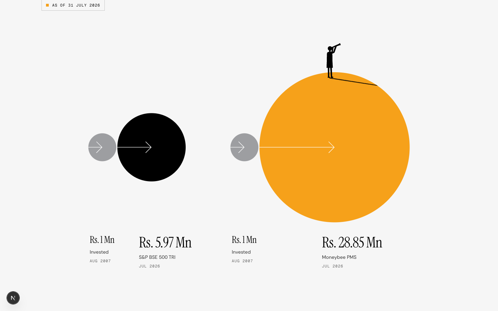 |

On phones the two progressions stack, both at one scale so the areas still compare:

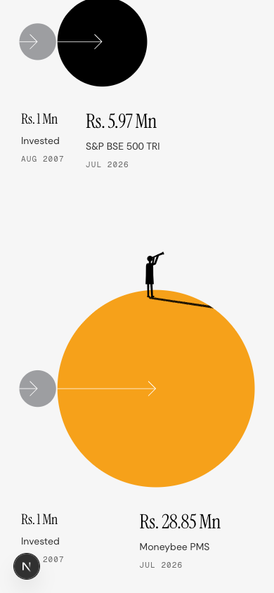

## Files

| File | Today | After |
| --- | --- | --- |
| `components/approach-v3/sheet.tsx` | new | The 09 kit. A figure is data: nodes (ring, box, square, field, cycle, point, label) and edges. It holds the measured rules: 6.8% chain overlap, 42° chevrons, 1:1 dotted lines. |
| `components/approach-v3/process-sheet.tsx` | new | The six stage figures, each with a desktop and a phone arrangement, and the ruled sheet section. |
| `components/approach-v3/criteria-lists.tsx` | new | The two lists with ring bullets. |
| `components/approach-v3/risk-rings.tsx` | new | Half-rings and closing columns. |
| `components/performance-v3/wealth-discs.tsx` | new | The 08 wealth discs. |
| `components/drawing/lookout.tsx` | new | The telescope figure, moved out of `pms-v3/selection-lines.tsx` unchanged, so /pms and /performance draw the same person. |
| `app/our-approach/page.tsx` | hero, ProcessSteps, ListsSection, RiskSection | hero, ProcessSheet, CriteriaLists, RiskRings |
| `app/performance/page.tsx` | WealthSection (unit grid on black) | WealthDiscs on the panel grey |
| old drafts in `approach-v3/` and `performance-v3/` | unvetted agent work | deleted on approval |

## The decision that matters

```tsx
// Two outcomes of one Rs. 1 Mn: each progression starts from its own Rs. 1 Mn disc.
const radius = (value: number) => (D0 / 2) * Math.sqrt(value / GROWTH.start);
const WIDE = [...benchmark(0), ...ours(BENCHMARK[1].x + BENCHMARK[1].r + BETWEEN)];
```

The older draft lined the discs up as Rs. 1 Mn, then the benchmark, then Moneybee. That reads as the benchmark turning into Moneybee, so I replaced it.

## Left out

- The next batch, being built now: /case-studies on 07, /team on 02, /careers on 03, /investor-centre on 04, /pms-vs-aif on 02 (two equal rings standing apart).
- Risk descriptions stay lorem until the client sends copy.
- Figures are as of 31 July 2026. The plan asks for 31 August, and that data is not in the decks yet.
