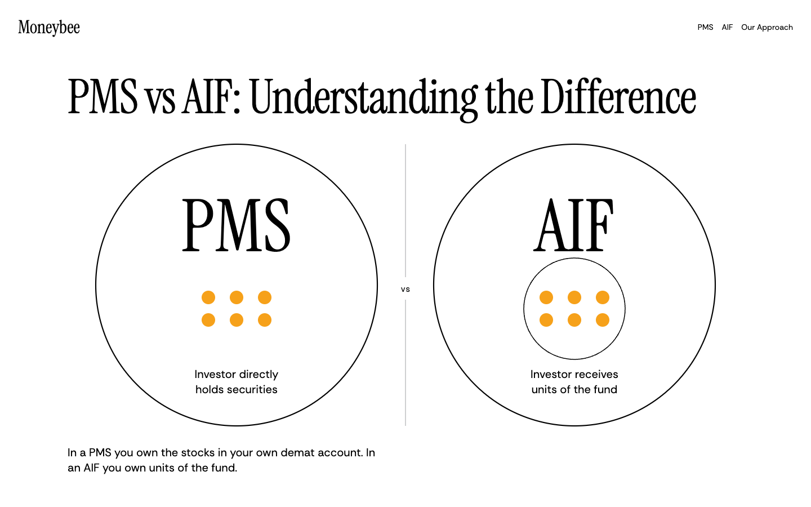
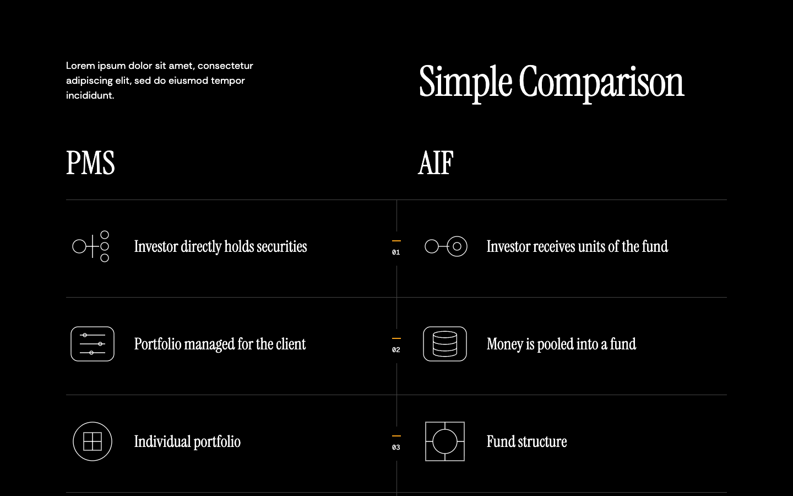
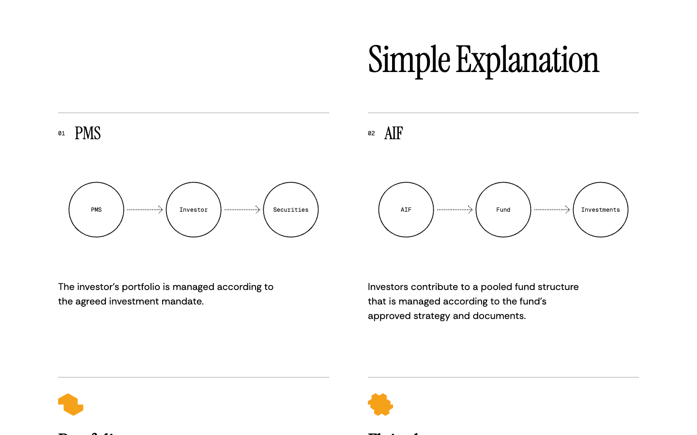
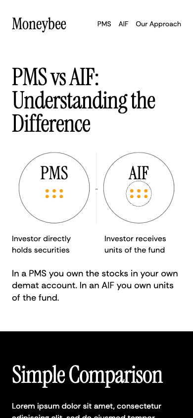
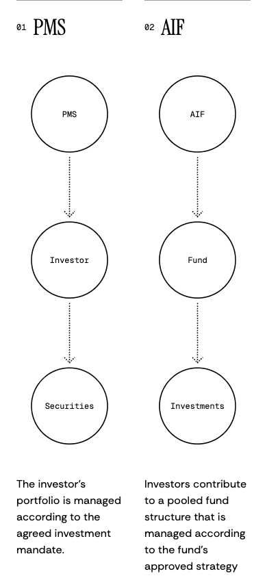

# Comparison preview rework

## Goal
The first pass shows cooperation rather than a comparison and leaves the table without drawings.
Apply the supplied second-pass brief to the isolated preview, with equal product treatment throughout.
Prove verbatim content, equal geometry, padded labels, completed reveals and zero mobile overflow in the running browser.

## Visual explanation
Proposed preview at 1440 × 900, rendered with the site's actual fonts. This replaces the earlier fallback-font drawing.











[Open the isolated runnable proposed preview](preview.html). The revised header fills the top with one 84px display line and enlarges each ring to 500px in diameter at 1440px. Product titles grow to 128px within each ring. On phones, the two exact ownership lines sit below the rings at readable body size. Product blocks will use the real ProductMark component rather than the prototype's simplified paths.

[Current rejected first pass, retained for comparison](current-desktop.png). It is not the proposal.

The hero's two equal rings translate outward over 1.6s on cubic-bezier(.87,0,.13,1). They start adjacent, never overlapping. The initial inward offset is 40 SVG units each, leaving a positive gap of 20 units; the final gap is 100 units. Contents draw in after separation. Each has six equal orange dots. The AIF side encloses its dots in one smaller ring. No scroll lock. Reduced motion renders the final state.

Below the hero:

1. Black comparison band. A short existing lorem paragraph on the left and Simple Comparison on the right, aligned at the bottom. Two equal columns, each row with matching 96-unit line drawings and its source text. Five row numbers in the central gutter. Both cells reveal together. Drawings use study 04's cylinder and line constructions and study 09's container/node vocabulary, without overlapping product rings or converging fan art.
2. Simple Explanation. Two numbered equal chains under stage rules, with titles PMS and AIF. Rings follow study 09's 34.4 radius, with label font scaled to its 7.4 ratio. The original pitch is increased to leave room for dotted arrows rather than overlap. Both chains draw rings first and arrows second. On phones each chain is vertical, keeping the products side by side. Each source explanation sits underneath.
3. Two equal product blocks. ProductMark, the existing full product name in Instrument Serif, then a plain text product link. Equal block heights and treatment, no button shells.

The motion sequences are fixed by the brief, with no external integrations or simulated investment data.

## File table
| File | Today | After |
| --- | --- | --- |
| components/compare-v3/compare-sections.tsx | Shared lens, text-only table, undersized chains, pill links | Separate ownership rings, paired row glyphs, padded chains, ProductMark blocks |
| components/compare-v3/compare.module.css | Small hero drawing and generic table spacing | Full-viewport composition, central numbering, equal figures and mobile treatment |
| components/compare-v3/verify.mjs | Checks rejected lens geometry and old browser session | Checks separation, equal orange area, equal cells/chains/blocks, content and label containment in pi-compare2 |
| app/preview/pms-vs-aif/page.tsx | Isolated preview with shared navigation/footer | Unchanged route and surrounding shared components |

Generated evidence stays in .plannotator/batch1/compare2/.

## Decision-bearing edits
```diff
- <CooperationFigure />
+ <OwnershipFigure />
- import { BUTTON } from '@/components/hero/tokens';
+ import { ProductMark } from '@/components/pms-v3/marks';
- const radius = 34.4; // 9-unit labels overrun the ring
+ const radius = 34.4;
+ // Use the study's 7.4-unit label size inside equally padded circles.
```

## Scope left out
No published route changes, shared navigation/footer changes, packages, server lifecycle actions or commits. No invented facts. Existing lib/compare and lib/insights remain the text sources. webreel is not installed, and the brief prohibits package installation. No new demo video is available. The isolated HTML previews the separation animation; runtime animation evidence will be captured through browser samples and screenshots. Final compliance approval remains the owner's responsibility.
