# Case Studies and Careers: references 07, 04, 03 and 08

**Missing:** /case-studies and /careers still carried their old drawings under the new headers. References 07 and 03 were not used anywhere.
**Becomes true:** each case study is a 07 isometric solid whose three callouts are the plan's three lines. Careers uses 04 for the openings, 03 for the culture and 08 for How to Apply.
**Proof:** previews at `/preview/case-studies` and `/preview/careers`, captured at 1440, 1024 and 390 below. Neither has horizontal scroll, and the live pages are unchanged until you approve.

## Case studies on 07

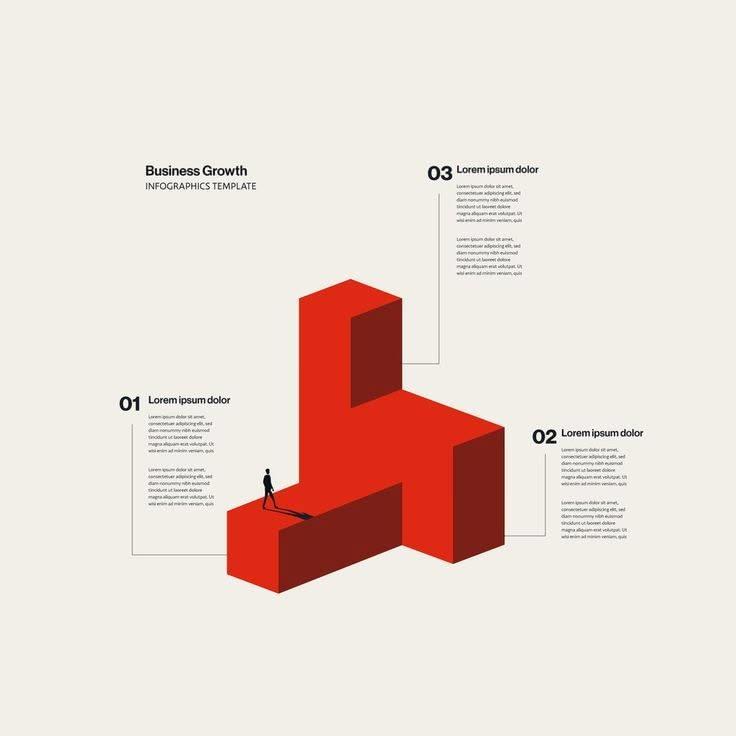

The card scroll you approved stays. Each card's empty half becomes the 07 solid, in 07's 20.6° projection with its box heights in 07's ratios (3.30 : 1.87 : 1). Its three numbered callouts hold the plan's lines in the plan's order: 01 Business Model on the low bar, 02 Competitive Edge on the arm, 03 Growth Prospect on the tall column. Each callout's leader ends on the edge 07 attaches it to. The figure walks the bar toward the column. The heights stand for no figures.

| Current | Proposed |
| --- | --- |
| 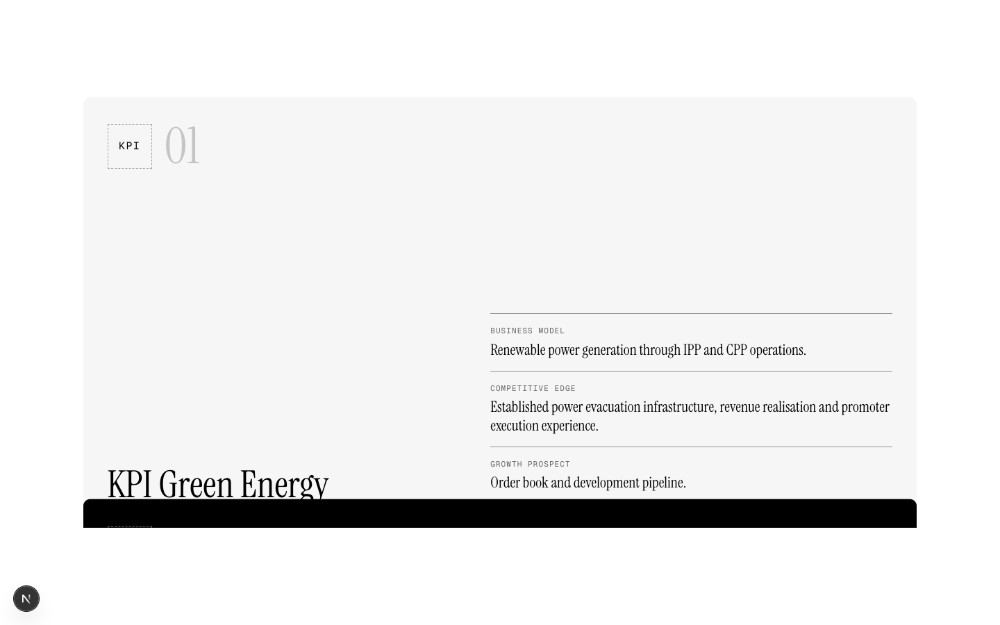 | 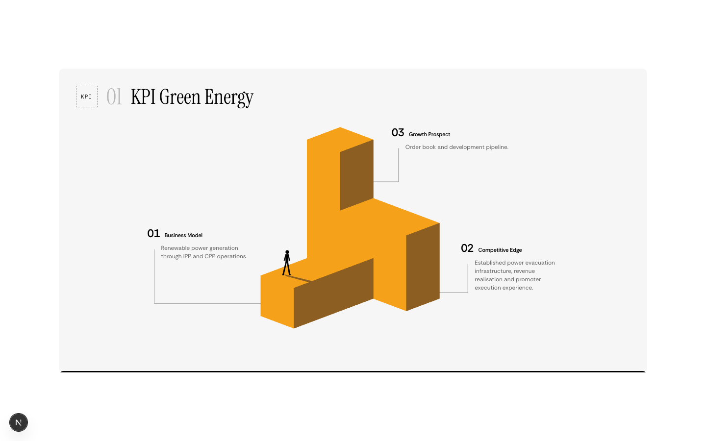 |
| | 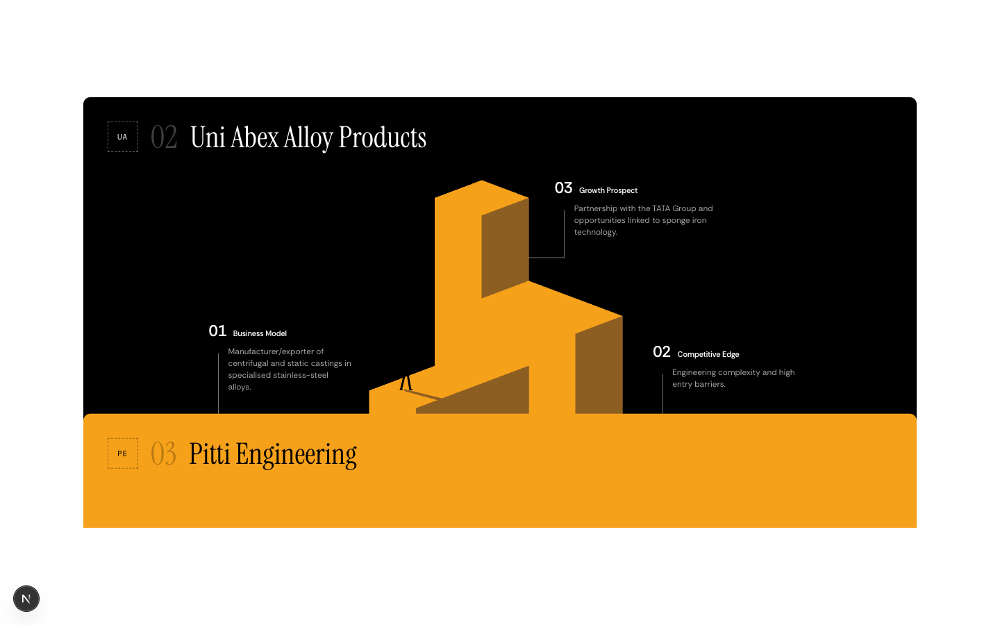 |
| | 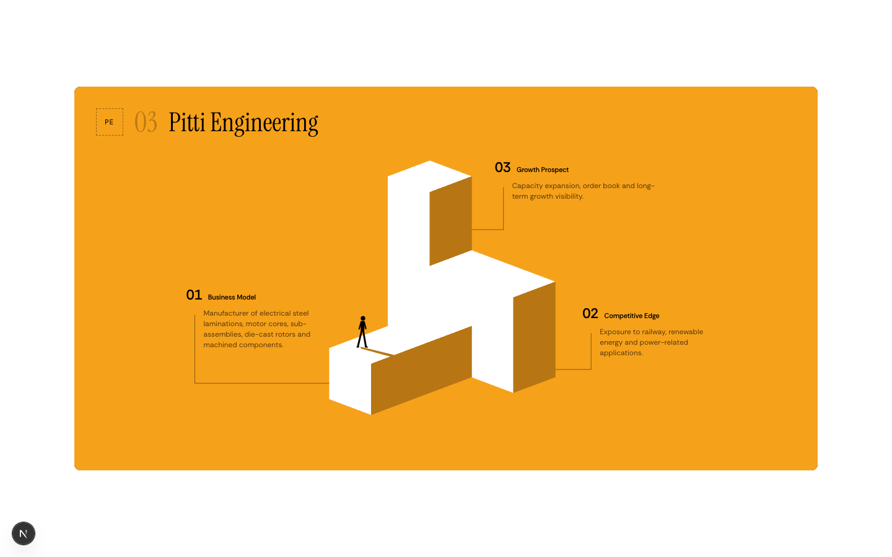 |

On phones and up to 1024 px, the solid sits above the three lines:

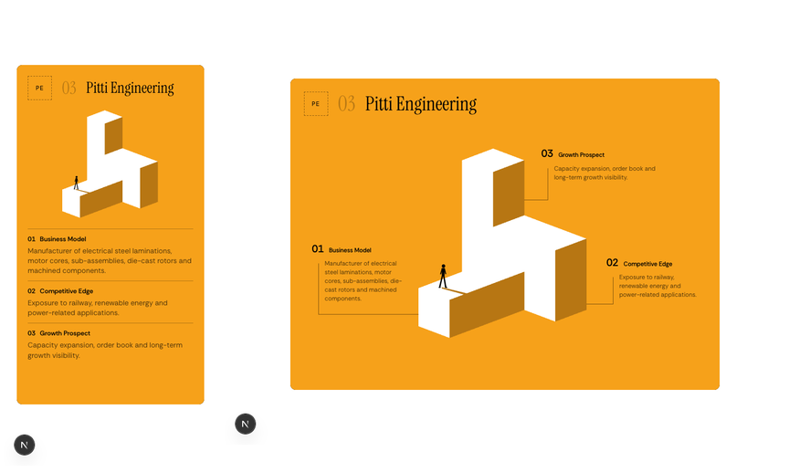

## Careers

**Current Openings on 04.** 

Each card is 04's layout: title, one line, a centred line drawing with one orange element, and a link with the small square. The drawings are 04's own, one per discipline the plan names: the cylinder for research, the square distributing to three holdings for portfolio management, the fan for advisory, a framed set of rules for compliance, the burst for financial services, and the open frame with the arrow out for "Not listed here?". The team filter chips are gone, because with one card per team they filtered nothing.

| Current | Proposed |
| --- | --- |
| 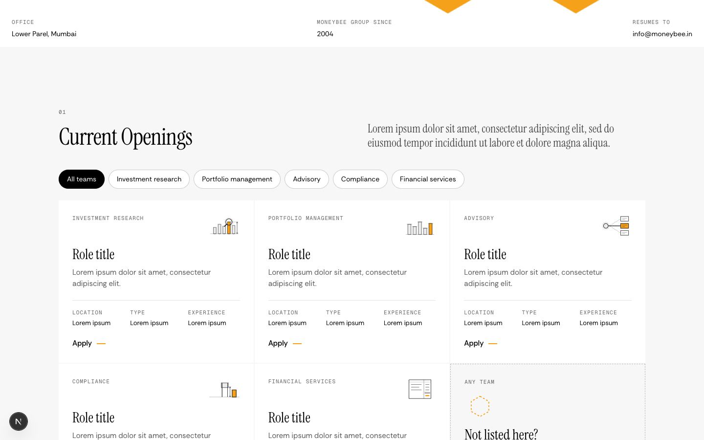 | 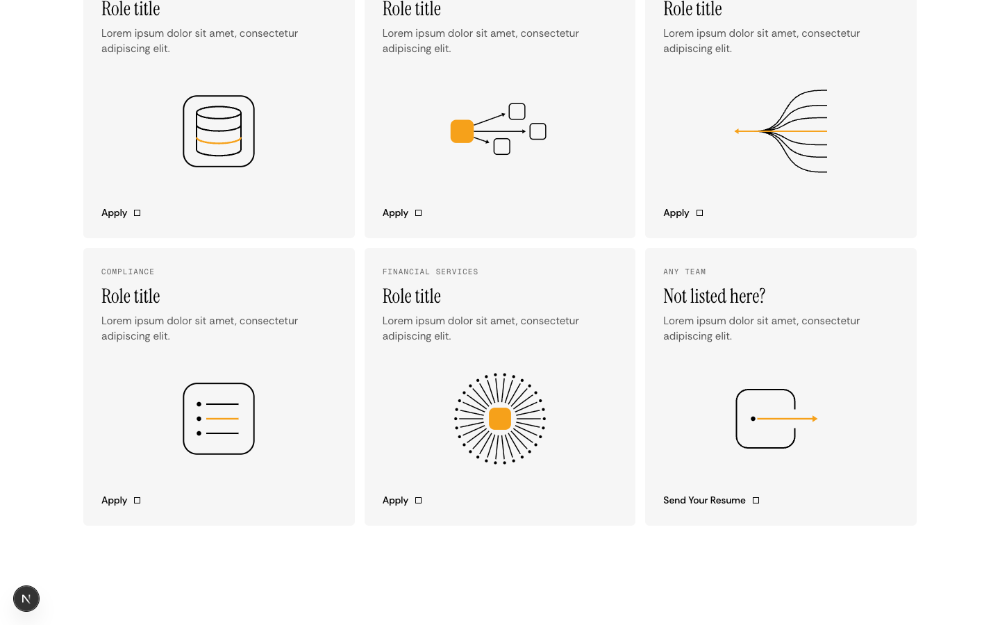 |

**Our Work Culture on 03.** 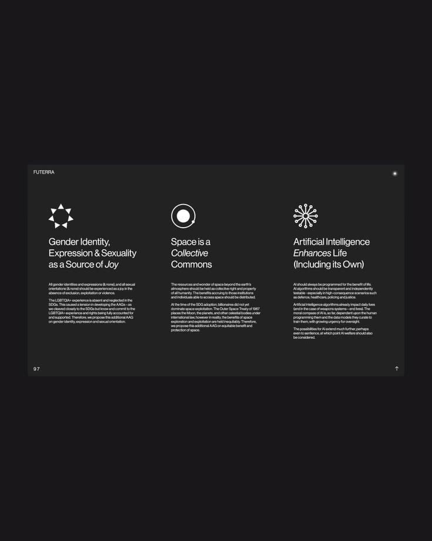

A dark card with four equal columns: a solid white glyph with one orange element, a heading with its last word in italic, and the body. Instrument Serif's italic is now loaded for this. The boardroom photograph stays beside the heading.

| Current | Proposed |
| --- | --- |
| 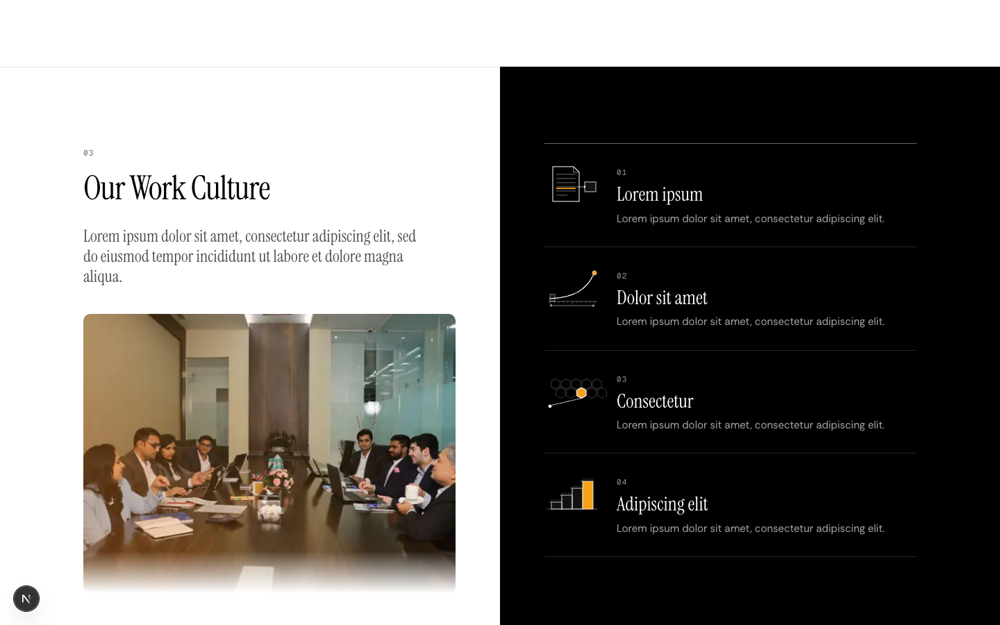 | 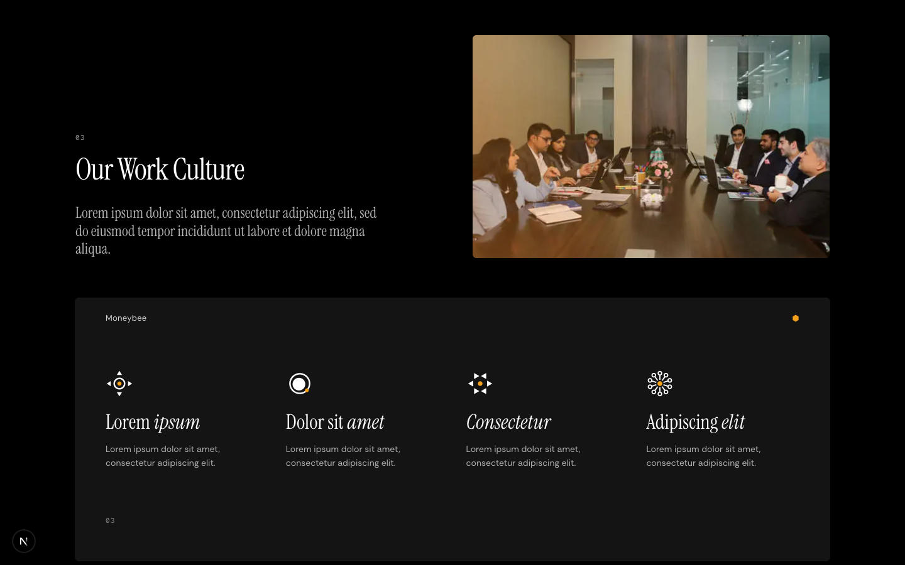 |

**How to Apply on 08.** 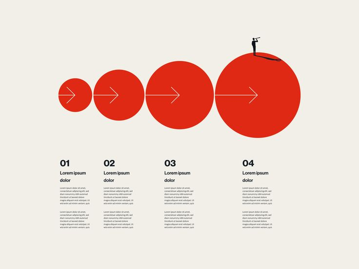

The stacked-sheets drawing goes. These four steps carry no data, so 08's own linear step stands: four orange discs, white arrows, the lookout on the last disc, and a numbered column under each disc.

| Current | Proposed |
| --- | --- |
| 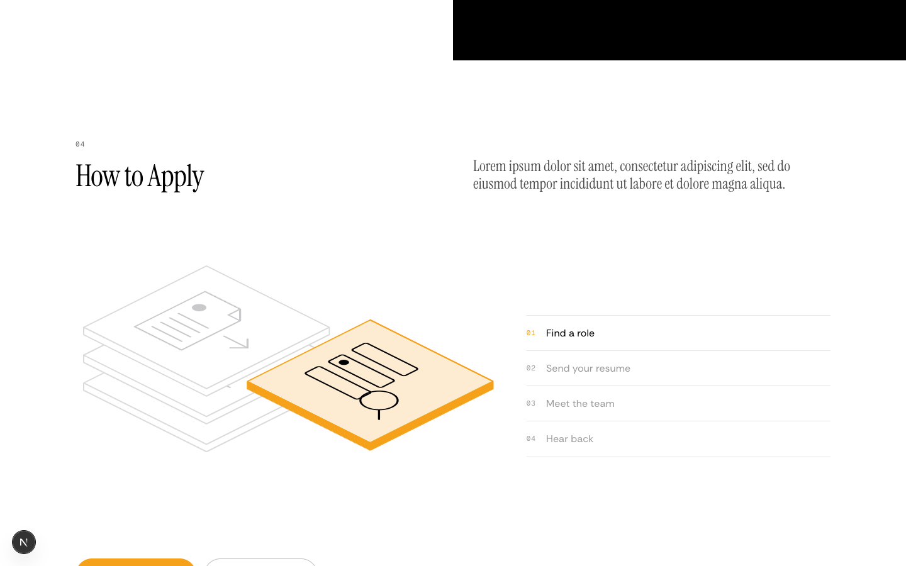 | 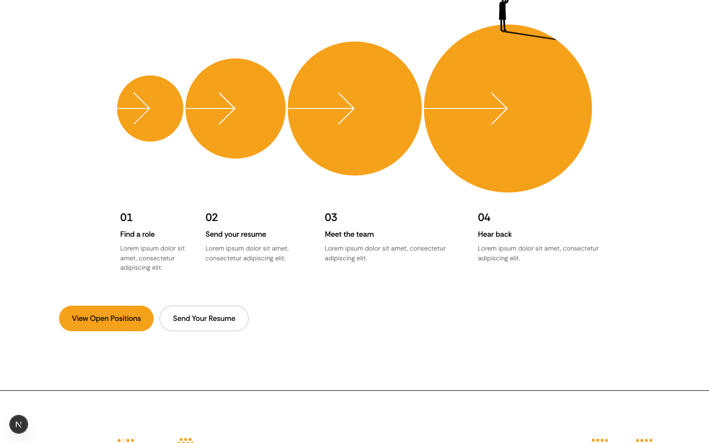 |

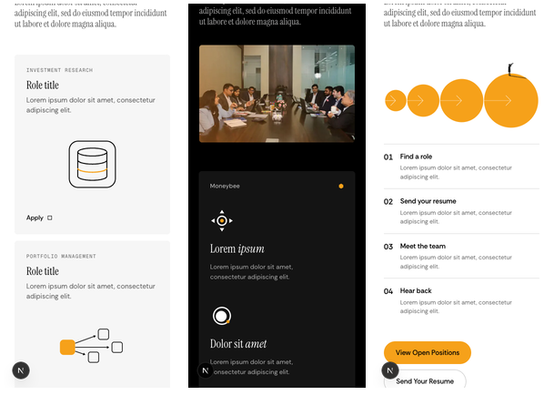

## Files

| File | Today | After |
| --- | --- | --- |
| `components/case-studies-v3/journey-block.tsx` | new | The 07 solid, faces, walker, callouts and leaders, plus a phone layout |
| `components/case-studies-v3/case-cards.tsx` | new | The card scroll, with one 07 block per company |
| `components/careers-v3/opening-cards.tsx` | new | 04 cards, with drawings from `reference/visual-language/04/moneybee.svg` |
| `components/careers-v3/culture-columns.tsx` | new | 03 card and glyphs |
| `components/careers-v3/apply-discs.tsx` | new | 08 discs and step columns, and the two CTAs |
| `app/layout.tsx` | Instrument Serif normal only | normal and italic |
| `app/case-studies/page.tsx` | CaseCardsSection | CaseCards (CaseStudyList and the timeline stay) |
| `app/careers/page.tsx` | Openings, Culture, Apply | OpeningCards, CultureColumns, ApplyDiscs (Life stays) |
| old drafts in `case-studies-v3/` and `careers-v3/` | unvetted agent work | deleted on approval |

## Left out

- The timeline on /case-studies repeats PAT from the charts above it. I'll raise that separately, since the plan asks for both.
- Role titles, culture points and step text stay lorem until HR sends copy.
- Next, being built now: /pms-vs-aif on 02, /investor-centre on 04, /team on 02.
