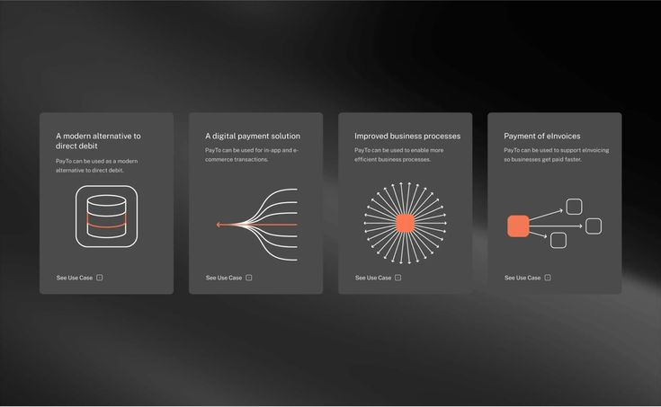
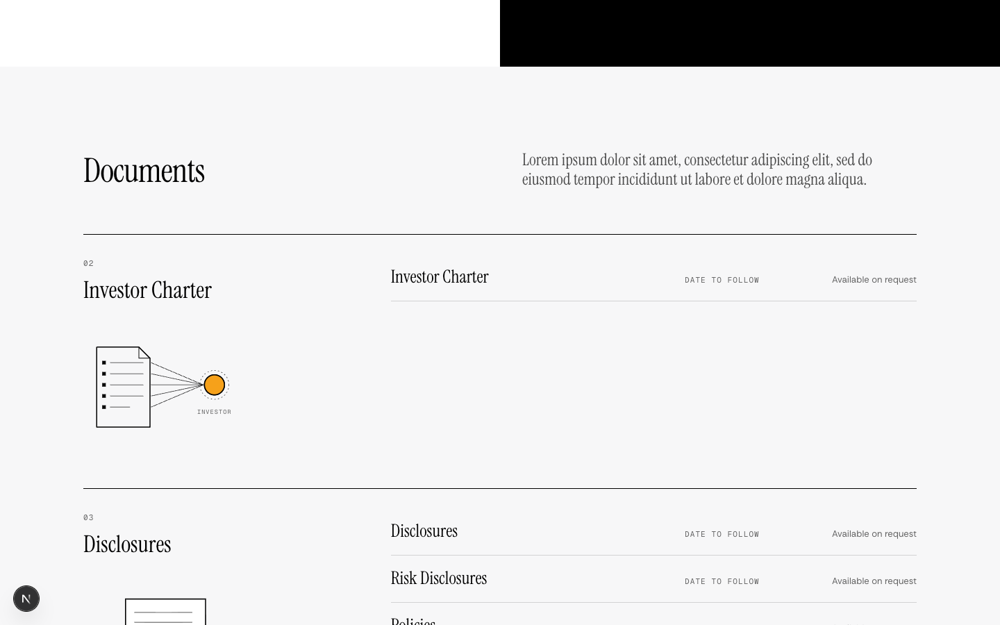
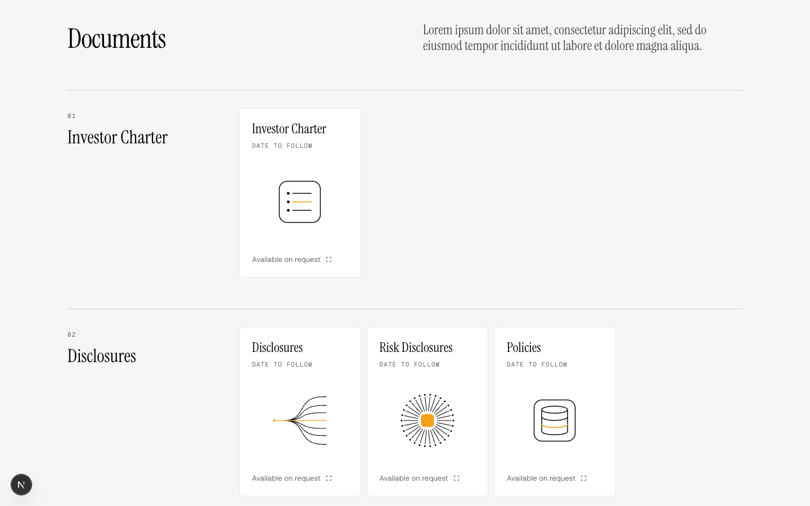
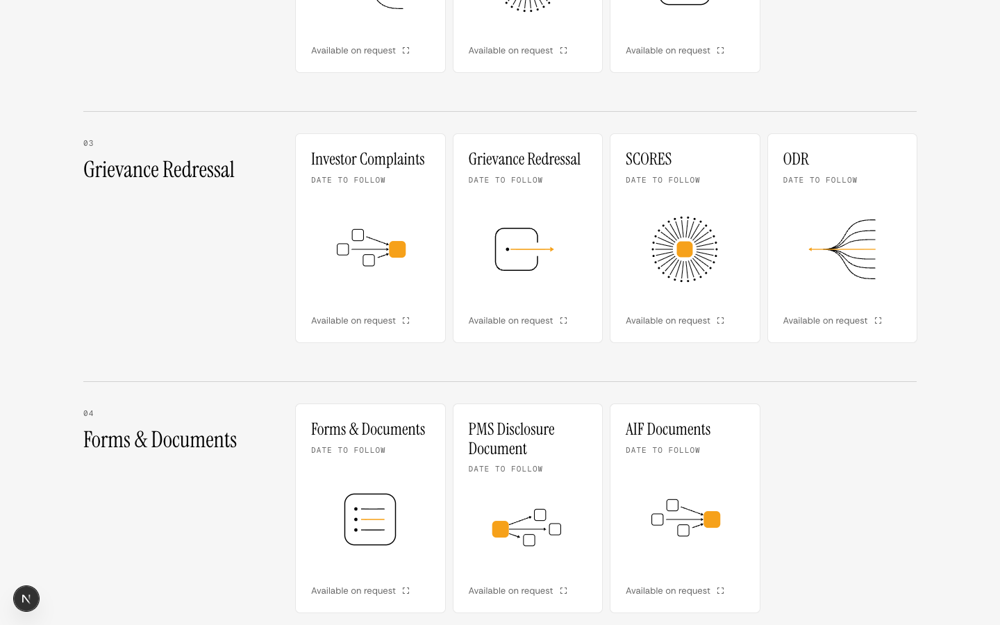
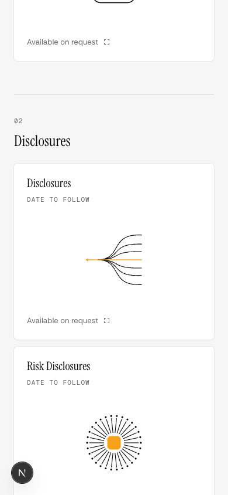

# Investor Centre: documents on reference 04

**Revised from your notes:** the PMS vs AIF posters and the founder's rings are gone. /pms-vs-aif keeps its current Simple Explanation, and /team keeps the current founder drawing. Nothing on either page changes.

**Missing:** the Investor Centre documents kept their old ruled lists under the new header.
**Becomes true:** every document is a 04 line card, as the plan asks: "simple document cards with clear titles, dates and view/download buttons".
**Proof:** preview at `/preview/investor-centre`, captured at 1440 and 390. No horizontal scroll, and the live page is unchanged until you approve.

Each of the eleven documents gets a 04 card under its group: title, date, a line drawing with one orange element, and the link with 04's small square. Until the client sends a file, the card reads "Available on request" instead of linking. The drawings come from the same 04 set as the live careers cards, now in `components/drawing/line-art.tsx`. Group and document ids stay the same, so the footer links still land.

| Current | Proposed |
| --- | --- |
|  |  |
| |  |

## Files

| File | Today | After |
| --- | --- | --- |
| `components/drawing/line-art.tsx` | new | 04's drawings, shared with the live careers cards (no visual change there) |
| `components/investor-v3/document-cards.tsx` | new | One 04 card per document, under its group |
| `app/investor-centre/page.tsx` | DocumentsSection | DocumentCards (the logins stay) |

## Left out

- The client and distributor logins stay as they are.
- After this: one review of the whole diff.
