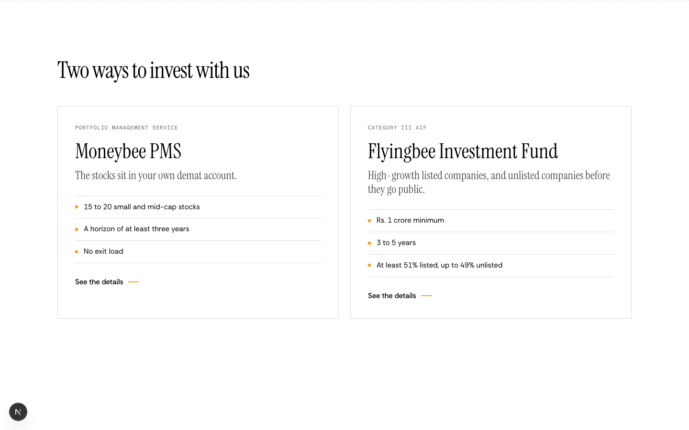
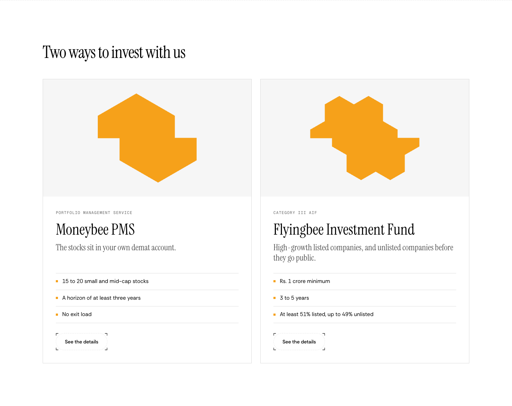
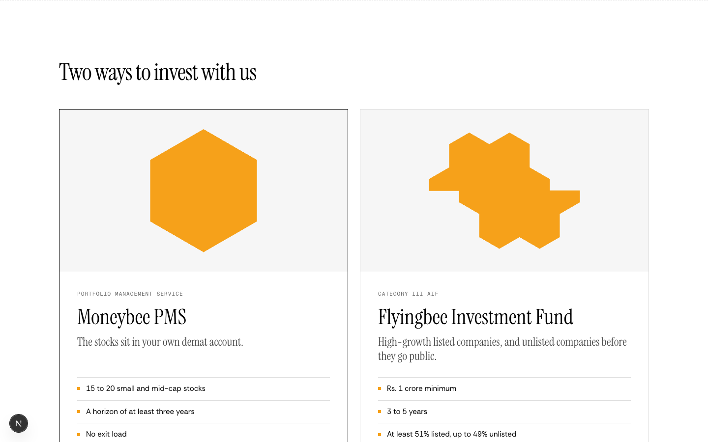
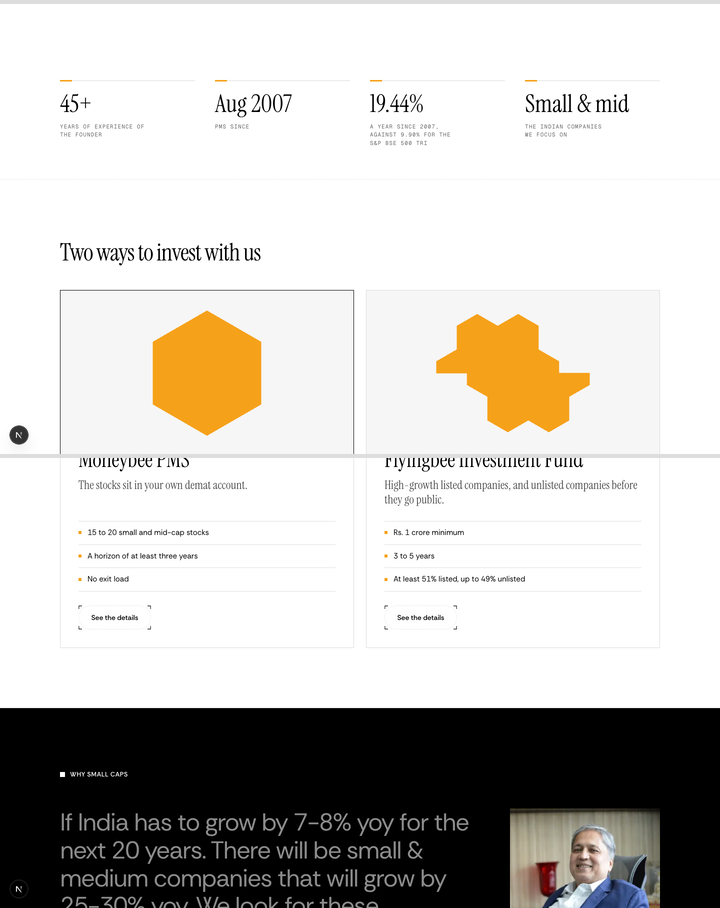

# Two ways to invest: better cards, before the founder

**Problem.** The PMS and AIF cards are two plain bordered boxes. Their fact lists sit at different heights, and their link reads as text. The section comes after the Dhiren Shah band.
**Result.** The section moves up, right after the hero. Each card opens on its product's mark from the /pms or /aif hero, which closes into a whole shape when you hover or focus the card. The two cards line up row for row. All copy stays as it is.
**Proof.** The screenshots below at 1440 and 390, with the PMS card hovered.

```
now:      Hero → Why small caps (Dhiren Shah) → Two ways → Philosophy → …
proposed: Hero → Two ways → Why small caps (Dhiren Shah) → Philosophy → …
```

Preview: `https://moneybees.localhost:1355/preview/home-two-ways` (deleted once this lands).

## Current and proposed, 1440





- **Mark:** the same orange mark each product page opens on. PMS is one honeycomb cell, a single portfolio. The AIF is seven cells merged, a pooled fund. The two marks cover the same area, so neither card outweighs the other.
- **Hover and focus:** the mark's two halves slide together over 0.7 s, on the hero's easing. With reduced motion, the halves meet without moving.
- **Alignment:** the two cards share row tracks. The AIF's two-line lead no longer pushes its facts and button below the PMS card's.
- **Button:** "See the details" becomes the hero's dashed bracket button. The whole card stays the link.

PMS card hovered:



## 390


## Around it

The hero's figures above, the black Why small caps band below:



## Files

| File | Change |
| --- | --- |
| `components/home/two-ways-section.tsx` | New: the reworked section |
| `components/home/home-sections.tsx` | The old `TwoWaysSection` and its `WAYS` list go |
| `app/page.tsx` | Two ways moves before the founder band |

## Worth knowing

- **Orange:** each mark is a solid orange field, larger than the site's usual orange accents. The product heroes use the same marks at full height, so this repeats their own identity rather than adding a new use of orange.
