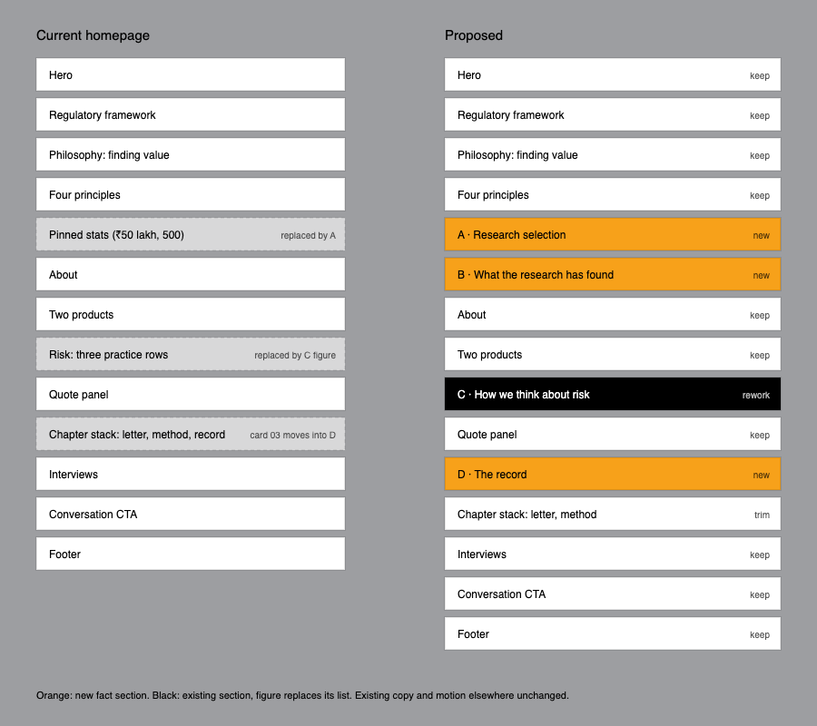

# Homepage fact sections

Replaces `plan.md` in this folder. The card grid is dropped.

## 1. Goal

The homepage at `/` says Moneybee researches deeply and manages risk, but it never shows the evidence. Its only figures are the SEBI minimum and a round "500".
Four scroll sections change that. Each one opens with text, builds its figure as you scroll, then lets the visitor hover (tap on mobile) any part of the figure to see the detail from the decks behind it.
Proof: each section built one at a time, starting with B (the pyramid) as the pattern check. Each gets a scroll recording and a hover pass at 390 / 900 / 1440.

## 2. Where they go

Only three existing things change. Pinned stats is removed. The risk section's three practice rows become section C's figure, and its heading, portrait and two closing panels ("Nothing hidden", "Capital held in trust") stay. Chapter-stack card 03 ("Where the figures live") moves into D, and the stack keeps the letter and the method. Everything else on the page stays as the client saw it.

Order logic: principles say what Moneybee believes. A shows the research, B what that research has found, then the page continues into the firm (about, products). C shows the risk rules, and D closes with the record before the conversation CTA.

## 3. The sections

Every section follows the same sequence:

1. **Text first.** A heading plus two or three sentences, in the homepage's light type.
2. **Scroll builds the figure.** It pins for about two viewports while it assembles. Under reduced motion there's no pin, and the figure appears complete.
3. **Hover to explore.** Hovering a part turns it orange, and a detail panel beside the figure shows the facts for that part. On touch, a tap does the same. The keyboard gets arrow keys between parts.
4. **Source line.** Deck, page and date under every figure. The caveat stays wherever the deck carries one.

### A · Research selection (replaces pinned stats)

- **Heading draft:** How ~6,000 companies become ~20
- **Scroll:** six planes stack top to bottom. Dots fall through and merge (the card animation, full size).
- **Hover a plane:** it turns orange. The panel shows the stage, the count and the work done there.

| Plane | Count | Panel shows (group profile p13) |
|---|---|---|
| Universe | ~6,000 | Starting universe: annual reports, in-house screeners, news flow, team experience |
| Investable | ~1,200 | Within ₹150 cr to ₹2,000 cr market cap |
| Shortlist | ~350 | Management quality, fundamentals, external events, timing |
| Analyse | >100 | Management meetings, plant visits, competitive advantage, peer comparison, financial models |
| Ideas | ~75 | Risk-reward, macro trends, buy at target price or add to watchlist |
| Portfolio | ~20 | Liquidity, sector exposure, risk management, quarterly reviews, sell discipline |

### B · What the research has found (new)

- **Heading draft:** What the research has found
- **Lead:** the deck's own thesis: capable, honest management and a sound business model, bought early, then growth and rerating (profile p14).
- **Scroll:** the pyramid builds tier by tier from the base, then turns once.
- **Hover a tier:** it turns orange and the panel lists what sits there.

| Tier | Panel |
|---|---|
| >100× | Fairchem Organics, Privi Speciality Chemicals |
| >20× | KPI Green Energy, Pitti Engineering. KPI Green opens its case study: solar IPP/CPP in Gujarat, ₹85 reference price (FY2023), revenue ₹59 cr → ₹1,024 cr and profit ₹6 cr → ₹162 cr over FY20–24 as a small bar chart |
| >10× | Uni Abex Alloy, Tejas Networks. Uni Abex opens its case study: heat- and corrosion-resistant castings, ₹58 reference price (FY2008), revenue ₹102 cr → ₹180 cr and profit ₹5 cr → ₹35 cr |
| >5× | More than 10 stocks |
| 2× or more | More than 25 stocks |

- **Caveat under the panel, from the deck:** shown for illustration only, not a recommendation. The decks give no purchase dates or return method. This is also where the old "business growth" card ends up, as case-study detail inside a tier instead of a figure on its own.
- Pitti Engineering's case study (profile slide 23) goes in the same way once I've read it.

### C · How we think about risk (existing section, list replaced)

- The heading, portrait and closing panels stay.
- **Figure:** a portfolio of about 18 holdings stacked in sector columns under a 30% ceiling line. Scroll assembles it.
- **Four risk labels around it (AIF deck p7).** Hovering one makes the figure demonstrate the rule and the panel states it:

| Risk | Figure shows | Panel |
|---|---|---|
| Concentration | A column rises to the 30% line and stops. The next block goes elsewhere. | 15 to 20 holdings, no sector above 30%, a single-stock limit set per portfolio |
| Valuation | A block is held outside the portfolio until its price marker drops below value | Margin of safety before buying |
| Liquidity | Blocks thin where trading volume is low. Unlisted blocks show an exit route. | Enough traded volume to enter and exit, and an exit route defined before an unlisted investment |
| Market | The portfolio holds steady while a price line swings behind it | Patience, a three-year horizon, no short-term trading |

- Below the figure, the six red flags (AIF p6) as a plain list, and the two exit triggers: target price reached, or the growth strategy changing.

### D · The record (new, absorbs chapter card 03)

- **Heading draft:** What ₹10 lakh became
- **Scroll:** two stacks rise. Queenbee reaches ₹2.885 crore, the S&P BSE 500 TRI ₹59.7 lakh, and the 4.83× bracket appears. Only the start and end values exist in the deck, so there's no year-by-year path and none will be invented.
- **Hover a period** in a row below (1m, 3m, 6m, 1y, 3y, 5y, since inception): both bars show that period's return, and the difference appears. 1y shows −7.45% against 1.95%, and the section doesn't hide it.
- **Method line:** TWRR, after expenses, APMI data, as at 31 July 2026, AIF deck p12. Chapter card 03's point about where figures are published moves here.

## 4. Files

| File | Change |
|---|---|
| `app/page.tsx` | Remove `<PinnedStats />`. Insert `<ResearchSection />` and `<PicksSection />` after principles. Replace the `riskPractices` rows with `<RiskFigure />`. Insert `<RecordSection />` before `ChapterStack`. |
| `components/option-one/chapter-stack.tsx` | Drop card 03. |
| `lib/insights.ts` *(new)* | All figures, tiers, stages, periods and sources in one typed module that every section reads. |
| `components/fact-sections/*` *(new)* | One file per section, plus a shared `FactSection` shell: text, pinned figure, detail panel, source line. |
| `components/insight-cards/moneybee-figures.tsx` | The figures take a scroll `progress` and an `active` part index instead of only a hover clock. The geometry is reused. |

## 5. Left out

- Compliance sign-off on the multiples, the case studies and the return table. The site is `noindex`, and every section shows its source.
- Rewriting existing homepage copy, including the "₹50 lakh" PMS minimum in the products list.
- The card grid and the `/insights/<slug>` pages from the previous plan.

## Next step after approval

Build B (the pyramid) on its own at `/preview/fact-sections` so you can judge the pattern: text, scroll build, hover tiers, company panel with the KPI Green case study. A, C and D follow the same shell once that's approved.
