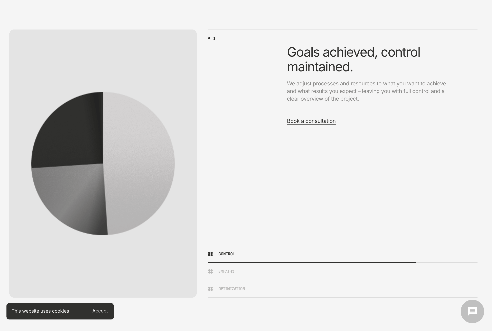

# Moneybee footer and chart preview

The research preview replaced the requested grainy segmented sphere with curves, and has no footer.
Restore the source chart motion and add a footer using the supplied gradient artwork on the isolated preview.
Verify source frame pixels, footer SVG values, scroll behaviour and desktop/mobile screenshots before integration.

```text
Research curves → Grainy segmented sphere
Preview ending  → Footer with supplied bars
```

## Source and intended appearance



The chart is a raster sequence inside a Lottie file, not vector wedges. The recovered file contains 233 PNG assets, a 564 × 540 composition and a 466-frame timeline at 60 fps. Individual images occupy two timeline frames. Its parent transform scales the artwork to 103%.

Use the recovered images with their actual timeline intervals and transform inside an SVG image viewport. Scroll selects frames forward and backward. Existing research selectors move to their corresponding positions. Retain the source grey, black and grain so the effect is preserved; use Moneybee orange on the active control. Treat this as a process illustration, not an allocation chart. Move research counts outside the sphere so they do not cover its shading.


Preserve all six gradient bars, their 32-stop gradients, overlap, order and proportions from the attached HTML. Keep the black upper area for the logo and footer navigation. Replace the attachment's serif wordmark with the supplied Moneybee SVG logo on a light logo area so its black lettering stays legible. The bars form the lower artwork, with no text over the bright gradients.

Footer links: About Us, PMS, AIF, Our Approach, Careers and Contact Us, using existing destinations. Include the existing external Investment Banking and Stock Broking destinations. Keep Client Login visibly unavailable until the internal system exists. No invented legal links, addresses or contact information.

## Files

| File | Today | After |
| --- | --- | --- |
| `app/preview/homepage/preview.tsx` | Research curves and metrics in the illustration, no footer | Uses the source chart, keeps counts in the copy area, mounts footer and adds a Footer jump link |
| `app/preview/homepage/preview.module.css` | Amber curve panel | Neutral chart panel, readable metric placement and responsive footer layout |
| `app/preview/homepage/research-chart.tsx` | Does not exist | SVG image sequence, source transform, scroll progress input and reduced-motion frame |
| `app/preview/homepage/preview-footer.tsx` | Does not exist | Existing destinations and supplied SVG logo above the original footer artwork |
| `public/preview/moneybee/` | Does not exist | Extracted chart frames, timing manifest and footer SVG without its text wordmark |
| `scripts/prepare-moneybee-preview.mjs` | Does not exist | Deterministically extracts pinned sources and checks frame hashes and SVG geometry/gradient values |
| `reference/medusmo/chart.json` | Newly pinned original animation | Unmodified source for extraction and comparison |
| `reference/footer-pulse/source.html` | Newly pinned supplied HTML | Unmodified source for footer artwork |

## Decisions in code

Use the existing Motion scroll value. The frame manifest comes from layer intervals, not guessed equal divisions.

```diff
- <ResearchDrawing stage={active} />
- <div className={s.visualMetric}>...</div>
+ <ResearchChart progress={scrollYProgress} stage={active} />
```

The chart uses source images inside SVG. This preserves the grain baked into the images and makes no claim that the original is pure vector artwork.

```tsx
<svg viewBox="0 0 564 540" aria-hidden="true">
  <g transform="translate(282 270) scale(1.03) translate(-282 -270)">
    <image href={frame.src} width="564" height="540" />
  </g>
</svg>
```

On desktop, select the source interval containing `progress * 466`, clamped before the end. Preload frames as the section approaches and retain the last decoded frame until the next is ready. On mobile and reduced motion, stage selectors choose still frames without requiring a long pinned scroll. Do not add an animation library for an image sequence.

```diff
  </section>
+ <PreviewFooter />
  </main>
```

Keep footer artwork scoped to the footer instead of copying the attachment's fixed full-window background.

```diff
- .gradient { position: fixed; inset: 0; }
+ .footerArtwork { display: block; width: 100%; height: auto; }
```

## Verification

1. Check every extracted PNG byte hash against the original embedded asset. Check timeline intervals and the 103% transform against the JSON.
2. Compare footer rectangle positions, dimensions and every gradient stop with the supplied SVG. The removed text wordmark is the intentional difference.
3. Compare original and rendered chart at first, middle and final frames at matching size. Report pixel differences and any resampling differences.
4. Exercise forward/backward scrolling, stage selectors, reduced motion and footer navigation. Capture desktop and mobile results, check text contrast and horizontal overflow.
5. Run focused ESLint and TypeScript checks. Leave all changes uncommitted.

## Outside this change

No integration into the actual homepage, no navbar redesign, no invented allocation percentages, no change to approved financial figures and no push. The newly supplied ivory hero artwork is a proposal only and is not included in this implementation. Exact source greys are retained for the chart; tinting its segments orange would be a separate visual adaptation.
