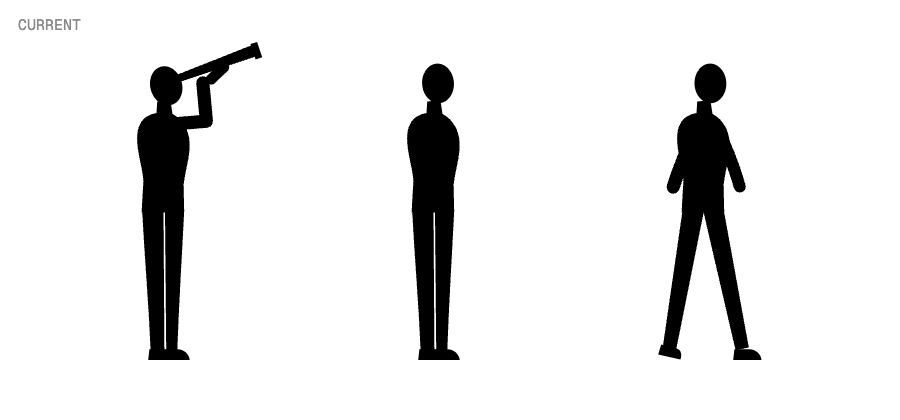
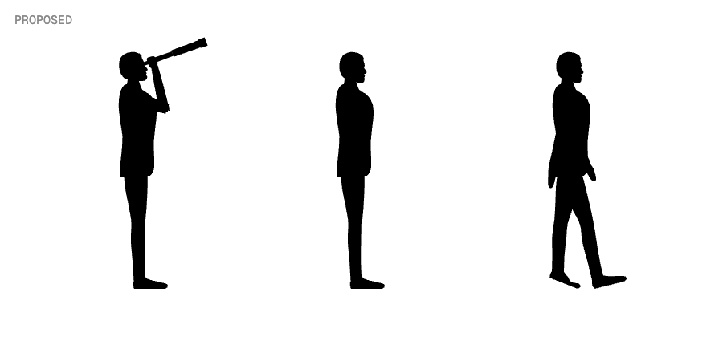
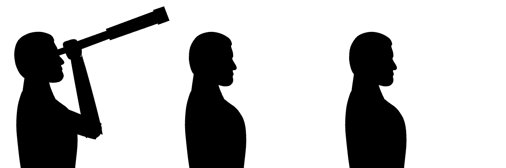
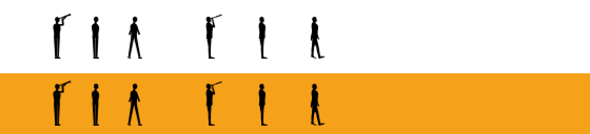

# Scale figures that look like people

**Wrong now.** The three figures in `components/drawing/lookout.tsx` face the viewer: an egg for a head, a peg for a neck, a bean torso, stick legs. They read as a robot.
**After.** The same three poses redrawn in profile facing right, as in studies 05 to 08: a man in a suit with a skull and hair, nose and chin, a neck that joins the shoulders, a jacket to the seat, trousers with knees, and dress shoes.
**Proof.** Same feet origin, height (98.4) and facing, so all five placements keep their size, position and shadow. Screenshots of each page after the swap.

## Current

## Proposed preview

Close up of the heads:

At the size they run (about 40 px). Left three are current, right three proposed, on white and on the disc orange:

## Where they appear

| Pose | Page | File |
| --- | --- | --- |
| Telescope | /pms selection, /our-approach philosophy, /performance wealth | `pms-v3/selection-lines.tsx`, `approach-v3/philosophy-discs.tsx`, `performance-v3/wealth-discs.tsx` |
| Standing | /pms risk blocks | `pms-v3/risk-blocks.tsx` |
| Walking | /about timeline | `drawing/journey-block.tsx` |

## File

| File | Today | After |
| --- | --- | --- |
| `components/drawing/lookout.tsx` | three frontal figures built from ellipses, blocks and stroked arms | three profile figures as filled paths, generated once from joint positions by `.plannotator/people-figures/build.mjs` and pasted in; same exports and `PERSON_HEIGHT` |

No caller changes. The arms become filled shapes, so the stroked `ARM` style goes away.

## Left out

- The cast shadows stay as they are. They start at the feet, which do not move.
- Figures stay black silhouettes, no faces drawn inside.
