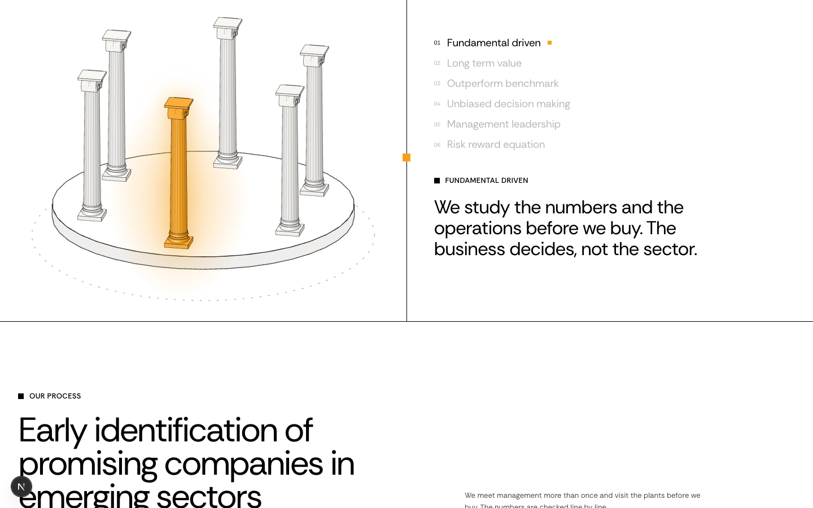
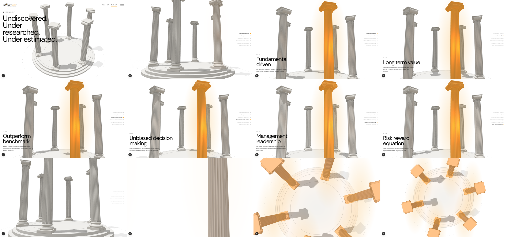
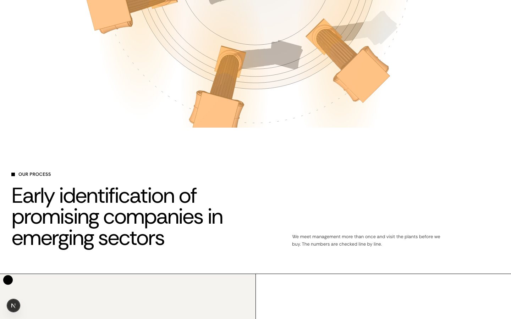

# Philosophy: a camera move through the columns

**What's wrong.** The philosophy section is a small flat drawing of six columns turning in a box, and the six pillars share one cramped text panel.
**What becomes true.** Scrolling through the section flies a camera down into a detailed 3D tholos, past each column in turn (one pillar per column, full screen), into the centre and up to a view from above, then straight into "Our process".
**How we prove it.** The storyboard below is the real preview at `/preview/philosophy`, captured at 1440×900. After approval the same scroll points are captured again on `/`.

## Current



## Proposed preview (working, at https://moneybees.localhost:1355/preview/philosophy)

Storyboard, left to right, top to bottom, at scroll progress 0, .14, .2, .32 / .44, .56, .68, .8 / .88, .93, .97, 1:



| Scroll | Shot |
| --- | --- |
| 0 to 0.14 | Opens on the whole ring from high on the right, under "Our philosophy" and the deck line. The camera comes down along your teal curve to column height; the heading fades. |
| 0.14 to 0.86 | The camera circles the ring once. Each pillar gets its own stretch: its column lights orange with a soft glow; the camera rises from base to capital and pushes in slightly as it passes; the card bottom left shows `01 / 06`, the pillar name large, and its sentence. A rail on the right lists all six with the current one marked. |
| 0.86 to 0.93 | In through the gap between two columns to the centre (the X on your sketch). All six start to light. |
| 0.93 to 1 | Straight up over the centre, looking down on the ring with all six lit. Scrolling on runs into "Our process" (below). |

Hand-off into the next section:



## Files

| File | Today | After |
| --- | --- | --- |
| `components/philosophy/tholos.ts` | new | three.js scene: detailed Ionic column (plinth, Attic base with torus-scotia-torus, 24-flute shaft with fillets and entasis, astragal with bead-and-reel, echinus with egg-and-dart, twin bolsters with balteus, three-turn spiral volute faces with eyes, canalis, bevelled abacus), three-step round base with joint lines, dashed ground ring, soft shadows, per-column orange glow. Also the camera path and which column is lit at each scroll point. |
| `components/philosophy/philosophy-flythrough.tsx` | new | The pinned section (760svh tall, canvas sticky), heading, six pillar cards, pillar rail. three.js loads only when the section mounts; frames render only while it is on screen. |
| `app/page.tsx` | renders `PhilosophySection` | renders `PhilosophyFlythrough` in the same place |
| `components/fact-sections/philosophy-section.tsx`, `ionic-column.tsx` | the flat version | unused (not deleted unless you say) |
| `app/preview/philosophy/page.tsx` | new | preview route |

## Decisions in the code

```ts
// One pillar per sixth of the orbit; the camera leads each column slightly so it is seen three-quarter on.
export const pillarCentre = (index: number) => DESCENT_END + ((index + 0.5) / COLUMN_COUNT) * (ORBIT_END - DESCENT_END);
```

```ts
// Motion's array form of useTransform is handed to the browser's scroll timeline,
// which mis-maps ranges once the scroll passes them (the heading came back at 0.5).
const introOpacity = useTransform(scrollYProgress, (value) => between(value, [0, 0.077, 0.126], [1, 1, 0]));
```

The ending departs from your sketch on purpose: the camera does reach the centre X, but from inside the ring a column 3.2 m away can't be framed whole, so it then rises to look down on all six.

## Left out, and still to check

- Reduced motion: no fly-through; the opening view is shown still with all six pillars as a list. Not yet screenshotted.
- Mobile: lens widens on narrow screens; not yet checked on a phone-sized viewport.
- Performance: not yet measured. Six columns share geometry; eggs and beads are instanced; shadows are one 2048 map.
- The section is long (7.6 screens of scroll). Easy to shorten if it drags.
- No video: webreel is not installed and Argent can't record Chromium, so this is a storyboard of the real preview.
