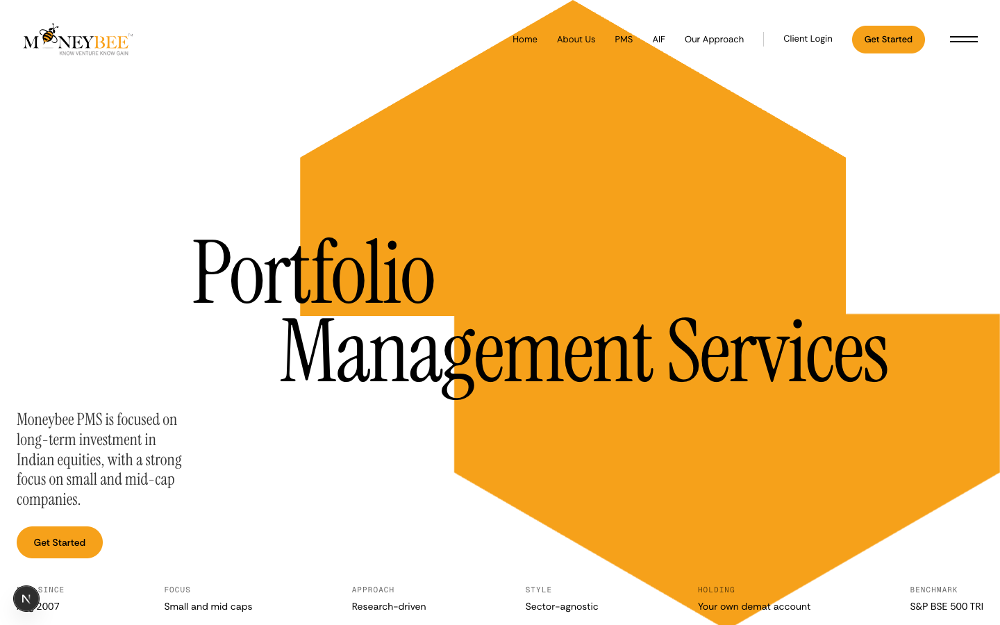
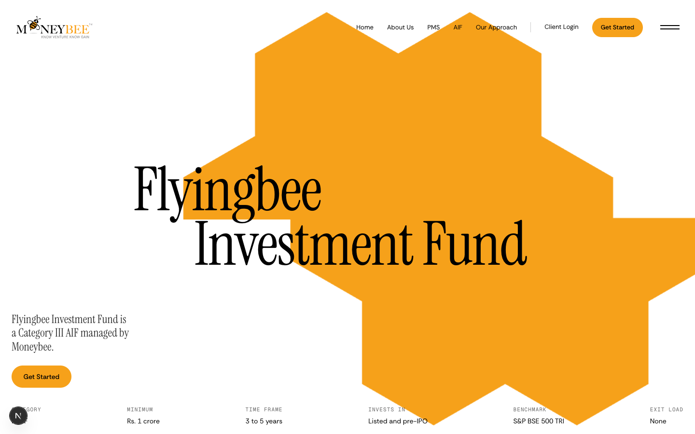
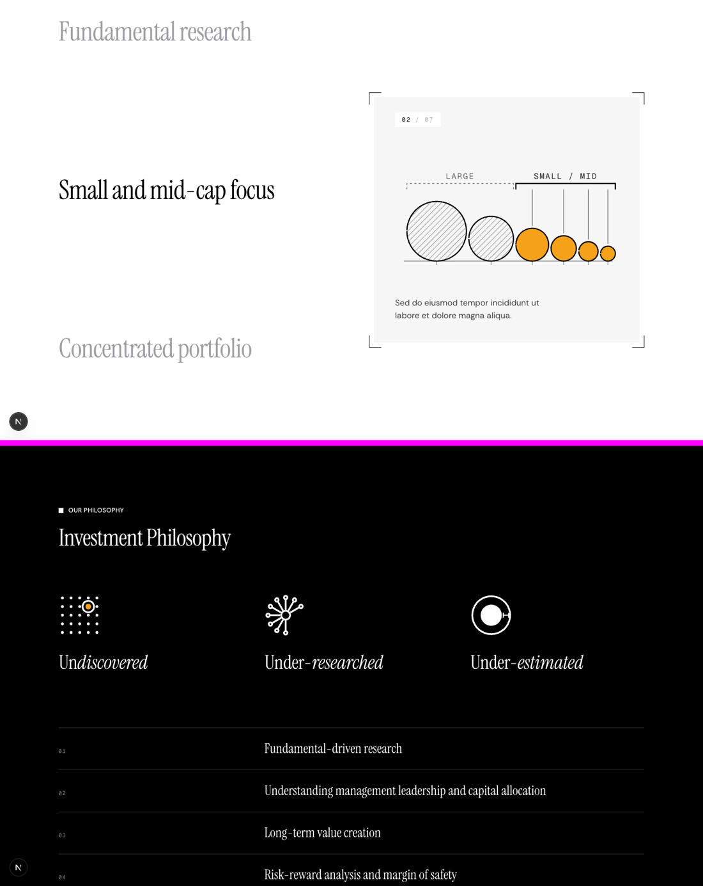
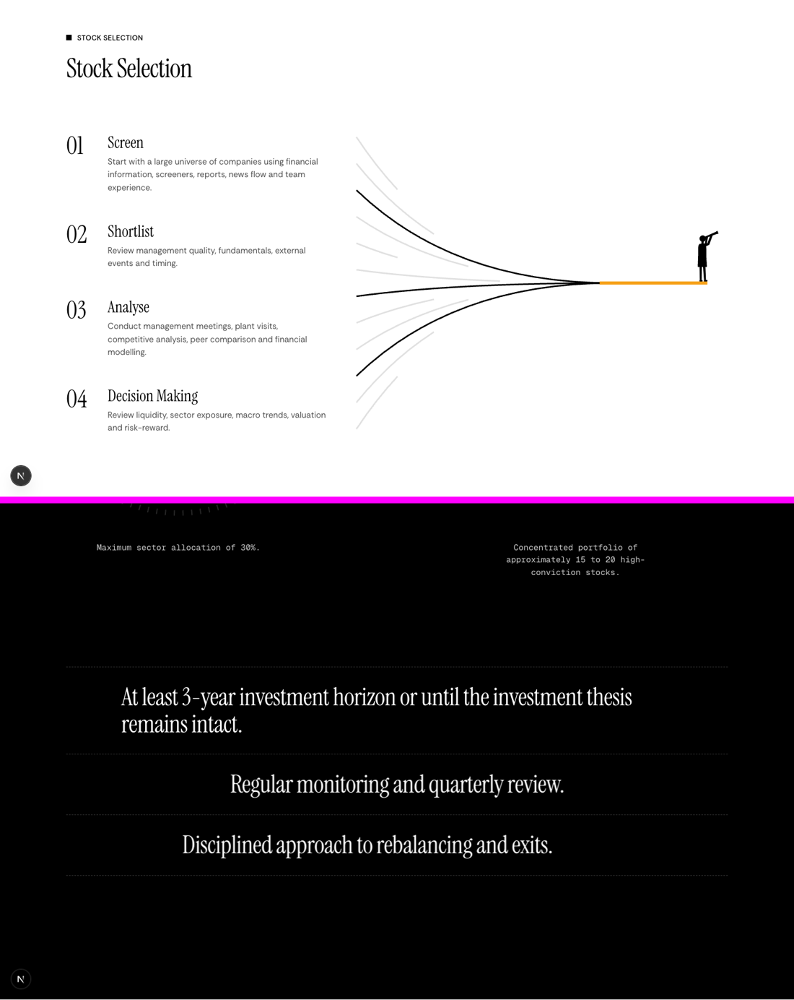
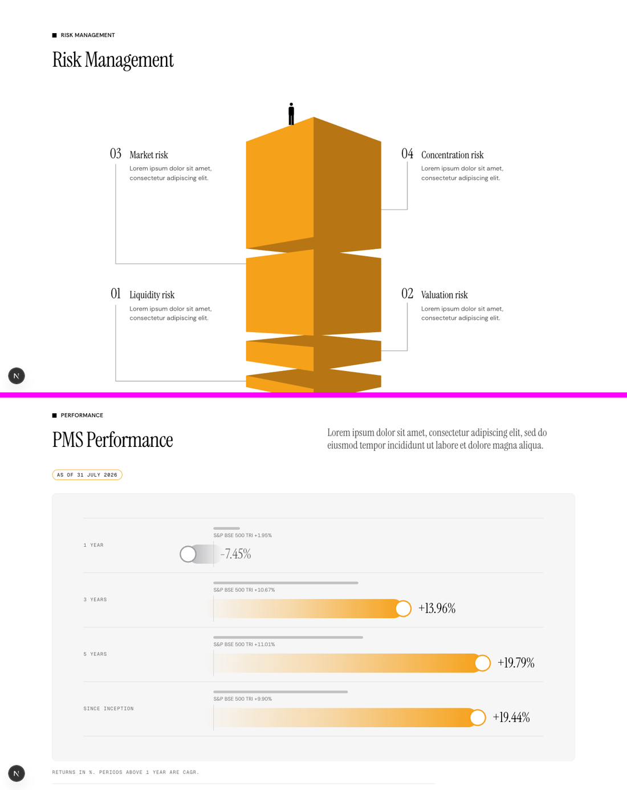
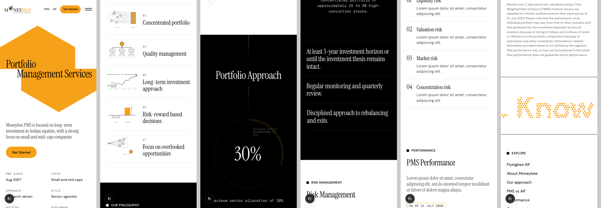
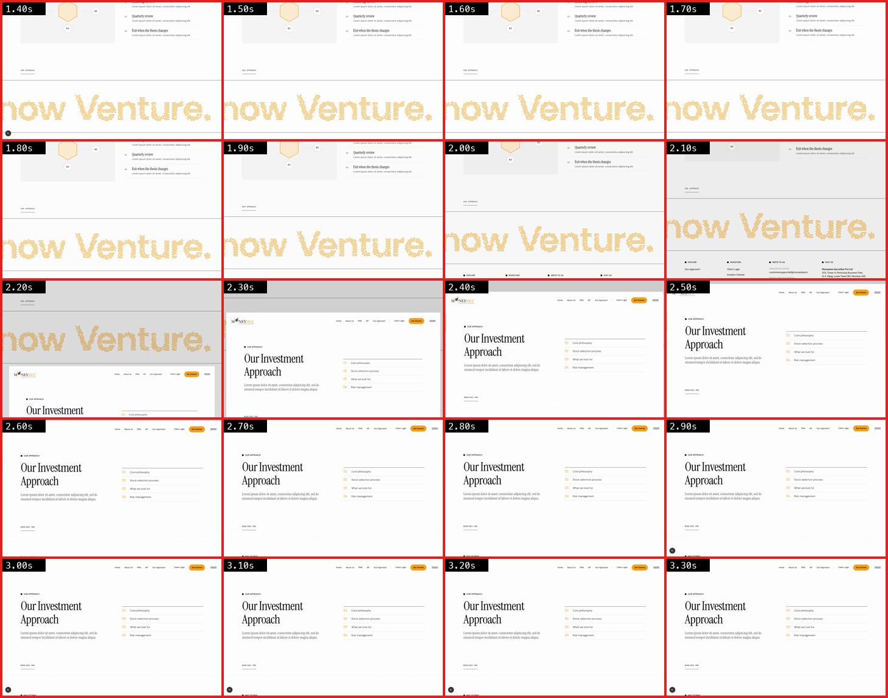

# /pms rebuilt on Tres Mares, Titan Gate and the figure studies

**Wrong now:** the /pms header is text with an "on this page" index ("not deserving of header"). The funnel looks amateur. Risk Management repeated Portfolio Approach. The sections read as one template repeated.
**After:** /pms opens on Tres Mares' product header in our orange, and every section is a different scroll pattern rebuilt from the references. Each figure was measured and diffed in `reference/visual-language/`. /aif gets the same header, with its own mark, so PMS and AIF stay on equal footing. The PMS Performance chart you love stays exactly as it is.
**Proof:** the preview at `https://moneybees.localhost:1355/preview/pms` (and `/preview/aif`), the screenshots and scroll video below. /pms is unchanged until you approve.

## Current vs proposed header

| Current /pms | Proposed /pms | Proposed /aif (same template) |
| --- | --- | --- |
|  |  |  |

How the header works (Tres Mares `herosolutions`, values read from their source):
- **The mark:** a huge orange mark fills the right side, split on the centre line. It builds over 2s (expo in-out) after 0.5s.
- **The title:** two stepped lines in Instrument Serif. The second line slides into its step over 2.2s after 0.8s, using `mix-blend-mode: multiply` so it darkens over the orange.
- **Below the title:** one docx sentence at bottom-left, one Get Started button (the docx asks for it), and a strip of six figures along the bottom.
- **What's gone:** no eyebrow, no button row and no index.
- **The marks:** both come from our hexagon. PMS is one hexagon (your own portfolio). AIF is seven cells merged into one pooled shape, with equal orange area.

## The page, section by section (1440)

1. **Why Moneybee PMS?** This is Titan Gate's sticky split. The seven docx points scroll on the left; a sticky pane swaps each point's drawing at the viewport centre while a "01 / 07" counter rolls its digits.
2. **Investment Philosophy** (black band). These are the Futerra glyph columns from study 03: Un*discovered*, Under-*researched*, Under-*estimated*, each with a symbol that draws on (the found dot is the one orange element). The five docx philosophy points sit below.

3. **Stock Selection.** This is the converging-lines figure from study 05: 12 measured quadratic curves sharing one control point. As each docx step enters, the curves still in play draw on and the dropped ones fade to 12%. Three survivors reach the point, then the orange portfolio line and the figure with the telescope appear. It replaces the trapezoid funnel.
4. **Portfolio Approach** (black band). This is Titan Gate's "Access That Speaks for Itself":
   - **"30%"** sits in a ring of 100 ticks that fills clockwise and stops at exactly 30%. This was checked by sampling all 100 tick pixels: ticks 0–29 are orange and 30 is dim.
   - **"15–20"** sits over three thin circles: the outer two slide apart and the centre one grows.
   - Both numbers scramble for 0.75s before settling.
   - The three remaining docx rules slide in below.

5. **Risk Management.** This is the stacked-blocks figure from study 06 (two-point perspective, measured, 0.994 overlap with the original). It carries the four docx §6 risks with elbow leaders. The shaded face is `#B77613`, picked over `#8C5E22`, which read brown.
6. **PMS Performance.** The existing component is unchanged.

There is no "Let's talk" band.

**Scroll video (1440):** [full/pms-scroll-1440.webm](full/pms-scroll-1440.webm)

**Phone (390), no sideways scroll** (page width measured at exactly 390):

## Page transition

Tres Mares (measured in `reference/page-transitions/NOTES.md`): over black, the old page drifts to −50vh and dims to 0.8 while the new page rises from translateY(100vh) scale(.8) to rest. It takes 1400ms with GSAP's expo.inOut. At 1100px and below it's a 0.4s fade out and in.

The prototype is built with React `<ViewTransition>`; no GSAP was needed. Demo routes: `/preview/transition-a` ↔ `/preview/transition-b`.

**What it does:**
- **Timing:** measured against Tres Mares. The slide starts about 155ms after the click (theirs is 166ms) and runs for 1400ms. At 700ms the old page is at −224.9px (target −225).
- **Back and forward:** both play the same slide. Next's own back/forward swap skips view transitions, so the prototype replays them as `router.replace` without changing the history.
- **Fast repeat clicks:** ignored while a slide runs, as Tres Mares does.
- **Phone (≤1100px):** a 400ms fade out, then a 400ms fade in.
- **Reduced motion:** a 200ms fade.
- **Header:** moves with its page and never shows twice.

**Recordings:** [transition/desktop-1440.webm](transition/desktop-1440.webm) and [transition/mobile-390.webm](transition/mobile-390.webm).

**After approval it goes site-wide:** every page renders inside `<PageTransition>`, and the nav, footer and in-page links use `TransitionLink`. The prototype currently lists only the two demo routes in `components/transition/routes.ts`.

**Untested:** Safari and Firefox. A page taller than about 16,000px may get a clipped old snapshot. /pms is about 11,400px tall.

## Files

| File | Today | After approval |
| --- | --- | --- |
| `components/pms-v3/product-hero.tsx`, `marks.tsx`, `lib/pms-v3-hero.ts` (new) | none | The product header and both marks, with PMS and AIF data |
| `components/pms-v3/why-sticky.tsx` (new) | none | The sticky split with the counter (reuses `WHY_GLYPHS`) |
| `components/pms-v3/philosophy.tsx` (new) | none | The glyph columns and the five points |
| `components/pms-v3/selection-lines.tsx` (new) | none | The converging lines |
| `components/pms-v3/portfolio-stats.tsx` (new) | none | The tick ring and circles stats band |
| `components/pms-v3/risk-blocks.tsx` (new) | none | The perspective blocks |
| `app/pms/page.tsx` | pms-v2 hero, why grid, philosophy, funnel, stack loop, risk hex, chart, Let's talk | The v3 sections above, the same `PerformanceChart`, and no Let's talk |
| `app/aif/page.tsx` | aif-v2 hero with its index | `ProductHero` with `AIF_HERO`. Its other sections stay for now |
| `components/pms-v2/*`, `lib/pms-v2.ts` | the old sections | `performance-chart.tsx`, `glyphs` and the data stay. The replaced hero, funnel, risk and stack sections get removed |
| `components/transition/*` (new) | none | The page transition, switched on for every route; the nav and footer links become `TransitionLink` |
| `app/preview/pms`, `aif`, `pms-parts/*`, `transition-a`, `transition-b` (new) | none | Deleted after the swap |

## Choices worth checking

- **Six header figures.** These are deliberately facts not shown again lower on the page:
  - **PMS:** since Aug 2007, small and mid caps, research-driven, sector-agnostic, your own demat account, and the S&P BSE 500 TRI.
  - **AIF:** Category III, Rs. 1 crore, 3 to 5 years, listed and pre-IPO, S&P BSE 500 TRI, and no exit load.
- **The 30% ring has 100 ticks,** not Titan Gate's 132, so one tick is exactly 1% and the stop is exact.
- **Risk Management uses §6's four risks.** That makes it no longer a copy of Portfolio Approach on this page, but /our-approach shows the same four risks.

## Left out, and open

- /aif below its header, and the other internal pages, will follow the same approach after this is approved.
- **The inactive names in Why Moneybee PMS** use grey `#9D9EA1` at 2.7:1, under the 3:1 minimum for large text. I'll darken them to about `#767676` in the swap unless you prefer the lighter look.
- **The Portfolio Approach list slide** uses CSS scroll timelines. Firefox shows the rows in place with no slide.
- Body copy where the docx gives none is still lorem.
- **Webreel** was not used. The scroll video is an Agent Browser recording.
