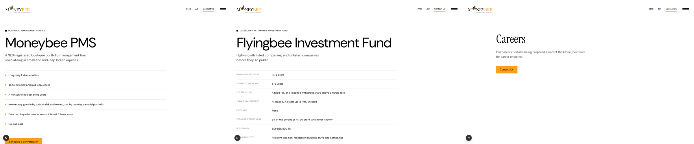

# Product pages: /pms, /aif, /careers

**Wrong:** the product pages open in a different voice (large sans heading, plain list) from the homepage, and three built sections with deck content are unused.
**Becomes true:** both product pages share the homepage's editorial style and one skeleton, with the product's own middle, a way across to the other product, and a closing ask with that product's FAQs.
**Proof:** screenshots of /pms and /aif at 1440 and 390 after the build; no console errors.

## Skeleton (both)
1. Hero: label, serif name, lead, "Schedule a conversation" + link to the other product, orange figures strip.
2. Product middle (below).
3. Selection lists, risk, chapter stack (as now).
4. "PMS or AIF?" band from `PMS_VS_AIF`, linking across.
5. Let's talk, then FAQs filtered to the product.

## /pms middle
Full points list · Why small caps (`why-small-caps-section`, unused) · Performance (disc stacks + returns bars).

## /aif middle
Full terms table · TWRR returns · Fund structure (`structure-section`, unused) · partners band.

## /careers
Restyled to match; no deck content exists for careers, so no new copy.

## Files
| File | After |
| --- | --- |
| `components/products/product-page.tsx` | new: composes each page |
| `components/fact-sections/products-section.tsx` | hero + details per product in editorial style |
| `components/home/home-sections.tsx` | `FaqSection` takes the questions to show |
| `lib/insights.ts` | each FAQ tagged pms / aif / both |
| `app/[section]/page.tsx` | renders `ProductPage`; careers restyled |

## Left out
PMS minimum investment (not in decks). No careers copy.
