# Every section: graphics, words, motion

## Goal

Each page follows the docx's list of items, but the graphics and motion were chosen page by page, so the site has no shared visual system.
After this plan, every docx section has one explainer graphic, one way of wording it and one motion drawn from four measured references, all in a shared visual style taken from kobbe.io.
Proof: each page is rebuilt against this table, then pixel-checked at 1440 and 390, and the timings are read off the running page and compared with the reference notes.

Investor Centre is out: it is internal. Insights has no docx content and waits on the client.

## The system, before the pages

```
kobbe style (type, whitespace, panels)
        │
        ├─ Stack loop    (movin 04122)  → structures: fund, portfolio, group
        ├─ Lit rows      (movin 04076)  → performance: Moneybee vs benchmark
        ├─ Card scroll   (360 Lex)      → a few pinned sequences
        └─ Contact form  (realevate)    → contact page only
```

### Visual style, from kobbe (reference/kobbe/NOTES.md)


| Item | Now | After |
|---|---|---|
| Section lead | Bracket eyebrow + serif subhead + lorem paragraph | Sentence-case label, then **one paragraph: a black first sentence (the docx heading line) and grey follow-on text** (`rgba(0,0,0,.55)`, which passes AA; `#9D9EA1` does not) |
| Graphic frame | Graphics sit loose on white | Every explainer sits in one panel: `#F6F6F6` fill, 10px radius, 1px `rgba(0,0,0,.06)` ring, bottom 15% fades to white |
| Section spacing | 80 to 220px | 128px between sections, 200px above the first |
| Orange | Buttons, rules, random highlights | Only: Get Started, the active nav item, the one lit element inside each graphic, and key numbers |
| Weight | Mixed 400 to 600 | 400 everywhere, 500 on buttons |
| Kept | Instrument Serif headings, pill buttons, isometric line drawings | kobbe's raster crowd illustration and Inter are rejected |

### Motion cadence (all four references plus what we already ship)

| Kind | Timing | Source |
|---|---|---|
| Entrance | 0.7s, `cubic-bezier(.22,1,.36,1)`, 12px rise, 70ms stagger | our `mb-rise`; movin 04076 row stagger (70ms) |
| Hover / press | 160ms `(.23,1,.32,1)`, scale .97 | our `BUTTON` |
| Stack loop | 6.8s cycle: slide out 1.2s ease-out, hold 1.7s, slide back 1.2s ease-in-out, rest 2.7s | movin 04122 |
| Lit row | Grey rows enter 70ms apart, the lit bar fills 0.6s ease-out, ring draws 0.53s, text rises after | movin 04076 |
| Card scroll | Pinned stage, each card slides up linearly over one viewport (~100svh), 60svh hold after the last | 360 Lex; matches our 520svh / 6-step approach band |
| Reduced motion | Every graphic shows its final frame, no loops | existing rule |

Each page gets **at most one** pinned scroll and loops play only while on screen (kobbe is nearly static; the site should stay calm).

---

## Reference frames

| Stack loop | Lit rows | Card scroll | Contact |
|---|---|---|---|
|  |  |  |  |

Palette swap everywhere: blue / teal becomes `#F6A11A`, fills become a 15% orange tint, grey outlines `#DADADA` at 1.5px. The lit-row gradient becomes a single hue, transparent grey to orange, no teal.

---

## Page by page

Words: headings and list items stay verbatim from the docx. "How we talk about it" is the black lead sentence plus the grey follow-on. The follow-on is written plainly from deck facts, replacing lorem wherever the deck has the fact; where it does not, lorem stays and is listed at the end.

### 1. Home

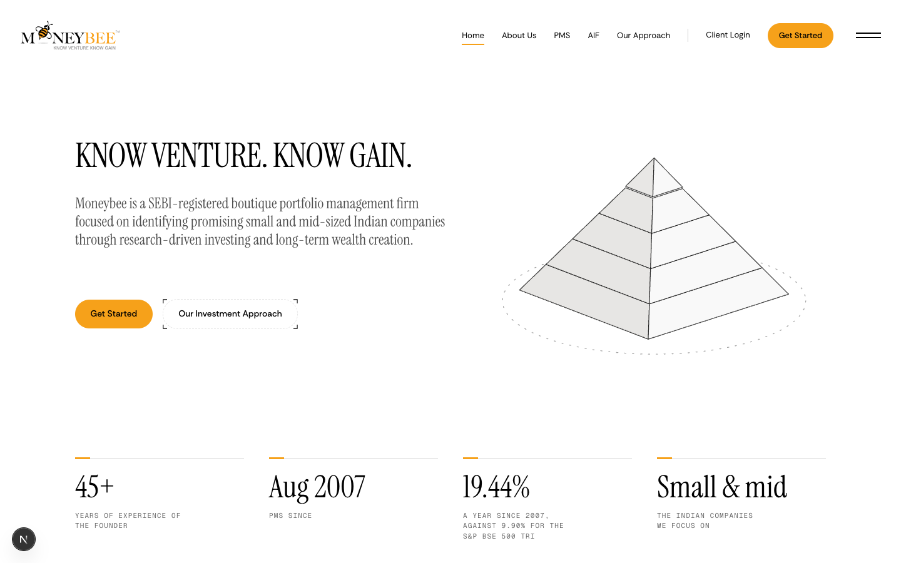

| Docx block | How we talk about it | Graphic | Motion |
|---|---|---|---|
| KNOW VENTURE. KNOW GAIN. + intro | Heading verbatim, docx intro | Hero pyramid (kept) | Rise, as now |
| Why Moneybee (5 highlights) | "Five things that have not changed since 2007." + highlights | Wealth chart beside the list (kept) inside a panel | Rows rise 70ms apart |
| Our Investment Approach | "Undiscovered, under-researched, under-estimated." grey: the three words explained | Philosophy fly-through (kept) | Pinned, as now |
| PMS / Flyingbee AIF | Docx names | The two existing cards, side by side and identical in weight (equal footing, user 2026-09-30) | Rise |
| Performance | "19.44% a year since August 2007." grey: against 9.90% for the benchmark | **Lit rows**, 4 periods, links to /performance | Lit row on view |
| Our Team | "People Behind Moneybee." | Team roster (kept) | as now |
| Get Started | Orange band | — | — |

Not in docx, proposed to remove: Recognition, Multibagger picks (lives on /case-studies), FAQ. **Your call**, listed in open questions.

### 2. About

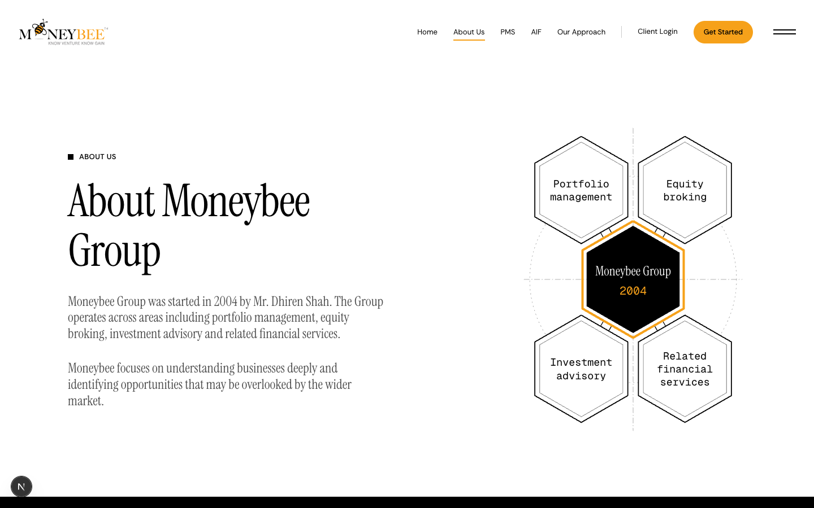

| Docx block | How we talk | Graphic | Motion |
|---|---|---|---|
| About Moneybee Group | Docx paragraph 1 black, paragraph 2 grey | Group honeycomb (kept), in a panel | Stack loop variant: the four hexes are sheets, **portfolio management** stays lit |
| Founder | "Mr. Dhiren Shah, Managing Director." grey: credentials | Founder photo + credential chips | Rise |
| Timeline | "2004, then PMS in August 2007." | Timeline as **card scroll**: 2004 → Aug 2007 → today, each a card | Card scroll, 3 cards, ~300svh |
| Moneybee Story | The bee quote verbatim | Nectar → honey / money → wealth drawing (kept) | as now |
| Team photos | — | `moneybee-team.jpg` in a faded-bottom panel | none |

### 3. PMS

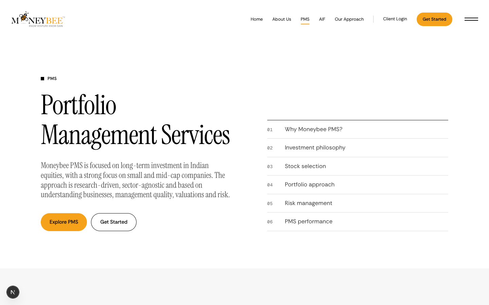

| Docx block | How we talk | Graphic | Motion |
|---|---|---|---|
| Intro | Docx intro, first sentence black | — | Rise |
| Why Moneybee PMS? (7) | "Seven rules the portfolio follows." | Grid of 7 (kept), lorem removed from cards | Rise, 70ms stagger |
| Investment Philosophy | Three words + 5 points | Value/price/margin drawing (kept) | as now |
| Stock-selection funnel | "From the whole market to 15 to 20 stocks." | Flat trapezoid funnel (kept, not stacked sheets) | as now |
| Portfolio Approach | "15 to 20 stocks, no sector above 30%." | **Stack loop, five sheets** = the five portfolio rules; each slides out in turn, the 30% sheet carries the cap line | Stack loop, cycles through 5 |
| Risk management | Uses `RISK_CONTROLS` (margin of safety, sector cap, quarterly review, exit on thesis change), which is deck content tied to §3 | Four controls around a hex | Rise |
| Performance chart | Same lit rows as /performance, 4 periods | Lit rows | Lit row |
| CTA | Hero: **orange Get Started** + outline Explore PMS | — | — |

### 4. AIF

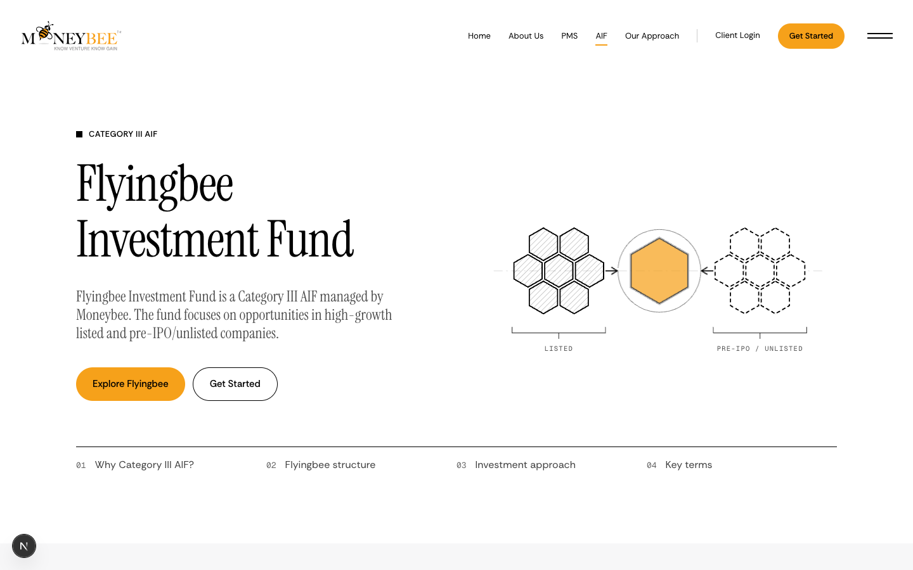

| Docx block | How we talk | Graphic | Motion |
|---|---|---|---|
| Intro | Docx intro | Fund graphic (kept) | Rise |
| Why Category III AIF? | "You hold units, not shares." grey: the pooled-vehicle sentence | PMS demat vs AIF units pair (kept) | as now |
| Flyingbee Structure | "Investors → Fund → Manager." | **Card scroll, the page's one pin**: card 1 Investors (light, full width), card 2 Fund (black, right half), card 3 Moneybee Investment Manager (orange, bottom-left); Trustee, Custodian & Fund Accountant, RTA, Brokers arrive as four chips on card 2 | Card scroll, 3 cards + chips, ~340svh |
| Investment Approach (7) | "Seven filters before a stock enters the fund." | Dot field narrowing (kept) | as now |
| Key Terms | ₹1 Crore, 3–5 years, listed + pre-IPO, S&P BSE 500 TRI, no exit load | Five term glyphs (kept) in panels | Rise |
| CTA | Hero: **orange Get Started** + outline Explore Flyingbee | — | — |

### 5. PMS vs AIF

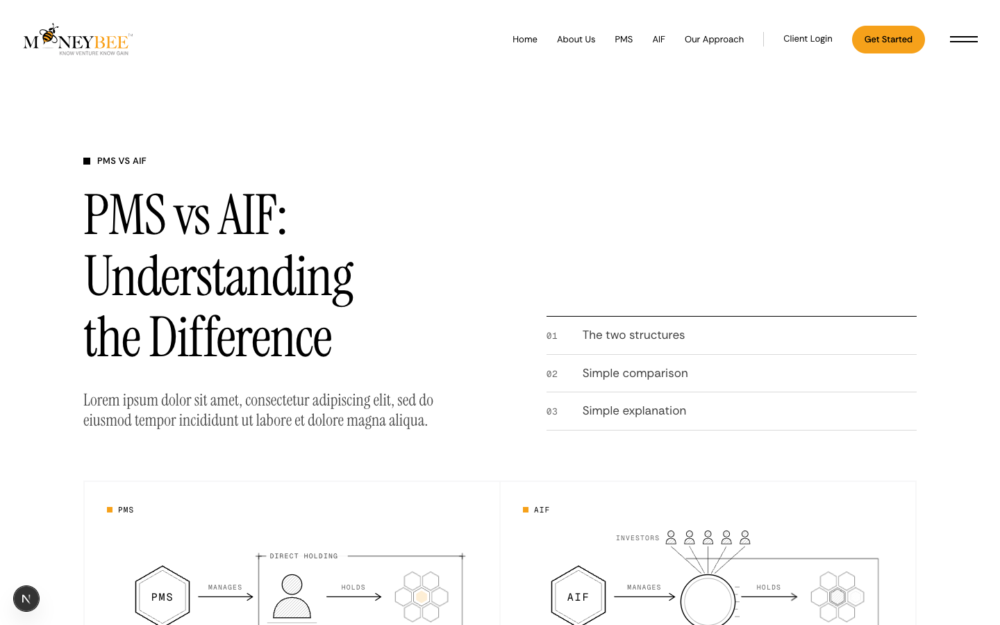

| Docx block | How we talk | Graphic | Motion |
|---|---|---|---|
| Heading | Verbatim | — | — |
| Simple Comparison (5 rows) | Table verbatim | Table with glyphs (kept); duplicate lorem removed | Rows rise 70ms |
| Two diagrams | Docx lines | Existing PMS and AIF chain diagrams (kept). The stack is not used to tell PMS and AIF apart. | Rise |
| Simple Explanation | Two docx sentences | Mandate / Pool drawings (kept) | as now |

### 6. Our Approach

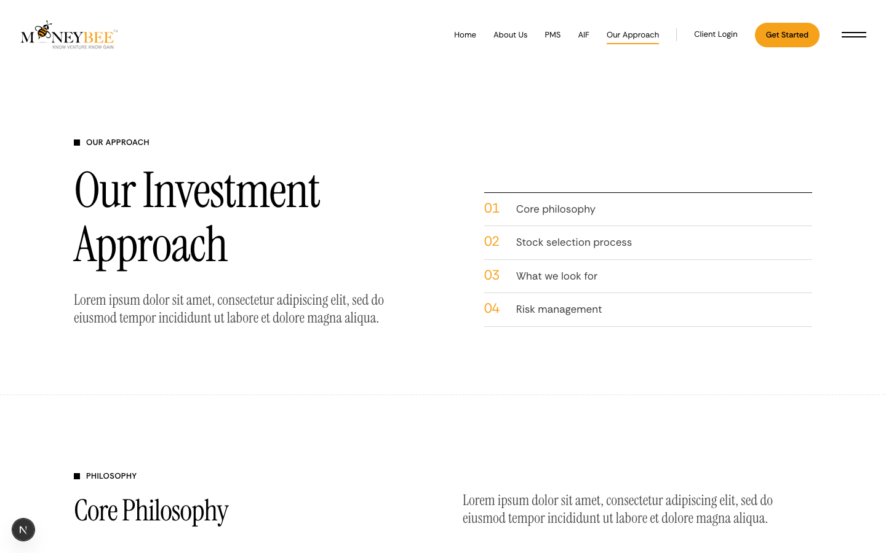

Already at ~95% and approved as the model page. Only change: section leads take the two-tone paragraph, graphics go in panels. Motion unchanged.

### 7. Performance — the lit rows page

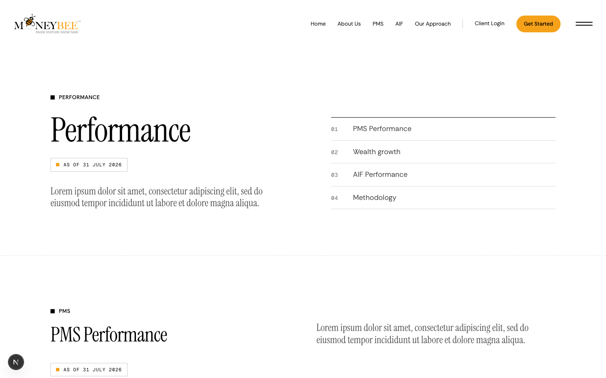

| Docx block | How we talk | Graphic | Motion |
|---|---|---|---|
| Heading + date | "Performance." grey: "As of 31 July 2026" until August figures arrive | — | Rise |
| PMS Performance, 8 periods | "Moneybee PMS against the S&P BSE 500 TRI." | **Lit rows**: one row per period; grey benchmark pill, then the Moneybee bar fills transparent → orange, ringed marker carries the number; the excess return prints once at the ring. 2 Years row shows N/A | Rows enter 70ms apart, each lit bar 0.6s ease-out as it scrolls into view; 1 Year (−7.45%) fills leftward from zero in grey, not orange |
| Table | Same data as a plain table under the rows, for reading and screen readers | Table (kept) | none |
| Wealth growth | "₹1 Mn in August 2007 became ₹28.85 Mn." | Unit-square wealth drawing (kept) | as now |
| AIF Performance | Flyingbee 3M / 6M vs S&P BSE 500, others N/A | Lit rows, 2 lit, rest grey N/A | Lit row |
| Methodology | Deck TWRR text + docx "past performance does not guarantee" line | Outlined disclosure card, rises last (the reference's privacy card) | Rise after rows |

### 8. Case studies

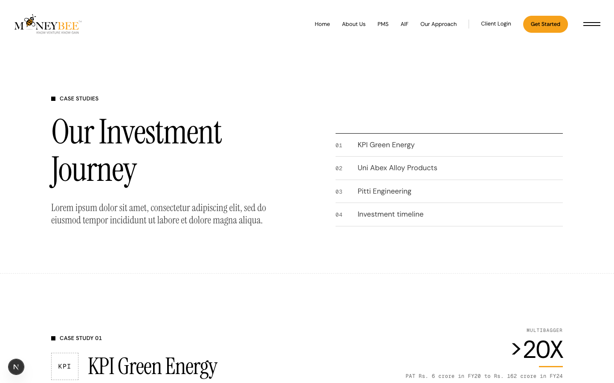

| Docx block | How we talk | Graphic | Motion |
|---|---|---|---|
| Our Investment Journey | "Three companies, and why we looked." | — | Rise |
| Each company (business / edge / growth) | Three docx lines per company | Business drawing (kept) + Revenue/EBITDA/PAT bars (kept) | Bars grow 0.6s ease-out on view |
| Three companies together | — | **Card scroll**: KPI Green, Uni Abex, Pitti as three cards stacking | Card scroll, 3 cards |
| Disclaimer | Docx wording | Disclosure card | Rise |

Removed: the ">20X / >10X" tags (not asked for, and they read as recommendations). Logos stay initials until the client sends them.

### 9. Team

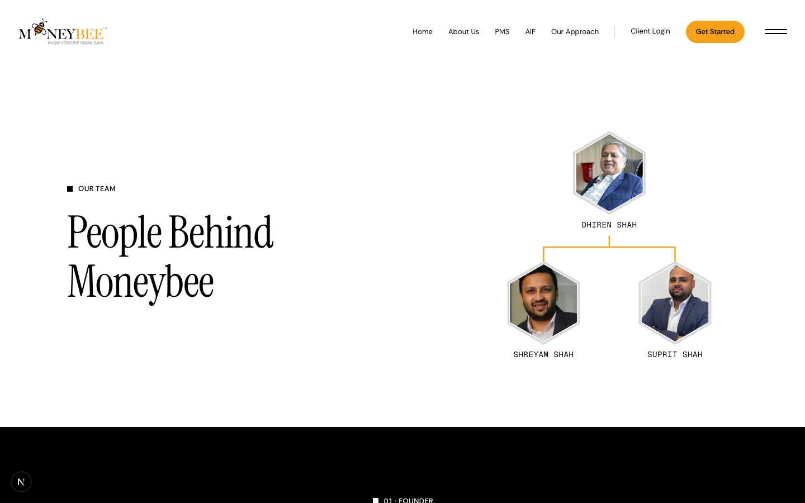

Keep headshots, names, designations, qualification chips. Lead: "People Behind Moneybee." Motion: rise only. Bios stay one line until the client sends 2–3 line bios.

### 10. Careers

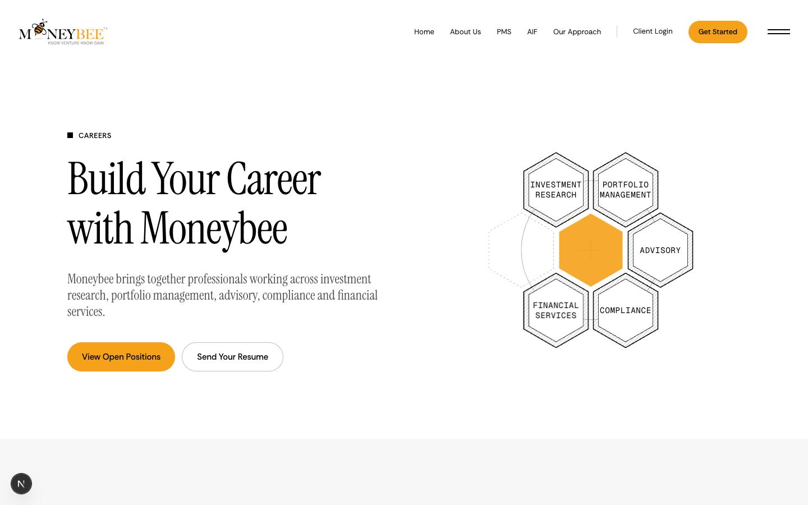

Structure stays (openings, life, culture, how to apply, both CTAs). Photos move into faded-bottom panels. How to Apply becomes a **four-sheet stack loop** (the four steps). All copy stays lorem until HR sends it.

### 11. Contact — realevate layout

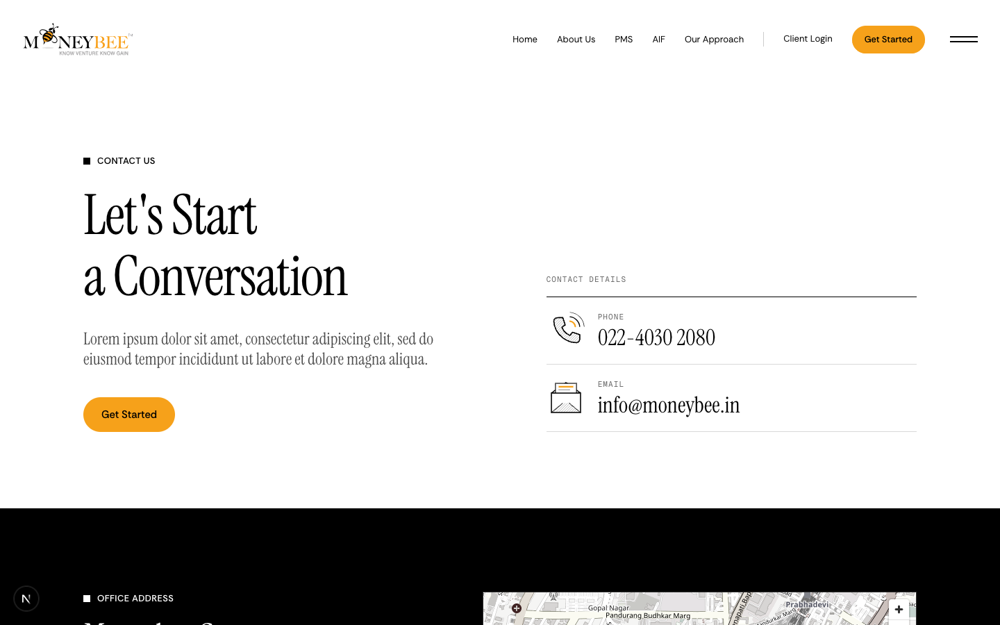

| Docx block | After |
|---|---|
| Let's Start a Conversation | First screen, three columns at 1440: left a slow vertical **"Contact"** marquee (orange outline type, ~111px/s, static under reduced motion); middle the h1, then Office / Phone / Email stack (email copies to clipboard with a chip); right the form |
| Enquiry options (4) | Four **tabs** above the form: PMS, AIF, Investor Support, General. Active tab: 2px orange underline scaling from centre, 0.5s `(.7,.6,0,1)`; inactive grey |
| Simple form | Underline-only fields, real labels, 1px `rgba(0,0,0,.25)` bottom border turning black on focus (0.3s). Per-tab extra fields kept |
| Orange Get Started | The submit button: solid orange, black text, black fill slides in on hover |
| Map | Below the first screen: existing black office band with the map |
| Phone / email icons | Kept in the middle column |
| 390 | One column: marquee as a single horizontal line, then details, tabs, form, map |

---

## Files

| File | Today | After |
|---|---|---|
| `components/motion/stack-loop.tsx` (new) | — | Isometric sheet stack; props: sheets, lit index or auto-cycle; the 6.8s timing |
| `components/motion/lit-rows.tsx` (new) | — | Period rows with benchmark pill and lit bar; props: rows, lit on view |
| `components/motion/card-scroll.tsx` (new) | — | Pinned stage, cards slide up linearly over 100svh each |
| `components/ui/section-lead.tsx` (new) | — | Two-tone lead paragraph + sentence-case label |
| `components/ui/figure-panel.tsx` (new) | — | Grey panel with faded bottom |
| `components/performance/*` | Horizontal bars + table | Lit rows + table |
| `components/aif-v2/aif-sections.tsx` | Structure chain + parties | Card scroll structure; orange hero Get Started |
| `components/pms-v2/pms-sections.tsx` | Honeycomb portfolio, §6 risks | Stack loop portfolio, `RISK_CONTROLS`; orange hero Get Started |
| `components/compare/*` | Chains + duplicate lead | Two stack loops; lead once |
| `components/about-v2/about-sections.tsx` | Timeline, no photos | Card-scroll timeline, team photo panel |
| `components/case-studies/*` | Multibagger tags, separate cases | Tags removed, card scroll |
| `components/contact-v2/*`, `lib/contact-v2.ts` | Hero + radio cards + map band | Three-column screen, tabs, underline form, map band below |
| `components/home/home-sections.tsx` | Two cards | Two-sheet stack loop; lit-rows performance teaser |
| All section heads | Bracket eyebrow + subhead + lorem | `SectionLead` |

### The one decision-bearing piece of code

```tsx
// card-scroll.tsx: 360 Lex's mechanism. Linear with scroll, no easing, like the reference.
const { scrollYProgress } = useScroll({ target: ref, offset: ["start start", "end end"] });
// n cards, each owns 1/(n+0.6) of the track; the last 0.6 is the hold
const y = useTransform(scrollYProgress, [i / (n + 0.6), (i + 1) / (n + 0.6)], ["105%", "0%"]);
```

The reference is linear; our other pins (fly-through, approach band) are too, so all pinned motion shares one feel.

## Scope left out, and open questions

1. **Home extras.** Remove Recognition, Multibagger picks and FAQ? The docx does not ask for them.
2. **Insights.** No docx content. Build a small index page (Performance + Case Studies), or wait?
3. **Performance date.** Stays "31 July 2026" until the client sends August figures.
4. **Client content still lorem:** careers copy, 2–3 line bios, case-study logos and investment dates, many section follow-on lines the decks do not cover.
5. **No proposed-preview images yet.** This plan shows current pages and the measured reference frames. The three motion components get built first on `/preview/motion` so you can see them running before any page changes; that is step 1 after approval.
6. Build order: components on /preview → Performance → AIF → PMS → PMS vs AIF → Home → About → Case studies → Contact → Careers.
