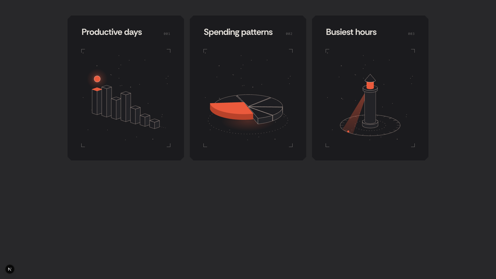
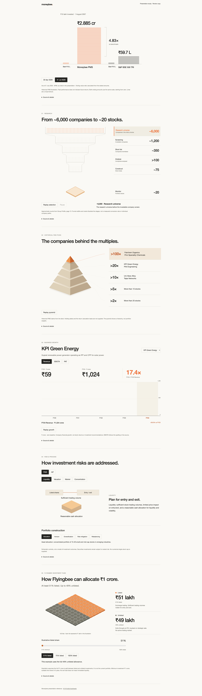
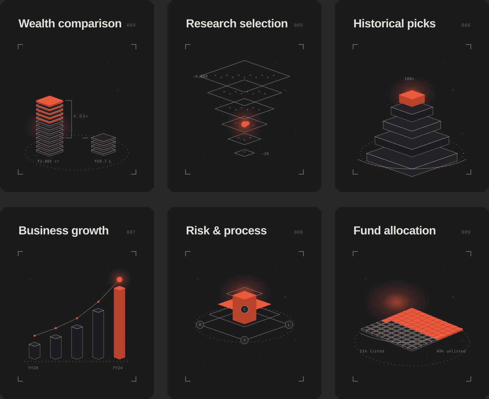

# Six Moneybee insight cards

## 1. Goal in three lines

Replace the discarded Matter prototype with six SVG cards under the existing three-card reference set.
Each new card carries one visualization from `Moneybee-interactive-visualizations.html`, but uses the existing card's projection, hover tilt, dark-to-light material change, orange emission, and hover-driven motion clock.
Prove the result by exercising hover, leave and reduced-motion behavior on all nine cards, then capture the rendered grid and check TypeScript, ESLint and the browser console.

## 2. Visual explanation

```text
Existing card shell
        |
        v
Six data motifs -> shared projection -> shared light/glow materials -> hover-driven motion
```

### Current card language



### Current visualization content

This is content input only. Its page layout and animation implementation will not carry forward.



### Proposed cards 004 to 009



The six scenes are:

| Card | Existing visualization retained | Card animation |
| --- | --- | --- |
| Wealth comparison | Equal starting amount, PMS ending value, benchmark ending value and 4.83x ratio | Two measured stacks use one plate per value interval instead of plain columns. The Moneybee stack emits orange light. A ratio bracket follows both tops. Motion advances only while hovered, then loses energy and freezes. |
| Research selection | Approximately 6,000 companies narrowing through six stages to approximately 20 stocks | Six suspended isometric selection planes narrow from top to bottom. A glowing marker descends while a bounded field of company dots thins at each plane. Dots follow deterministic paths instead of collision physics. |
| Historical picks | Five return-multiple tiers | All five square frustums spin around a vertical axis. One tier lifts and turns orange at a time, using the pie chart's spin, painter sorting and highlighted-solid treatment. |
| Business growth | Five fiscal-year values | Five extruded bars retain their relative values and a rising path connects their tops. A glowing marker travels from FY20 to FY24 and lights each top face, adapting the first card's measured marker mechanic. |
| Risk and process | Four risk categories and a central investment decision | Four protective diamond frames surround an investment core. The frames activate inward in sequence, then the core emits orange light. The sweep uses the beacon's glow timing rather than a generic line reveal. |
| Fund allocation | 51 percent listed minimum, up to 49 percent unlisted | All 100 isometric units remain visible. Exactly 51 begin in orange, the split boundary sweeps through 75 and 100 while hovered, and listed units use both orange top and wall materials. |

### Motion storyboard

All cards use the same interruption behavior as the first three.

| State | Card shell | Figure clock | Figure result |
| --- | --- | --- | --- |
| Rest | Dark, no tilt | Stopped | Figure remains at its last composed pose |
| Pointer enters | Crossfades to warm light in 200ms and tilts toward pointer | Energy approaches 1 in about 100ms | Card-specific sequence resumes from its frozen pose |
| Pointer moves | Tilt follows pointer without lag | Continues | Projection, painter order, glow and highlighted faces update per frame |
| Pointer leaves | Returns to dark and neutral tilt | Energy decays over about 1.2s | Motion slows and freezes without resetting |
| Reduced motion | No tilt | No frame loop | One readable composed state with the active value visible |

## 3. File table

| File | Responsibility today | Responsibility after this change |
| --- | --- | --- |
| `components/insight-cards/insight-cards.tsx` | Maps three figure names to three SVG components and owns card hover state | Uses a discriminated figure registry for nine components, keeps one shared card shell, uses unique gradient IDs per card, and exposes hover and focus state to every figure |
| `components/insight-cards/figures.tsx` | Contains the measured bars, pie and beacon figures plus a private hover clock | Keeps the original three unchanged and exports the shared hover clock and figure props used by the new card figures |
| `components/insight-cards/moneybee-figures.tsx` | Absent | Contains six focused SVG components with module-level geometry and refs for per-frame path updates |
| `components/insight-cards/insight-cards.module.css` | Defines the exact card shell and materials for the first three cards | Adds only reusable figure material roles needed by the six new scenes, including dim faces, glowing routes and labels. The card shell remains unchanged |
| `components/iso/geometry.ts` | Shared measured projection plus bars, pie and beacon geometry | Adds reusable box, frustum and translated-path helpers when more than one new figure needs them |
| `app/preview/insight-cards/page.tsx` | Renders three reference cards | Renders the original three first, followed by cards 004 to 009 in the same three-column rhythm |
| `app/preview/viz/page.tsx` | Discarded Matter prototype | Deleted |
| `components/viz/selection-funnel.tsx` | Discarded Matter prototype | Deleted |
| `package.json`, `pnpm-lock.yaml` | Briefly contained Matter dependencies | No Matter dependency or lockfile residue |

## 4. Real code for real choices

The card list becomes typed data. The registry prevents an item from naming a missing figure.

```diff
-type FigureKind = "bars" | "pie" | "beacon";
+type FigureKind =
+  | "bars"
+  | "pie"
+  | "beacon"
+  | "wealth"
+  | "research"
+  | "pyramid"
+  | "growth"
+  | "risk"
+  | "allocation";
```

The first three figures already have the correct lifecycle. The new figures reuse it instead of introducing six clocks.

```diff
-function useFigureFrame(active: boolean, draw: (seconds: number) => void) {
+export function useFigureFrame(active: boolean, draw: (seconds: number) => void) {
```

Each scene updates SVG refs during the frame loop. React state does not update per frame.

```tsx
useFigureFrame(active, (time) => {
  const phase = time % cycle;
  activeFaceRef.current?.setAttribute("d", buildFace(phase));
  glowRef.current?.setAttribute("transform", buildGlowTransform(phase));
});
```

The pyramid uses the same projection and back-face rule as the pie and lighthouse work. Rotation changes the visible walls and painter order, not only a wrapper transform.

```ts
const visible = Math.sin(outwardNormal + rotation) > 0;
const faces = sideFaces.filter((face) => face.visible).sort((a, b) => a.depth - b.depth);
```

The research card is deterministic geometry, not physics. Its animation tells the same sourced narrowing story without suggesting measured company paths.

```ts
const stage = Math.floor(time / STAGE_DURATION) % RESEARCH_STAGES.length;
const visibleDots = RESEARCH_STAGES[stage].sampleCount;
```

## 5. Scope left out

- No Matter.js, canvas renderer, collision simulation or `/preview/viz` route.
- No attempt to preserve the standalone HTML page's controls inside 450 by 561 cards.
- The cards preserve the six data relationships and visual motifs, not every disclosure and source detail from the review page.
- The first three reference figures and their measured dimensions remain unchanged unless verification finds a regression caused by shared code extraction.
- The proposed SVG is a composition preview. It does not prove motion. The implementation still needs hover, rapid enter/leave, pointer tilt, reduced-motion and console verification in the browser.
