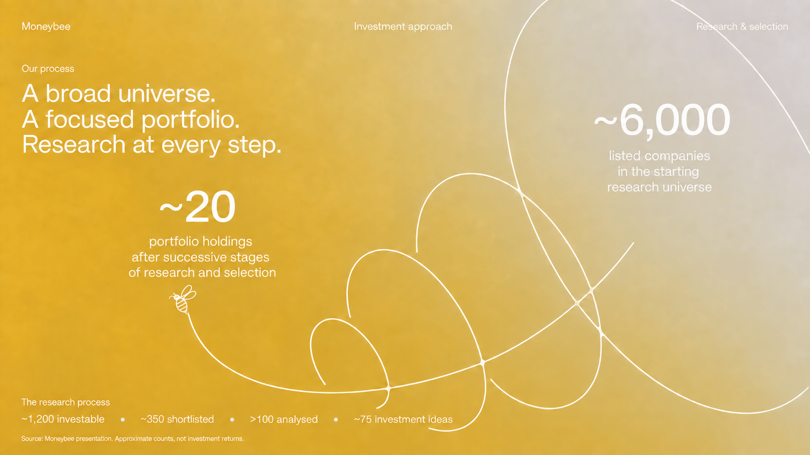
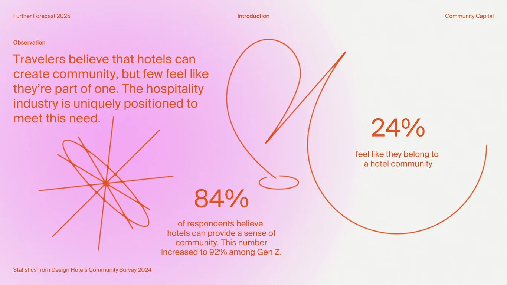
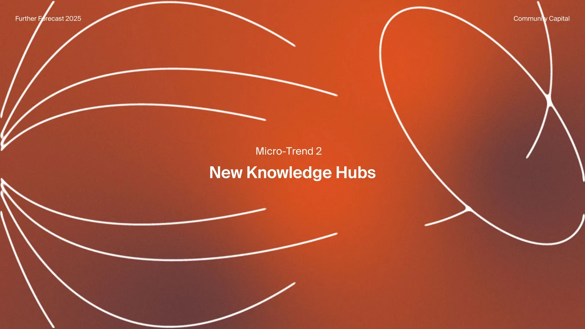
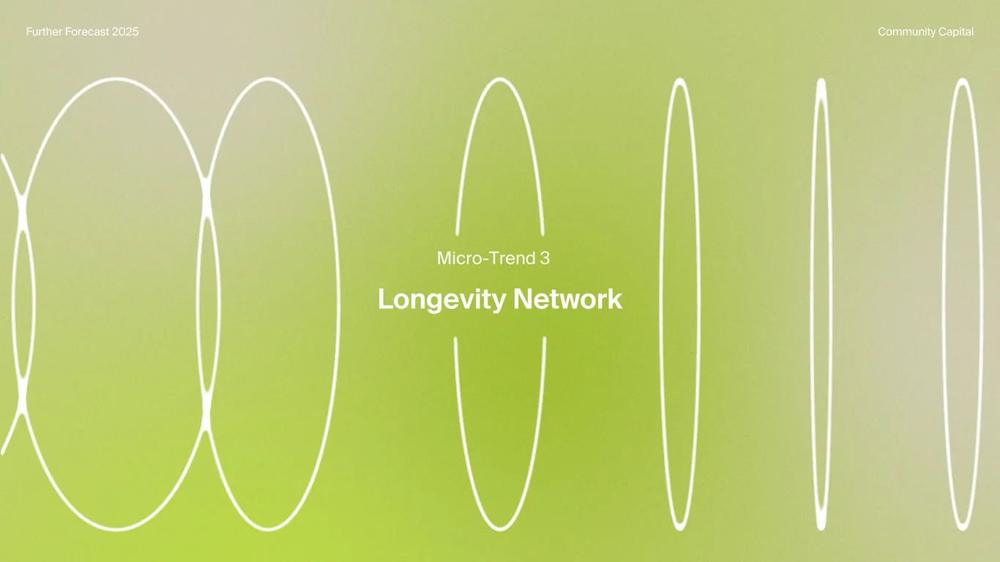
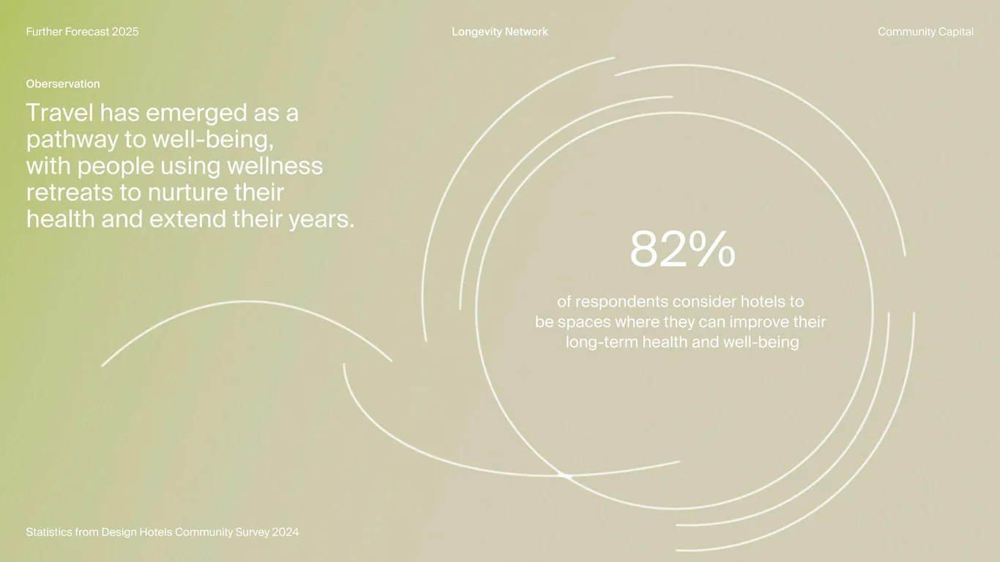
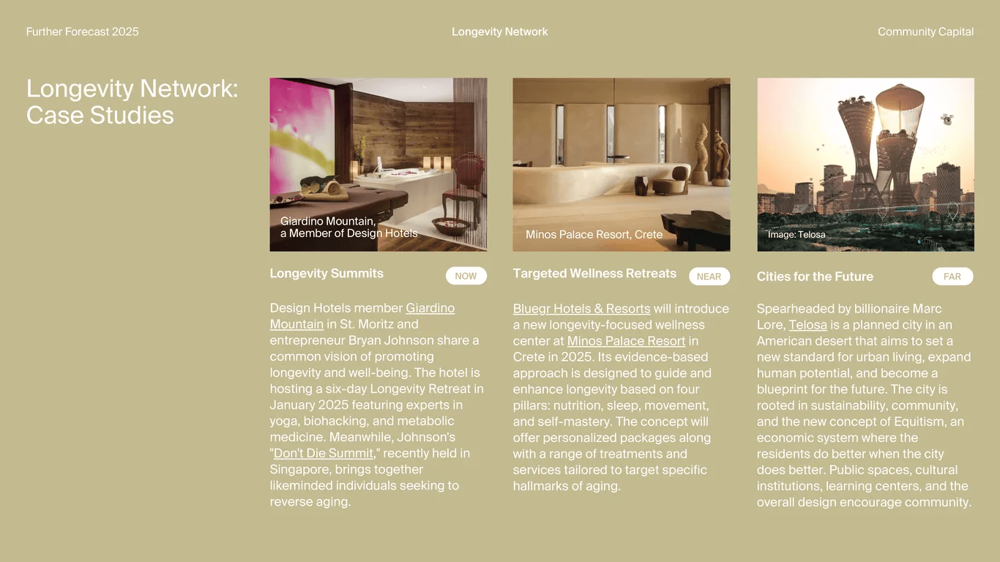

# Moneybee concept visuals: reference analysis

Analysed 12 September 2026. This is a source study, not an approved implementation plan. No website components have changed.

## What defines this style

An editorial slide grid holds a short argument and one or two large facts. Oversized, thin curves occupy the remaining space, sometimes enclosing a fact and sometimes leaving the frame. Soft colour fields and fine grain sit behind both. Text remains still and readable. The drawing establishes a relationship between ideas without pretending to be a quantitative chart.

The strongest property is controlled placement. These are individual compositions, not the same diagram dropped behind different text. The title pages deliberately interrupt their linework around the title. The evidence pages place a number inside a large clear region. The case-study page removes the diagram altogether because the photographs and text need the space.

Moneybee should retain that composition discipline, the generous empty space, the continuous curves, and the small source captions. The approved adaptation changes the palette and content. It does not justify changing every composition into a standard card grid.

## Evidence and source limits

- `01.png` is the user-supplied Moneybee adaptation, 1672 × 941. It is a separate reference, not an original Further Forecast slide.
- `02.png` through `08.png` are 1366 × 768 screenshots supplied by the user.
- `source.html` is the fetched gallery page. It identifies the original deck slides and serves their diagrams as raster images. The gallery's own typography and CSS are not the slide typography and CSS.
- `deck-005.webp`, `deck-019.webp`, `deck-021.webp`, `deck-023.webp`, `deck-033.webp`, `deck-035.webp`, and `deck-047.webp` are the corresponding gallery images.
- `manifest.json` records the attachment dimensions, SHA-256 checksums, and exact sampled pixel colours. Samples are individual pixels, not recovered brand tokens or gradient stops.
- `source-comparison.json` records decoded RGB comparisons between the seven supplied deck screenshots and their gallery images, without resizing.
- Images 04, 05, 06, and 07 are pixel-identical to those gallery images. Images 02, 03, and 08 have mean absolute channel differences of approximately 0.600, 0.335, and 0.821 on a 0–255 scale. The cause of those small differences is not established.
- Original editable vector paths, slide fonts, gradient definitions, and motion source have not been recovered. Positions and type sizes below are visual estimates unless explicitly marked as measured.

The user's PNG is the comparison target for each recreation. The corresponding gallery image supplies corroborating source evidence. Do not silently swap the two where they differ.

Source: https://deck.gallery/further-forecast-2025/

## Shared composition and type

At the 1366 × 768 reference size, the recurring left and right margins are approximately 35 px, or 2.56% of width. Top metadata begins around y=37 px. Its three positions are left aligned, centred on the canvas, and right aligned. Source captions sit near the bottom edge around y=721 px. The composition has a consistent perimeter even when a drawing runs off-screen.

| Element | Estimated size at 1366 × 768 | Behaviour |
| --- | --- | --- |
| Top metadata and source | 15–16 px | Quiet, usually regular weight |
| Observation or opportunity label | 15–16 px | Slightly heavier than the body |
| Editorial argument | 32–34 px | Regular weight, roughly 39–40 px line height |
| Large statistic | 66–70 px | Regular weight, no badge or container |
| Statistic explanation | 22–23 px | Centred beneath the number, tight multiline block |
| Chapter subtitle | 24 px | Centred, regular weight |
| Chapter title | 36–38 px | One of the few bold elements |
| Case-study body | 17–18 px | Denser, roughly 22 px line height |

The letters are a neutral sans serif, without the geometric exaggeration common in technology landing pages. The exact family is unverified. Font substitution will change line breaks, word widths, number widths, and the visual balance. Matching the type requires glyph comparison and rendered text measurements, not simply selecting a familiar sans serif.

The number is large because it is the subject. The editorial paragraph explains why it matters. The smaller paragraph defines what it measures. The source completes the claim. These roles must remain distinct when the content changes.

Avoid heavy tracking, all-caps microcopy, decorative numerical counters, pills around metrics, rounded panels, drop shadows, or dashboard-style dividers. The only prominent pill treatment in these references is the small time-horizon label in image 08.

## Drawing grammar

The diagrams share a stroke treatment, but not one geometric formula.

1. Most strokes appear approximately 2–3 px wide at the deck reference size. Some chapter strokes appear closer to 3–4 px. Verify per image; do not apply one global width without comparison.
2. Large curves have long, smooth tangents. They do not resemble hand-drawn jitter, a collection of short line segments, or a perfect stock orbit icon.
3. Shapes are often incomplete. Their openings are part of the composition. Closing every ellipse changes the reference.
4. Several curves extend beyond the canvas. The visible crop establishes scale. Fitting the complete drawing inside the viewport would shrink it and change its relationship to the text.
5. Several intersections have thicker, softened joins. Close inspection of images 01 and 05 shows filled-looking white connections. Plain stroked ellipses will not reproduce all of those pixels. Their original construction is unknown; a recreation may need local filled paths in addition to strokes.
6. Very narrow ellipses in image 06 merge visually at their ends. Preserve the varying apparent thickness, including raster antialiasing, rather than forcing every point to look equally thin.
7. There are no arrowheads directing the reader through the diagrams. The line shapes and text positions do that work.

These are mostly conceptual diagrams. Ring size is not a percentage scale. Arc length is not a duration scale. Do not give an abstract ornament the visual authority of a plotted series.

## Image 01: Moneybee research selection

**Composition.** The 1672 × 941 frame has about 44 px horizontal padding. Its top row reads Moneybee, Investment approach, and Research & selection. A three-line statement occupies the upper left. The ~6,000 metric is upper right; ~20 is lower and left of centre. The lower-left footer carries the intermediate stages and source note.

**Geometry.** The largest loop enters from outside the top and right edges. Successively smaller loops extend diagonally toward the lower left. A long curved path passes through their lower joins and terminates near a small white bee. The loops are tilted and unevenly spaced. Their overlaps and shared-looking joins matter as much as their outlines.

**Reading direction.** The count moves conceptually from ~6,000 in the upper right toward ~20 on the left. The left-to-right reading habit competes with that direction, so the labels and intermediate sequence must make the meaning explicit. The drawing is not a measured funnel. Loop areas do not encode company counts.

**Background.** The exact samples include orange-gold #E5AF28 on the left, #D9B351 near the centre, and warm grey #D4CCBB on the right. These are image colours, not the logo's orange. A cloudy, uneven texture crosses the full frame. The colour transition is broad rather than a visible linear band.

**Content.** The numbers agree with the existing repository analysis of the April group profile's PMS selection process: approximately 6,000 → 1,200 → 350 → more than 100 → 75 → 20. That analysis is a secondary source in this session; the underlying PDF has not been rechecked here. Label this as the PMS process, not a shared AIF funnel. The AIF process has stages without these counts.

**Recreation risks.** Do not build it as six neat nested circles. Do not convert the full corporate logo into a white stroke and assume it is this bee. The supplied logo is filled artwork, whereas the reference bee is outlined. The logo remains unchanged; this diagram's bee needs separate source matching. The footer already approaches the lower linework, so text length and source placement need careful comparison.

**Possible motion, not observed motion.** Reveal the selection path from the research universe toward the portfolio, with each stage label appearing at its position. Stop at the completed composition. Do not animate the counts down from 6,000 to 20 as if they are live measurements, and do not make the bee continuously circle the diagram.

## Image 02: belief versus experience

Original deck slide 005.

**Composition.** The upper-left statement uses a roughly 530 px text width. The first metric sits low around x=600, while the second sits higher around x=1070. This staggering leaves a route between the statement and two facts. The pink colour field is concentrated on the left and fades almost to white on the right.

**Geometry.** Three distinct structures share the canvas: an intersecting radial drawing at lower left, a tall narrow loop near the centre, and a large open bowl-shaped curve on the right. The centre drawing has an angular folded segment and a small horizontal ellipse beneath it. It is not a generic infinity symbol. The two metrics occupy different open regions rather than symmetrical columns.

**Why it works.** The two percentages are related but not presented as interchangeable measurements. Their descriptions supply the relationship. The diagram connects them spatially without adding axes or pretending their shapes represent their values.

**Moneybee application.** A dated PMS-versus-benchmark comparison could use this two-fact structure. Both numbers must have the same period and methodology. Do not put a PMS CAGR against a short-period AIF return just because the layout has two spaces. A percentage-point difference needs its own correct label.

**Palette adaptation.** Replace the pink field with pale Moneybee orange fading to white or grey. Use black for the argument and definitions, with orange linework or orange emphasis. Keeping orange body copy everywhere would undermine legibility on pale orange.

**Possible motion.** A single coordinated line reveal, followed by both facts together. Separate count-up effects would make the comparison harder to read and momentarily show invented intermediate values.

## Image 03: one origin, two outward arcs

Original deck slide 019.

**Composition.** The editorial paragraph is upper left, roughly 400 px wide. A radial burst centres around x=378, y=584. Two arcs extend upward and right, ending before separate outlined circles around x=1065, y=391 and x=1294, y=287. The 74% metric is central-right around x=808, y=450, below the arcs.

**Geometry.** The arcs have different radii and endpoints. Neither is a complete semicircle. Each endpoint circle is separated from its arc by a visible gap. The burst consists of many fine spokes that become dense and bright at the centre. Replacing that convergence with a large flat disc would change the texture.

**Background.** A blue field varies softly in lightness and has visible fine grain. White text and lines share one foreground colour. There is no glow halo around the metric.

**Moneybee application.** It could explain a shared research discipline serving separate PMS and AIF structures, provided those branches are labelled. It could also express different investment horizons. Two visible branches must not silently acquire meanings that the text does not support.

**Possible motion.** Draw both arcs outward from the shared origin; reveal the endpoint rings after the paths. No arrowheads. Do not animate the rings as moving assets or imply a plotted return trajectory.

## Image 04: chapter opening with cropped curves

Original deck slide 021.

**Composition.** The title is centred horizontally and vertically, with a smaller chapter label above it. The left drawing enters from off-canvas at several heights; the right drawing is a large tilted loop cropped at the top and right. The central text region is deliberately open.

**Geometry.** The left side is a group of broad, nested petal-like curves, not a set of concentric circles. The right shape crosses itself and has widened joins. Their unequal shapes balance through scale and placement, not mirror symmetry.

**Background.** Orange-red is brightest through the central and upper regions, with darker rust and muted brown-purple toward the sides and lower area. The original red-orange is not Moneybee #F9A11B.

**Moneybee application.** A chapter divider for Research & selection, Portfolio construction, or Understanding AIF. This is a transition, not a data display. It does not need a statistic, CTA, or supporting paragraph added into the empty centre.

**Possible motion.** Reveal the edge linework once, retaining the central gap. Text can remain present throughout. Continuous background motion is unnecessary.

## Image 05: intersecting orbital paths around a fact

Original deck slide 023.

**Composition.** The argument is lower left, about 335 px wide. The dominant diagram fills the right two-thirds. The 79% metric sits near x=845, y=240, with its definition below. This is noticeably above the geometric centre of the drawing.

**Geometry.** A large nearly circular outline intersects a low, wide curved orbit and a steeper tilted orbit. Some paths are incomplete. The wide orbit extends into the left half of the frame. The composition includes local thicker joins at several crossings. It should not be replaced by three equally sized ellipses rotated around a common centre.

**Meaning.** The reader sees a fact surrounded by related movement. The circle is not a donut chart and does not depict 79% completion.

**Moneybee application.** A qualitative explanation of the relationship between business quality, valuation, and governance could use the intersecting paths. A quantitative mandate split such as listed/unlisted allocation instead needs a diagram that honestly encodes that split. Do not put 51% inside this drawing and imply its orbit areas show allocation.

**Possible motion.** Trace the paths sequentially or reveal them together. Rotation would be a new mechanism and must be reviewed separately, especially because it could carry lines across the text.

## Image 06: ellipse widths as a chapter composition

Original deck slide 033.

**Composition.** Tall vertical loops span almost the full height, from around y=107 to y=724. Their widths differ sharply. The left loops are broad and partially cropped; the right group includes a very narrow loop. The centre loop is interrupted around the title block.

**Geometry.** The widths do not decrease monotonically across the entire frame. The last loop broadens again. This is a composed sequence, not a linear progression chart. The central opening is a missing section of line, not a rectangular panel painted over the background. A solid cover rectangle would interrupt the gradient and grain.

**Moneybee application.** A chapter about time horizon or continued monitoring. If width represents an actual variable, that variable must be defined and the geometry rebuilt from data. Otherwise retain it as a chapter illustration.

**Possible motion.** A small change in apparent ellipse width could suggest rotation around a vertical axis, but that is an inferred possibility, not evidence of the original animation. It must preserve the title opening and include a fixed reduced-motion state.

## Image 07: open rings and a separate left arc

Original deck slide 035.

**Composition.** The argument is upper left. A large metric and definition sit inside the right-hand rings near x=930, y=340. A detached left arch occupies the lower-left region. A low sweeping curve crosses the inner ring near the bottom.

**Geometry.** The right drawing contains several near-concentric open arcs with different endpoints, rather than complete rings. The inner outline and crossing low curve have their own shape. Gaps rotate around the upper and right portions, creating an uneven perimeter. Replacing these with standard circular progress indicators would introduce a false quantitative meaning.

**Background.** Pale warm grey occupies most of the canvas, with a yellow-green field on the left. This translates well to Moneybee's white and grey base with a restrained pale orange field on one side.

**Moneybee application.** Ongoing monitoring and review, or an explanation of investment horizon. A return statistic can occupy the centre only if the surrounding arcs remain clearly illustrative. The layout must not imply guaranteed growth or capital protection.

**Possible motion.** Reveal arcs once in sequence and stop. A endlessly rotating ring would resemble a loading indicator and would add a meaning absent from the reference.

## Image 08: three editorial case studies

Original deck slide 047.

**Composition.** Four columns span the slide. The first is a title column; the next three contain case studies. Approximate starts are x=35, 368, 700, and 1034. The image columns are approximately 298 px wide with 34 px gaps. The photographs begin at y=106 and are about 239 px tall. Their corners are square.

**Hierarchy.** Each photograph carries a small bottom caption. A title and a small NOW, NEAR, or FAR pill sit underneath. Body copy starts on a shared baseline around y=414. Links are underlined inline. The case studies have no outer borders, raised backgrounds, or enclosing card shells.

**Background.** This is mostly a flat muted warm field, not a strong atmospheric gradient. That restraint gives the photographs and denser writing enough separation.

**Moneybee application.** Approved historical business case studies. Each should state the business, original thesis, evidence, risk, and dated outcome. Do not reuse NOW/NEAR/FAR as investment recommendations or invent forward-looking outcome labels. Image credits and historical context remain explicit. Current research and watchlists stay private.

**Possible motion.** None is needed. A simple entrance is optional, but the text and image grid should remain stable while reading. This composition is also a useful limit on the rest of the system: the line motif does not have to appear everywhere.

## Moneybee palette translation

Exact logo fills were supplied in `public/moneybee-logo.svg`. The main orange is #F9A11B, black is #000000, and white is #FFFFFF. The tagline uses #A2A1A2. #E3E3E3 appears as a light grey. Other smaller fills and a gradient exist in the SVG; do not flatten or recolour the original logo.

| Role | Value or treatment | Evidence status |
| --- | --- | --- |
| Brand orange | #F9A11B | Exact SVG fill |
| Black | #000000 | Exact SVG fill |
| White | #FFFFFF | Exact SVG fill |
| Brand grey | #A2A1A2 | Exact SVG fill, not a default small-text colour |
| Light grey | #E3E3E3 | Exact SVG fill |
| Pale orange field | Orange blended toward white | Proposed adaptation, no approved stop values |
| Neutral field | White blended toward grey | Proposed adaptation |
| Dark field | Black and grey with local orange | Proposed occasional chapter treatment |

Use white and light grey as the normal page background, black for readable text, and orange for selected lines, facts, and small accents. Full orange fields can remain occasional educational compositions, especially the supplied image 01, without making the entire site orange.

The source often uses white text on pale backgrounds. Copying that contrast unchanged into Moneybee orange would be a problem. White against flat #F9A11B is approximately 2.1:1; black against the same orange is approximately 10.0:1. White against #A2A1A2 is only around 2.6:1. Check the actual background behind every label. Preserve the thin line appearance while allowing text to use a different foreground.

The soft fields are irregular, with several broad changes in colour and brightness. A single two-stop diagonal gradient will look too regular. Fine grain is static and subtle; it should not resemble a dense dot pattern, moving noise, strong film scratches, or a blurred layer over text. Any procedural recreation is a reconstruction, not a recovered source formula.

## Requirements checked against Linear

Freshly re-read the September 4 scope summary and the August 17 update containing Shreyam's email. The initial full-activity request returned a temporary 502; the two targeted reads succeeded.

Sources:

- https://linear.app/blankuwu/project/money-bee-787944f63b72/activity#project-update-525e2bc7
- https://linear.app/blankuwu/project/money-bee-787944f63b72/activity#project-update-7f0d399f

| Requirement | Consequence for this visual work |
| --- | --- |
| Branding first, investor discovery second | Visuals must explain the actual firm and its evidence, not generic finance concepts |
| Performance or benchmark leads the hero | Establish the approved claim before fitting a headline number into a composition |
| Separate PMS and AIF | Separate product facts, record periods, explanatory content, and enquiry journeys |
| Explain PMS versus AIF and Category III | Use diagrams to clarify ownership, structure, eligibility, and process; define all comparisons |
| Clean, serious, orange as accent | Preserve whitespace and restrained type; avoid making every site section a coloured slide |
| Moneybee line motif | Use the repeated line language, but do not claim deck linework is official Moneybee brand artwork |
| Structured monthly fact sheets | Numbers, periods, benchmarks, units, sources, and notes must remain editable content, not text baked into an image |
| One CRM | Website and offline leads, follow-ups, and any export or API sync use the same agreed system |
| Dynamic careers | Admin-editable roles and multi-step questions, filterable submissions; email/calendar scheduling remains a workflow detail to confirm |
| Analytics | Measure relevant page visits and clicks, including careers, PMS, and AIF |
| No distributor flow | Contact Us handles incoming interest; the later summary supersedes the earlier suggestion |
| No public research reports | Explain the method and approved historical case studies without publishing current investment research |
| AI later | No chatbot or AI feature in phase one |
| Blog later | Prepare compatible structure without inventing a publishing programme or newsletter |
| Reuse content on LinkedIn | Keep text and data separate from diagrams; export compositions in reviewed formats |
| AWS login placeholder | No invented portal functionality or backend access |
| Links to other group businesses | Keep broking and investment banking distinct from this PMS/AIF site |
| Design approval first | Aditi was named for look and feel; Pournima and Suprit for compliance; Shreyam for editorial copy |
| About four weeks and one WhatsApp channel | Project coordination requirements, not animation or site copy |

The older local public-research document still suggests a distributor route. That conflicts with the newer September 4 scope. Do not carry that old recommendation into implementation.

## Numbers that can inform drafts, not automatic public claims

The existing `docs/moneybee-actual-specs-from-client-documents.md` reports a detailed extraction of the supplied presentations. This session read that analysis, but did not independently reopen the PDFs. Treat the following as documented working values awaiting source and publication checks, not newly verified current figures.

- Queenbee PMS: 19.44% since-inception CAGR versus 9.90% S&P BSE 500 TRI as at 31 July 2026. The period begins 1 August 2007. The difference is 9.54 percentage points, not 9.54% relative growth.
- The same analysis reports Rs. 10 lakh growing to Rs. 2.885 crore versus Rs. 59.7 lakh. Those are dated endpoint values. Do not invent a smooth historical series between them.
- The PMS process is approximately 6,000 → 1,200 → 350 → more than 100 → 75 → 20. Counts describe selection, not investment returns or current live holdings.
- Flyingbee AIF has its own newer history. Do not attach the PMS inception date or long-term result to it.
- Shreyam's 7–8% India growth and 30–40% company growth statements express a thesis in the email. They are not established forecasts to turn into a factual data chart.

This resolves an earlier uncertainty in our conversation: the repository has more precise working figures than the email's shorthand. What remains unresolved is their approval for publication and whether a newer reporting month should replace them.

## Recreation and animation constraints for the later build

Keep the original-reference comparison separate from the Moneybee adaptation comparison. Changed text and colours cannot produce a whole-image zero diff against the original deck. Exactness means defining which properties are retained and checking those properties explicitly.

For a reference reconstruction, compare at its pinned native size, with a fixed render state and loaded fonts. Check text positions, line breaks, curve endpoints, openings, stroke widths, crossings, cropping, and background separately. A low whole-image error can hide a badly misplaced thin line because the background occupies most pixels.

For the Moneybee adaptation, preserve the selected composition and line geometry unless changed content requires an explicitly reviewed adjustment. Compare the line layer independently of approved text and palette changes. Keep the original raster only as evidence; the delivered graphic must use actual HTML and SVG, not a screenshot with transparent overlays.

Text should remain selectable HTML where practical. Use SVG for diagram paths and local joins. Keep the small-print source, date, benchmark, units, and any applicable disclaimer associated with the metric in both the visual layout and the reading order. If a diagram is decorative, hide it from assistive technology and explain the concept in text. If it communicates stages, provide that sequence as real text.

None of these stills establishes animation direction, duration, easing, or scroll coupling. All motion suggestions above are new choices. Agree on each mechanism before implementation. Begin with a verified still; a moving diagram cannot fix incorrect geometry.

Default motion behaviour should finish in the reference composition. Avoid simultaneous movement of background, lines, text, and numbers. Respect reduced motion and keep information available before or without animation. A financial figure should not temporarily become a different figure just to animate in.

The desktop compositions cannot simply shrink into a 390 px-wide slide. A nominal 16 px footer at the original width becomes roughly 4.6 px. Mobile needs a separately approved arrangement that preserves the reading order and recognisable diagram, with readable labels and source notes. Social exports likewise need deliberate layouts rather than arbitrary crops.

## What has and has not been established

Saved all eight user references, pinned their source mapping, compared the seven available gallery counterparts, sampled background pixels, inspected line joins, and rechecked the two relevant Linear updates.

No editable deck vectors or exact font identification are available from the fetched gallery source. No animation has been observed. No HTML/SVG recreation, responsive layout, performance claim publication, or visual parity result is claimed by this study.

The later implementation review should begin with image 01 as the first concrete test: its supplied Moneybee composition, the PMS selection sequence, the original outlined bee appearance, and the corrected product label. It exercises the difficult parts together: gradients and grain, irregular overlapping loops, small joins, dense source text, and faithful placement.
